# High-Level Design — WhatsApp Clone Backend

## Table of Contents

1. [Overview and Design Principles](#1-overview-and-design-principles)
2. [Architecture Style](#2-architecture-style)
3. [System Architecture Diagram](#3-system-architecture-diagram)
4. [Service Decomposition and Bounded Contexts](#4-service-decomposition-and-bounded-contexts)
5. [Communication Patterns](#5-communication-patterns)
6. [Data Architecture](#6-data-architecture)
7. [Key Request Flows](#7-key-request-flows)
8. [WebSocket Architecture](#8-websocket-architecture)
9. [Security Architecture](#9-security-architecture)
10. [Scalability Architecture](#10-scalability-architecture)
11. [Infrastructure Architecture](#11-infrastructure-architecture)
12. [Observability Architecture](#12-observability-architecture)
13. [Failure Modes and Recovery](#13-failure-modes-and-recovery)
14. [Capacity Planning](#14-capacity-planning)

---

## 1. Overview and Design Principles

### 1.1 System Purpose

This system is a WhatsApp-clone backend providing real-time messaging, group chat, media sharing, push notifications, and user management. It is built as a collection of eight Go microservices communicating via gRPC, NATS JetStream, and Redis Pub-Sub, deployed on a local Kubernetes cluster (Kind) and exposed to the internet via ngrok.

### 1.2 Design Principles

#### SOLID Principles Applied to Microservices

| Principle | Application |
|-----------|-------------|
| **Single Responsibility** | Each microservice owns exactly one bounded context. `message-service` handles message CRUD and status; it does not manage chat metadata or user profiles. |
| **Open/Closed** | Services expose stable gRPC and REST contracts. New consumers (e.g., a future analytics-service) subscribe to existing NATS subjects without modifying publishers. |
| **Liskov Substitution** | Internal service layers (handler -> service -> repository) depend on interfaces. Repository implementations for PostgreSQL and MongoDB are interchangeable behind the same `Repository` interface. |
| **Interface Segregation** | gRPC `.proto` files define narrow service contracts. `auth.proto` exposes only `ValidateToken`; it does not leak user profile RPCs. Consumers depend only on the slice of the API they need. |
| **Dependency Inversion** | Business logic in `internal/service/` depends on repository interfaces, not concrete database drivers. Configuration is injected via environment variables, not hardcoded. |

#### 12-Factor App Compliance

| Factor | Implementation |
|--------|---------------|
| **I. Codebase** | Single monorepo (`backend/`) with per-service directories; one-to-one mapping between service and deployable unit. |
| **II. Dependencies** | Go modules (`go.mod` per service) with explicit, versioned dependencies. No system-level package assumptions. |
| **III. Config** | All configuration via environment variables (`DATABASE_URL`, `REDIS_URL`, `NATS_URL`, `JWT_SECRET`, etc.). `config/config.go` reads from `os.Getenv`. |
| **IV. Backing Services** | PostgreSQL, MongoDB, Redis, NATS, MinIO are all treated as attached resources, referenced by URL. Swapping a managed PostgreSQL for the local one requires only changing `DATABASE_URL`. |
| **V. Build, Release, Run** | Multi-stage Docker builds produce immutable images. Helm values overlay environment-specific config. |
| **VI. Processes** | All services are stateless processes. Session state lives in Redis, not in process memory. The only exception is the WebSocket connection registry (in-memory), compensated by Redis Pub-Sub fan-out. |
| **VII. Port Binding** | Each service self-hosts on its own port (8080-8087 HTTP, 9081-9086 gRPC). No external web server (e.g., nginx) is required in front of individual services. |
| **VIII. Concurrency** | Horizontal scaling via Kubernetes replicas. NATS consumer groups distribute event processing. WebSocket instances are load-balanced with sticky sessions. |
| **IX. Disposability** | Graceful shutdown on SIGTERM: drain HTTP connections, ack in-flight NATS messages, close WebSocket connections with close frame. Fast startup (Go binaries cold-start in <500ms). |
| **X. Dev/Prod Parity** | Docker Compose mirrors the Kind cluster topology. Same container images run in both environments. |
| **XI. Logs** | Structured JSON logs via zerolog, written to stdout. Collected by the orchestration platform (kubectl logs, or Loki in production). |
| **XII. Admin Processes** | Database migrations in `migrations/` run as one-off Kubernetes Jobs or `docker-compose exec` commands. |

#### Separation of Concerns

The architecture enforces strict separation at three levels:

1. **Service level**: Each microservice owns a single domain (auth, users, chats, messages, notifications, media, websockets). No service accesses another service's database directly.
2. **Layer level**: Within each service, the internal structure follows `handler -> service -> repository`. Handlers parse HTTP/gRPC input, service layer contains business logic, repository layer abstracts data access.
3. **Communication level**: Synchronous concerns (request/response) use gRPC. Asynchronous concerns (events, fan-out) use NATS JetStream. Ephemeral real-time state (presence, typing) uses Redis Pub-Sub.

#### Polyglot Persistence Rationale

Different data shapes demand different storage engines:

| Data Category | Storage | Rationale |
|--------------|---------|-----------|
| Users, contacts, chats, participants, groups, device tokens, refresh tokens, privacy settings | **PostgreSQL 16** | Relational data with foreign key constraints, ACID transactions for group membership changes, strong consistency for auth. |
| Messages, media metadata | **MongoDB 7** | Write-heavy, time-series-like access pattern (append messages, paginate by `created_at`). Flexible schema accommodates multiple message types. Per-recipient status map is a natural fit for embedded documents. |
| Presence, typing indicators, sessions, rate limits, OTP | **Redis 7** | Ephemeral data with TTL requirements. Sub-millisecond read/write for real-time features. Pub-Sub channels for WebSocket fan-out. |
| Media files (images, videos, audio, documents) | **MinIO** | S3-compatible object storage. Presigned URLs offload bandwidth from application servers. Thumbnail generation pipeline stores both original and thumbnail. |

---

## 2. Architecture Style

### 2.1 Microservices + Event-Driven Hybrid

This system employs a **microservices architecture** with an **event-driven communication backbone**. Services interact via two complementary patterns:

- **Synchronous gRPC** for request-response interactions where the caller needs an immediate result (e.g., token validation, message persistence).
- **Asynchronous NATS JetStream** for event-driven workflows where the publisher does not need an immediate response (e.g., notifying recipients of a new message, triggering push notifications).
- **Redis Pub-Sub** for ephemeral real-time fan-out (e.g., WebSocket message delivery across instances, typing indicators).

### 2.2 Why Not a Monolith

| Concern | Monolith Problem | Microservices Solution |
|---------|-----------------|----------------------|
| **Independent scaling** | A messaging spike forces scaling the entire app, including idle components like auth. | Scale `websocket-service` and `message-service` independently while `auth-service` runs at 1 replica. |
| **Polyglot persistence** | A monolith typically uses a single database. Storing messages in PostgreSQL alongside relational user data leads to suboptimal query patterns for both. | `message-service` uses MongoDB (optimized for write-heavy, time-series-like queries); `user-service` uses PostgreSQL (optimized for relational joins). |
| **Fault isolation** | A bug in media processing (e.g., FFmpeg crash) takes down the entire application. | `media-service` crashes in isolation. Messaging, auth, and chat continue functioning. |
| **Team autonomy** | All developers work in the same codebase. Conflicting schema migrations block each other. | Each service owns its database schema. Teams can deploy independently. |
| **Technology flexibility** | Locked into one framework and one database driver. | Each service can adopt different libraries. `websocket-service` uses Gorilla WebSocket; `api-gateway` uses Gin's built-in proxy. |

### 2.3 Trade-Offs Accepted

| Trade-Off | Mitigation |
|-----------|------------|
| **Operational complexity**: 8 services + 5 data stores to deploy and monitor. | Docker Compose for local dev. Helm umbrella chart for K8s. Structured observability (zerolog + Prometheus + Jaeger). |
| **Network latency**: gRPC calls add network hops compared to in-process function calls. | gRPC uses HTTP/2 with connection multiplexing. Calls between co-located pods have sub-millisecond latency. Critical paths minimized to 1-2 hops. |
| **Data consistency**: No distributed transactions across services. | Event-driven eventual consistency via NATS JetStream (at-least-once delivery). Idempotency keys (`client_msg_id`) prevent duplicates. Saga-like patterns for multi-step operations. |
| **Debugging complexity**: A single user request may traverse multiple services. | Distributed tracing via OpenTelemetry. Every log line carries `request_id` for correlation. Jaeger UI visualizes cross-service traces. |
| **Duplicate code**: Shared concerns (JWT parsing, error formatting, logging) across services. | `pkg/` shared library within the monorepo provides common utilities without tight coupling. |

---

## 3. System Architecture Diagram

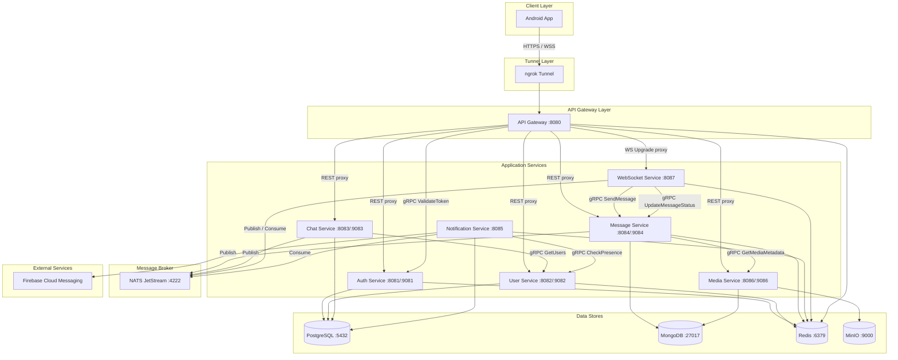

### Component Summary

| Component | Role | Port(s) |
|-----------|------|---------|
| **ngrok** | Exposes the API Gateway to the internet with a static domain | External |
| **API Gateway** | Reverse proxy, JWT validation, rate limiting, CORS, WS upgrade | 8080 |
| **Auth Service** | Phone+OTP auth, JWT issuance, token validation | 8081 (HTTP), 9081 (gRPC) |
| **User Service** | Profiles, contacts, presence, blocking, privacy, FCM tokens | 8082 (HTTP), 9082 (gRPC) |
| **Chat Service** | Chat CRUD, group management, participant roles | 8083 (HTTP), 9083 (gRPC) |
| **Message Service** | Message persist/retrieve, status tracking, pagination | 8084 (HTTP), 9084 (gRPC) |
| **Notification Service** | NATS consumer, presence check, FCM push, batching | 8085 (HTTP) |
| **Media Service** | File upload, FFmpeg thumbnails, MinIO storage, presigned URLs | 8086 (HTTP), 9086 (gRPC) |
| **WebSocket Service** | Persistent connections, connection registry, real-time delivery | 8087 (HTTP/WS) |
| **PostgreSQL** | Relational data (users, chats, groups, contacts, tokens) | 5432 |
| **MongoDB** | Messages and media metadata | 27017 |
| **Redis** | Sessions, presence, rate limits, typing, Pub-Sub channels | 6379 |
| **NATS JetStream** | Durable event streaming (at-least-once delivery) | 4222 |
| **MinIO** | S3-compatible object storage for media files | 9000 |
| **FCM** | Push notification delivery to Android devices | External |

---

## 4. Service Decomposition and Bounded Contexts

Each microservice is designed around a single **bounded context** from Domain-Driven Design (DDD). A bounded context defines a clear boundary within which a particular domain model applies, and each service is the sole authority over the data within its context.

### 4.1 Bounded Context Map

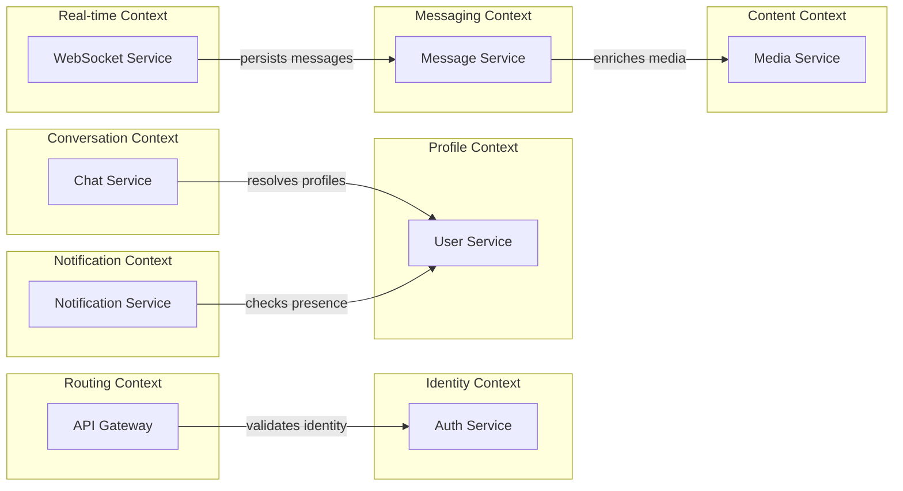

### 4.2 Service Breakdown

#### API Gateway (Routing Context)

| Aspect | Detail |
|--------|--------|
| **Bounded Context** | Request routing and cross-cutting concerns |
| **Owns** | Nothing (stateless proxy). Rate limit counters are transient in Redis. |
| **Responsibilities** | Reverse proxy to all downstream services. JWT validation middleware (delegates to `auth-service` via gRPC `ValidateToken`). Token-bucket rate limiting via Redis keys `rate:<ip>:<endpoint>`. CORS enforcement. WebSocket upgrade proxy to `websocket-service`. Health check aggregation. Request/response logging. |
| **Why this boundary** | Cross-cutting concerns (auth, rate limiting, routing) are shared by all client-facing requests. Centralizing them in a gateway avoids duplicating middleware in every service. The gateway owns no domain data; it is a pure infrastructure component. |

#### Auth Service (Identity Context)

| Aspect | Detail |
|--------|--------|
| **Bounded Context** | Identity verification and token lifecycle |
| **Owns** | `refresh_tokens` table (PostgreSQL). `otp:<phone>` keys (Redis, 5min TTL). `session:<user_id>` keys (Redis, 30-day TTL). |
| **Responsibilities** | Send OTP to phone number (mock provider in local dev). Verify OTP and issue JWT access token (15min) + opaque refresh token (30 days). Refresh access tokens. Revoke refresh tokens on logout. Expose gRPC `ValidateToken` RPC for gateway and other services. |
| **Why this boundary** | Authentication is a cross-cutting concern but requires its own domain logic (OTP generation, JWT signing, token rotation). Separating it from user profiles means the auth service has no dependency on user profile data beyond `user_id` and `phone`. It can issue tokens without querying the users table for display names, avatars, etc. |

#### User Service (Profile Context)

| Aspect | Detail |
|--------|--------|
| **Bounded Context** | User identity, social graph, and presence |
| **Owns** | `users` table, `contacts` table, `privacy_settings` table, `device_tokens` table (PostgreSQL). `presence:<user_id>` keys (Redis, 60s TTL). |
| **Responsibilities** | User profile CRUD (create on first login, update display name / avatar / status). Contact sync (match phone numbers to registered users). Presence tracking (online/offline via Redis TTL, `last_seen` persisted to PostgreSQL). Block/unblock users. Privacy settings (last seen, profile photo, about, read receipts). FCM device token management. Expose gRPC `GetUser`, `GetUsers`, `CheckPresence` RPCs. |
| **Why this boundary** | User profiles, social relationships (contacts, blocks), and privacy form a cohesive domain. Presence is included here because it is inherently user-centric and requires access to privacy settings to decide visibility. Device tokens are here because they are per-user and managed via the user profile API. |

#### Chat Service (Conversation Context)

| Aspect | Detail |
|--------|--------|
| **Bounded Context** | Conversation metadata and group management |
| **Owns** | `chats` table, `chat_participants` table, `groups` table (PostgreSQL). |
| **Responsibilities** | Create 1-to-1 chats (idempotent: same user pair always returns the same chat). Create group chats (creator becomes admin). Add/remove group members (admin-only). Promote/demote admins. Update group metadata (name, avatar, description). List chats for a user (with last message preview, unread count). Mute/pin chats. Publish NATS events: `chat.created`, `chat.updated`, `group.member.added`, `group.member.removed`. |
| **Why this boundary** | Chat metadata (who is in a conversation, group settings) is distinct from message content. The chat service manages the "container" while the message service manages the "contents." This separation means message-heavy operations (writes, reads, pagination) do not contend with chat metadata operations (membership changes, group settings). It also cleanly maps to the database split: chat metadata in PostgreSQL (relational, with foreign keys to users), messages in MongoDB (write-optimized, time-series). |

#### Message Service (Messaging Context)

| Aspect | Detail |
|--------|--------|
| **Bounded Context** | Message content, delivery status, and history |
| **Owns** | `messages` collection (MongoDB). Unread count cache in Redis. |
| **Responsibilities** | Persist messages (text, image, video, audio, document, system). Track per-recipient message status: `sent` -> `delivered` -> `read`. Cursor-based paginated message history retrieval (by `chat_id`, ordered by `created_at` descending, page size 50 default, 100 max). Soft-delete messages (replace content with deletion marker). Star/unstar messages. Forward messages to other chats. Search messages within a chat (MongoDB text index on `payload.body`). Deduplicate via `client_msg_id` unique index. Publish NATS events: `msg.new`, `msg.status.updated`, `msg.deleted`. Expose gRPC `SendMessage`, `UpdateMessageStatus` RPCs. |
| **Why this boundary** | Messages are the core write-heavy workload. Storing them in MongoDB enables efficient time-series-like queries without the overhead of relational joins. Per-recipient status tracking (embedded document in MongoDB) is a natural fit for the document model. Separating from chat metadata avoids mixing read-heavy (chat list) and write-heavy (message append) patterns in the same data store. |

#### Notification Service (Notification Context)

| Aspect | Detail |
|--------|--------|
| **Bounded Context** | Push notification delivery decisions and execution |
| **Owns** | Notification delivery state (in-memory batch buffers). Reads `device_tokens` from PostgreSQL (owned by `user-service` at the domain level, but notification-service has read access to its own replica/view). |
| **Responsibilities** | Consume NATS events (`msg.new`, `group.member.added`, `group.member.removed`). Check recipient online status via gRPC `CheckPresence` on `user-service`. If offline, check mute settings. Batch group notifications within a 3-second window to avoid notification storms. Build data-only FCM payloads (no `notification` block) for client-side display control. Send FCM push via HTTP v1 API. Handle FCM errors: remove stale tokens, retry transient failures with exponential backoff. |
| **Why this boundary** | Notification delivery involves complex decision logic (online check, mute check, batching, FCM error handling) that is orthogonal to message persistence. By consuming events asynchronously from NATS, it decouples push notification latency from message delivery latency. If FCM is slow or down, message delivery via WebSocket is unaffected. |

#### Media Service (Content Context)

| Aspect | Detail |
|--------|--------|
| **Bounded Context** | Binary content storage and metadata |
| **Owns** | `media` collection (MongoDB). MinIO bucket `whatsapp-media` (objects). |
| **Responsibilities** | Accept multipart file uploads (images, videos, audio, documents). Validate file type (magic bytes, not just extension) and enforce size limits (image: 16MB, video: 64MB, audio: 16MB, document: 100MB). Generate thumbnails for images and video keyframes via FFmpeg. Store original + thumbnail in MinIO. Persist media metadata in MongoDB (type, MIME, dimensions, duration, checksum, storage keys). Serve time-limited presigned download URLs (1-hour expiry). Cleanup expired/orphaned media (background job). Expose gRPC `GetMediaMetadata` RPC. |
| **Why this boundary** | Media handling involves binary processing (FFmpeg), object storage (MinIO), and large file I/O that are fundamentally different from text-based operations. Isolating it means a large video upload does not impact message delivery latency. The media service can be scaled independently when upload traffic spikes. |

#### WebSocket Service (Real-time Context)

| Aspect | Detail |
|--------|--------|
| **Bounded Context** | Real-time bidirectional communication |
| **Owns** | In-memory connection registry (`user_id` -> `[]*websocket.Conn`). Redis Pub-Sub subscriptions per connected user. |
| **Responsibilities** | Accept WebSocket upgrades from API Gateway. Authenticate connections via JWT (query parameter or first frame). Maintain in-memory connection registry. Subscribe to Redis Pub-Sub channels per user (`user:channel:<user_id>`) for cross-instance fan-out. Consume NATS events (`msg.new`, `msg.status.updated`, `msg.deleted`, `chat.created`, `chat.updated`, `group.member.added`, `group.member.removed`). Route events to appropriate WebSocket connections. Handle typing indicators (publish/subscribe via Redis `typing:<chat_id>:<user_id>`). Broadcast presence changes (online/offline). Heartbeat with 25s client ping, 60s server timeout. Graceful connection cleanup on disconnect. |
| **Why this boundary** | WebSocket connection management is fundamentally stateful (in-memory connections) and requires a distinct scaling model (Redis Pub-Sub fan-out). It acts as a bridge between the async event world (NATS) and the real-time client world (WebSocket). Separating it from message persistence means the WebSocket service is a thin routing layer that can be scaled based on connection count, while the message service scales based on write throughput. |

### 4.3 Data Ownership Summary

| Service | PostgreSQL Tables | MongoDB Collections | Redis Keys | MinIO |
|---------|------------------|--------------------|-----------:|-------|
| auth-service | `refresh_tokens` | — | `otp:<phone>`, `session:<user_id>` | — |
| user-service | `users`, `contacts`, `privacy_settings`, `device_tokens` | — | `presence:<user_id>` | — |
| chat-service | `chats`, `chat_participants`, `groups` | — | — | — |
| message-service | — | `messages` | unread count cache | — |
| notification-service | (reads `device_tokens`) | — | (reads `presence:<user_id>`) | — |
| media-service | — | `media` | — | `whatsapp-media` bucket |
| websocket-service | — | — | `user:channel:<user_id>`, `typing:<chat_id>:<user_id>` | — |
| api-gateway | — | — | `rate:<ip>:<endpoint>` | — |

---

## 5. Communication Patterns

### 5.1 Synchronous Communication (gRPC)

#### When to Use

gRPC is used when the calling service needs an immediate result to proceed with its operation:

- **Token validation**: The API Gateway cannot route a request without first confirming the JWT is valid. It calls `auth-service.ValidateToken` synchronously on every authenticated request.
- **Message persistence**: When the WebSocket service receives a `message.send` frame, it must call `message-service.SendMessage` to persist the message and get back the server-assigned `message_id` and `timestamp` before acknowledging to the client.
- **Profile resolution**: When `chat-service` builds a group creation response, it calls `user-service.GetUsers` to enrich participant IDs with display names and avatars.
- **Presence check**: When `notification-service` processes a `msg.new` event, it calls `user-service.CheckPresence` to decide whether to send a push notification.
- **Media enrichment**: When `message-service` returns message history, it calls `media-service.GetMediaMetadata` to include media URLs and dimensions.

#### gRPC Call Matrix

| Caller | Callee | RPC | Timeout | Retry |
|--------|--------|-----|---------|-------|
| api-gateway | auth-service (:9081) | `ValidateToken` | 500ms | 1 retry |
| websocket-service | message-service (:9084) | `SendMessage` | 2s | 0 retries (client retries) |
| websocket-service | message-service (:9084) | `UpdateMessageStatus` | 1s | 1 retry |
| chat-service | user-service (:9082) | `GetUsers` | 1s | 1 retry |
| notification-service | user-service (:9082) | `CheckPresence` | 500ms | 1 retry |
| message-service | media-service (:9086) | `GetMediaMetadata` | 1s | 1 retry |

#### Circuit Breaker Pattern

All gRPC calls are wrapped with `sony/gobreaker` circuit breakers to prevent cascading failures:

```
State transitions:
  CLOSED  --[5 failures in 10s]--> OPEN
  OPEN    --[30s timeout]--------> HALF-OPEN
  HALF-OPEN --[1 success]--------> CLOSED
  HALF-OPEN --[1 failure]--------> OPEN
```

| Parameter | Value | Rationale |
|-----------|-------|-----------|
| Max requests (half-open) | 1 | Test with a single probe before reopening |
| Failure threshold | 5 consecutive failures | Tolerate transient errors before tripping |
| Evaluation interval | 10 seconds | Rolling window for failure counting |
| Open timeout | 30 seconds | Allow downstream service time to recover |

#### Timeout Strategy

- **Per-call deadlines** are set via gRPC `context.WithTimeout`. The timeout values above reflect the worst-case acceptable latency for each call.
- **Gateway token validation** has a tight 500ms timeout because it is on the critical path of every request. If auth-service is slow, the gateway returns 503 rather than holding the connection.
- **SendMessage** has a 2s timeout because it involves a MongoDB write and NATS publish.
- If a gRPC call exceeds its deadline, the caller receives a `DeadlineExceeded` error and returns an appropriate HTTP error to the client (502 or 503).

### 5.2 Asynchronous Communication (NATS JetStream)

#### When to Use

NATS JetStream is used for event-driven workflows where the publisher does not need an immediate response and the consumer may process the event at its own pace:

- **New message fan-out**: `message-service` publishes `msg.new` after persisting a message. Both `websocket-service` (for real-time delivery) and `notification-service` (for push notifications) consume this event independently.
- **Chat lifecycle events**: `chat-service` publishes `chat.created`, `group.member.added`, etc. `websocket-service` consumes these to notify connected clients in real-time.
- **Status updates**: `message-service` publishes `msg.status.updated` when a message is marked delivered or read. `websocket-service` consumes this to update the sender's UI.

#### Stream Configuration

| Stream | Subjects | Retention | Max Age | Replicas | Max Deliver | Ack Wait |
|--------|----------|-----------|---------|----------|-------------|----------|
| `MESSAGES` | `msg.>` | WorkQueue | 7 days | 1 | 5 | 30s |
| `CHATS` | `chat.>` | WorkQueue | 7 days | 1 | 5 | 30s |
| `PRESENCE` | `presence.>` | Interest | 1 hour | 1 | 3 | 10s |
| `NOTIFICATIONS` | `notif.>` | WorkQueue | 3 days | 1 | 10 | 60s |

- **WorkQueue retention** ensures each message is delivered to exactly one consumer in a consumer group (for load distribution across replicas).
- **Interest retention** (for `PRESENCE`) means messages are kept only as long as there are active consumers, since stale presence events have no value.

#### Consumer Groups

| Stream | Consumer Group | Service | Durable | Filter |
|--------|---------------|---------|---------|--------|
| `MESSAGES` | `ws-msg-consumers` | websocket-service | Yes | `msg.>` |
| `MESSAGES` | `notif-msg-consumers` | notification-service | Yes | `msg.new` |
| `CHATS` | `ws-chat-consumers` | websocket-service | Yes | `chat.>` |
| `CHATS` | `notif-chat-consumers` | notification-service | Yes | `group.member.>` |
| `PRESENCE` | `ws-presence-consumers` | websocket-service | No | `presence.>` |

Note: The `MESSAGES` stream uses WorkQueue retention but has two consumer groups (`ws-msg-consumers` and `notif-msg-consumers`). This is achieved by creating the stream with WorkQueue retention per consumer group via JetStream's push-based delivery model where each consumer group receives its own copy of the message.

#### Dead Letter Handling

When a message exceeds `MaxDeliver` attempts:

1. NATS JetStream moves it to an advisory subject (`$JS.EVENT.ADVISORY.CONSUMER.MAX_DELIVERIES.*`).
2. A dedicated dead-letter consumer (within each service) subscribes to these advisories.
3. Failed events are logged with full context (subject, payload, consumer, stream, delivery count) at `ERROR` level.
4. For critical events (e.g., `msg.new` failures), an alert is triggered via Prometheus AlertManager.
5. Operators can replay dead-letter events using NATS CLI (`nats stream get MESSAGES --seq <seq>`).

#### Retry Policy

| Attempt | Backoff Delay |
|---------|--------------|
| 1st retry | 1 second |
| 2nd retry | 5 seconds |
| 3rd retry | 15 seconds |
| 4th retry | 30 seconds |
| 5th retry (final, for MESSAGES/CHATS) | 60 seconds |

NATS JetStream's `AckWait` timer triggers redelivery if the consumer does not ack within the configured window. The consumer uses a `nak` with delay to implement explicit backoff.

#### Event Schemas

All events follow a standard envelope:

```json
{
  "event_id": "uuid",
  "event_type": "msg.new",
  "timestamp": "ISO8601",
  "payload": { ... }
}
```

Key NATS subjects and their payloads:

| Subject | Publisher | Payload Fields |
|---------|-----------|---------------|
| `msg.new` | message-service | `message_id`, `chat_id`, `sender_id`, `type`, `payload`, `recipients[]`, `timestamp` |
| `msg.status.updated` | message-service | `message_id`, `chat_id`, `user_id`, `status`, `timestamp` |
| `msg.deleted` | message-service | `message_id`, `chat_id`, `deleted_by`, `delete_for`, `timestamp` |
| `chat.created` | chat-service | `chat_id`, `type`, `participants[]`, `created_by`, `timestamp` |
| `chat.updated` | chat-service | `chat_id`, `changes{}`, `updated_by`, `timestamp` |
| `group.member.added` | chat-service | `chat_id`, `user_id`, `added_by`, `timestamp` |
| `group.member.removed` | chat-service | `chat_id`, `user_id`, `removed_by`, `timestamp` |
| `presence.changed` | websocket-service | `user_id`, `status`, `last_seen`, `timestamp` |

### 5.3 Real-time Communication (Redis Pub-Sub)

#### When to Use

Redis Pub-Sub is used for ephemeral, fire-and-forget real-time fan-out that does not require durability:

- **WebSocket message delivery**: When `websocket-service` consumes a `msg.new` NATS event, it publishes the message to the Redis channel `user:channel:<recipient_user_id>`. All WebSocket service instances subscribed to that channel receive the message and deliver it to the connected client.
- **Typing indicators**: When a client sends a `typing.start` frame, the WebSocket service sets a Redis key `typing:<chat_id>:<user_id>` with a 5s TTL and publishes to the chat's typing channel. Other instances pick it up and forward to connected chat participants.
- **Presence broadcast**: When a user connects or disconnects, the WebSocket service publishes to a presence channel so other instances can update their connected clients' presence subscriptions.

#### Per-User Channels

Each connected user has a dedicated Redis Pub-Sub channel: `user:channel:<user_id>`. This design enables:

- **Targeted delivery**: Messages are published to specific recipient channels, not broadcast to all connections.
- **Multi-device support**: If a user has multiple connections (e.g., different devices), all connections on all instances receive the message.
- **Cross-instance fan-out**: If User A is connected to WebSocket instance 1 and User B is connected to instance 2, the message still reaches User B because instance 2 is subscribed to `user:channel:<user_b_id>`.

#### Channel Patterns

| Channel Pattern | Purpose | Publisher | Subscribers |
|----------------|---------|-----------|-------------|
| `user:channel:<user_id>` | Message delivery to a specific user | websocket-service (any instance) | websocket-service (instance holding user's connection) |
| `typing:<chat_id>` | Typing indicator broadcast for a chat | websocket-service | websocket-service (instances with connected chat participants) |
| `presence:updates` | Global presence change broadcast | websocket-service | websocket-service (all instances) |

### 5.4 Inter-Service Communication Diagram

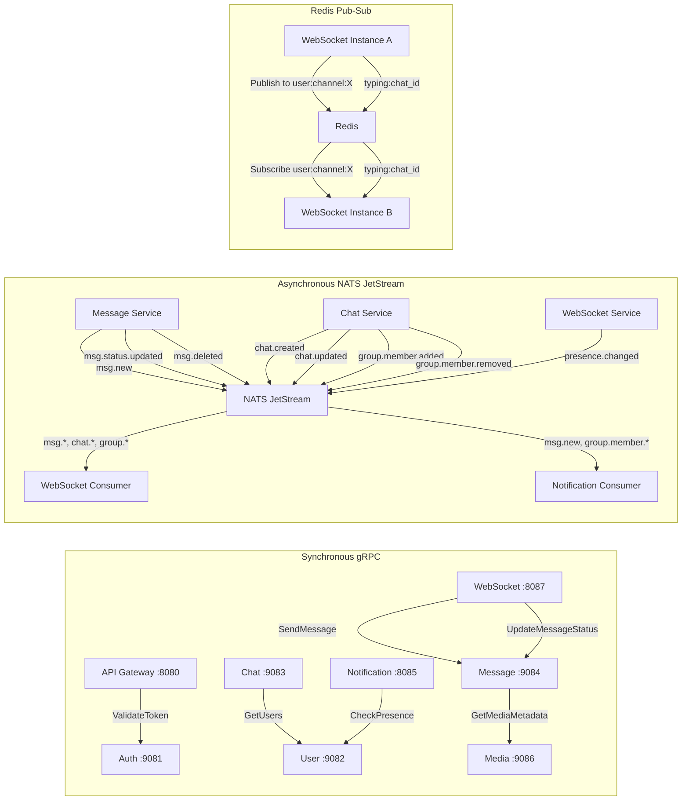

---

## 6. Data Architecture

### 6.1 Polyglot Persistence Strategy

#### Why PostgreSQL for Relational Data

PostgreSQL stores data with strong relational integrity requirements:

- **Users and contacts**: The `contacts` table has foreign keys to `users(id)` with `ON DELETE CASCADE`. This ensures referential integrity: if a user is deleted, their contacts are cleaned up automatically.
- **Chats and participants**: The `chat_participants` table is a many-to-many join between `chats` and `users`. PostgreSQL's JOIN performance is critical for queries like "list all chats for user X with participant details."
- **Group constraints**: The `groups` table uses `CHECK` constraints (`is_admin_only`) and the application layer enforces business rules (min 1 admin, max 256 members). PostgreSQL's ACID transactions ensure that adding a member and updating the participant count are atomic.
- **Auth tokens**: Refresh token revocation requires strong consistency. When a token is revoked, subsequent validation attempts must immediately see the revocation. PostgreSQL's read-after-write consistency guarantees this.

#### Why MongoDB for Messages

MongoDB stores messages because:

- **Write-heavy workload**: Messages are append-only in the common case. MongoDB's write-optimized WiredTiger storage engine with document-level locking provides high throughput for concurrent message inserts.
- **Flexible schema**: Different message types (text, image, video, audio, document, system) have different payload shapes. MongoDB's schemaless documents accommodate this naturally with a polymorphic `payload` field.
- **Embedded status tracking**: Per-recipient status (`sent`, `delivered`, `read`) is stored as an embedded map within the message document. This avoids an additional join table that PostgreSQL would require.
- **Time-series-like queries**: Message history is always queried by `(chat_id, created_at DESC)` with cursor-based pagination. MongoDB's compound index `{ chat_id: 1, created_at: -1 }` serves this pattern efficiently.
- **Text search**: MongoDB's built-in text index on `payload.body` enables in-chat message search without an external search engine.

#### Why Redis for Ephemeral State

Redis stores transient data with TTL requirements:

- **Presence (`presence:<user_id>`)**: Online status with 60s TTL, refreshed by WebSocket heartbeat. If the service crashes, presence keys expire automatically rather than leaving stale "online" states.
- **Typing indicators (`typing:<chat_id>:<user_id>`)**: 5s TTL. Typing state auto-expires even if the client fails to send `typing.stop`.
- **OTP codes (`otp:<phone>`)**: 5-minute TTL. Expired OTPs cannot be verified.
- **Rate limiting (`rate:<ip>:<endpoint>`)**: Counter with 1-minute TTL for sliding window rate limiting.
- **Session tokens (`session:<user_id>`)**: Refresh token hash with 30-day TTL. Enables fast session lookup without querying PostgreSQL.
- **Pub-Sub channels**: Fire-and-forget messaging for WebSocket fan-out. No persistence needed; if a message is missed, the client can fetch history via REST.

### 6.2 Data Ownership Per Service

The following principle is enforced: **no service directly accesses another service's database tables or collections.** All cross-service data access goes through gRPC or NATS events.

| Service | Writes | Reads (own) | Reads (cross-service via gRPC) |
|---------|--------|-------------|-------------------------------|
| auth-service | `refresh_tokens`, `otp:*`, `session:*` | `refresh_tokens`, `otp:*`, `session:*` | — |
| user-service | `users`, `contacts`, `privacy_settings`, `device_tokens`, `presence:*` | All owned | — |
| chat-service | `chats`, `chat_participants`, `groups` | All owned | `user-service.GetUsers` for participant enrichment |
| message-service | `messages` collection | `messages` collection | `media-service.GetMediaMetadata` for media enrichment |
| notification-service | — (reads only) | — | `user-service.CheckPresence`, reads `device_tokens` |
| media-service | `media` collection, MinIO objects | All owned | — |
| websocket-service | `typing:*`, `user:channel:*` (Redis) | Connection registry (in-memory) | `auth-service.ValidateToken`, `message-service.SendMessage` |
| api-gateway | `rate:*` (Redis) | `rate:*` | `auth-service.ValidateToken` |

**Exception**: `notification-service` reads `device_tokens` from PostgreSQL. This is a pragmatic exception since device tokens are relatively static and adding a gRPC call for every notification would be wasteful. In a production system, this could be resolved by having `user-service` publish device token changes via NATS, with `notification-service` maintaining its own local cache.

### 6.3 PostgreSQL Entity-Relationship Diagram

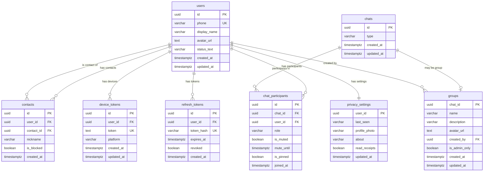

### 6.4 Index Strategy

#### PostgreSQL Indexes

| Table | Index | Columns | Purpose |
|-------|-------|---------|---------|
| `users` | `idx_users_phone` | `phone` | Phone number lookup during OTP verify and contact sync |
| `contacts` | `idx_contacts_user` | `user_id` | List contacts for a user |
| `contacts` | `UNIQUE(user_id, contact_id)` | Composite | Prevent duplicate contact entries |
| `chat_participants` | `idx_chat_participants_user` | `user_id` | List chats for a user |
| `chat_participants` | `idx_chat_participants_chat` | `chat_id` | List participants in a chat |
| `chat_participants` | `UNIQUE(chat_id, user_id)` | Composite | Prevent duplicate memberships |
| `device_tokens` | `idx_device_tokens_user` | `user_id` | Find all tokens for a user (for push notifications) |
| `refresh_tokens` | `idx_refresh_tokens_user` | `user_id` | Find all tokens for a user (for revocation) |

#### MongoDB Indexes

| Collection | Index | Fields | Purpose |
|------------|-------|--------|---------|
| `messages` | Compound | `{ chat_id: 1, created_at: -1 }` | Paginated message history |
| `messages` | Unique | `{ client_msg_id: 1 }` | Idempotency deduplication |
| `messages` | Text | `{ chat_id: 1, "payload.body": "text" }` | In-chat message search |
| `media` | Unique | `{ media_id: 1 }` | Media lookup by ID |
| `media` | Standard | `{ uploader_id: 1 }` | List media by uploader |

---

## 7. Key Request Flows

### 7.1 User Registration (OTP Send + Verify + User Creation)

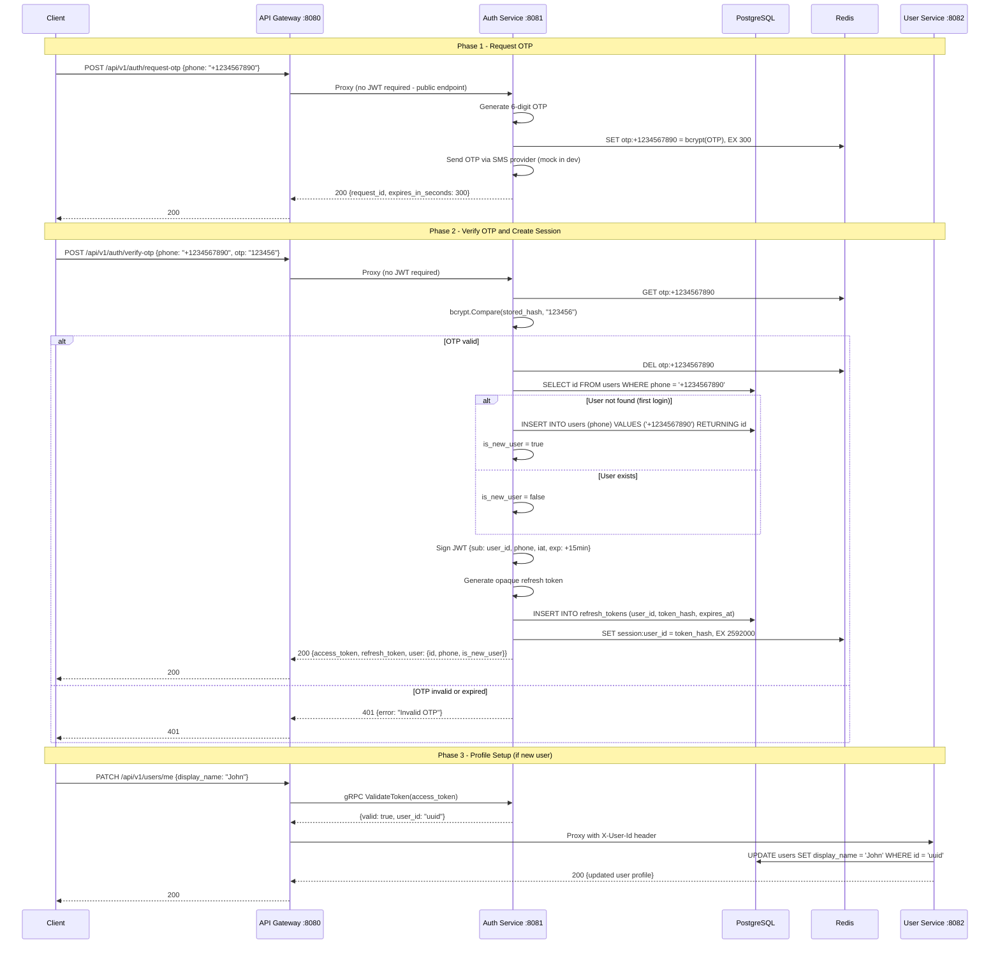

### 7.2 Send Message (WebSocket Path)

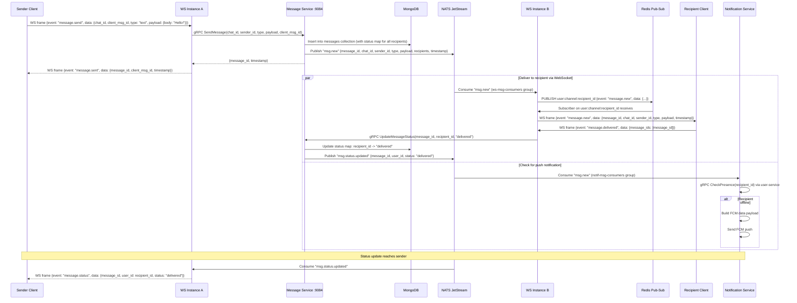

### 7.3 Send Message (REST Fallback)

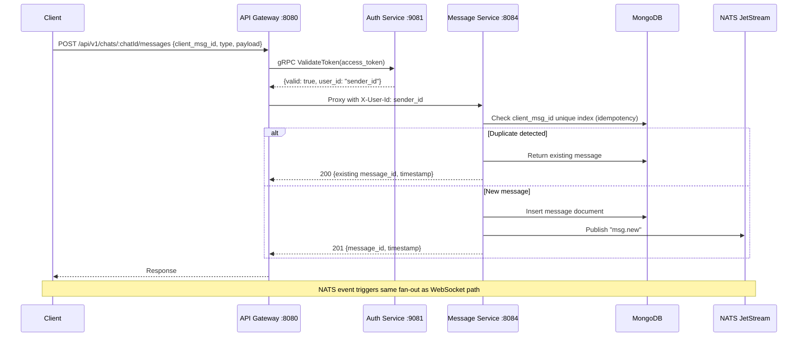

### 7.4 Group Creation

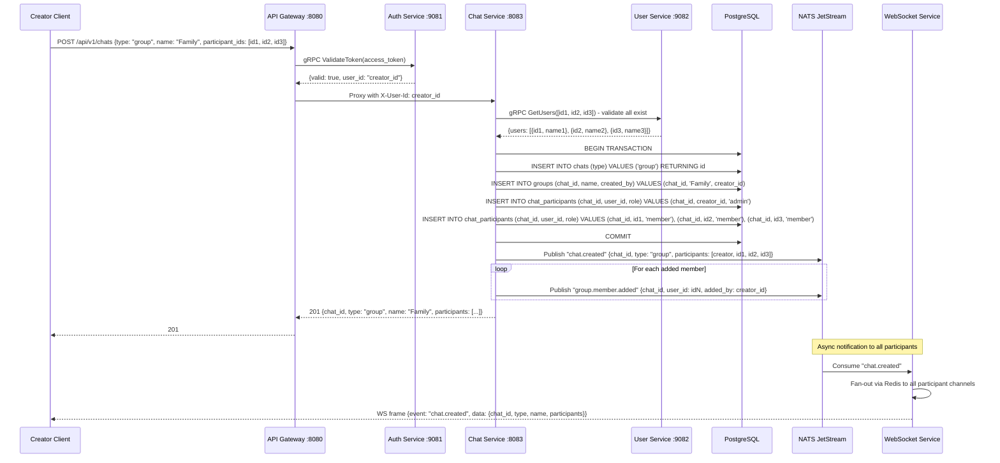

### 7.5 Media Upload + Send Media Message

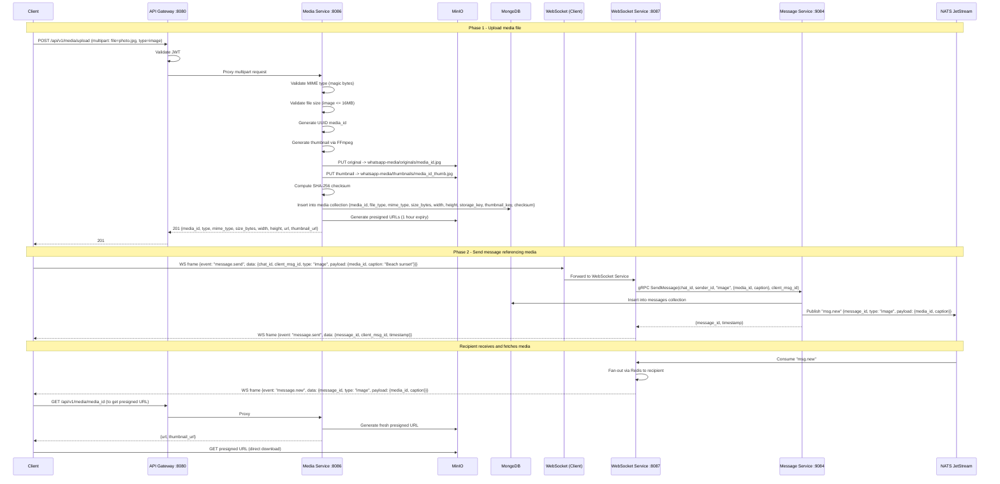

### 7.6 Message Status Update (Delivered + Read)

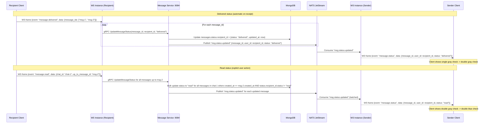

### 7.7 Typing Indicator Flow

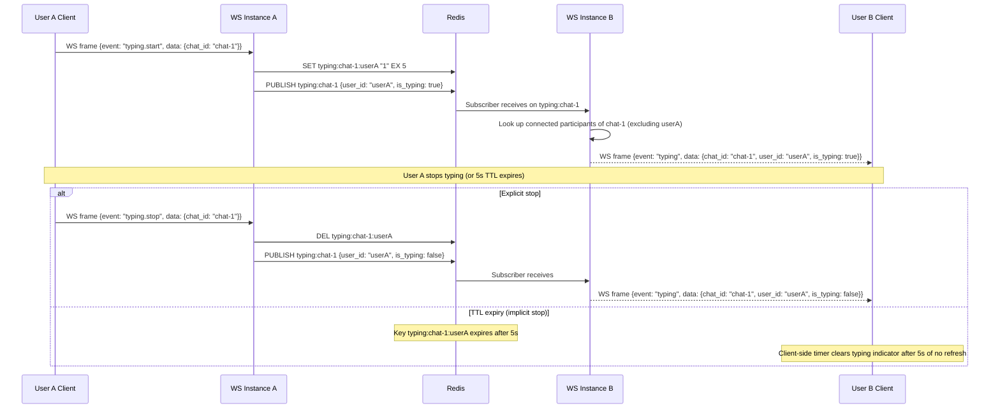

### 7.8 Contact Sync Flow

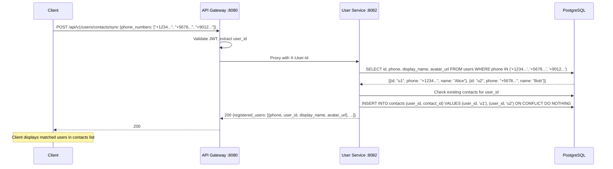

### 7.9 Push Notification Decision Flow

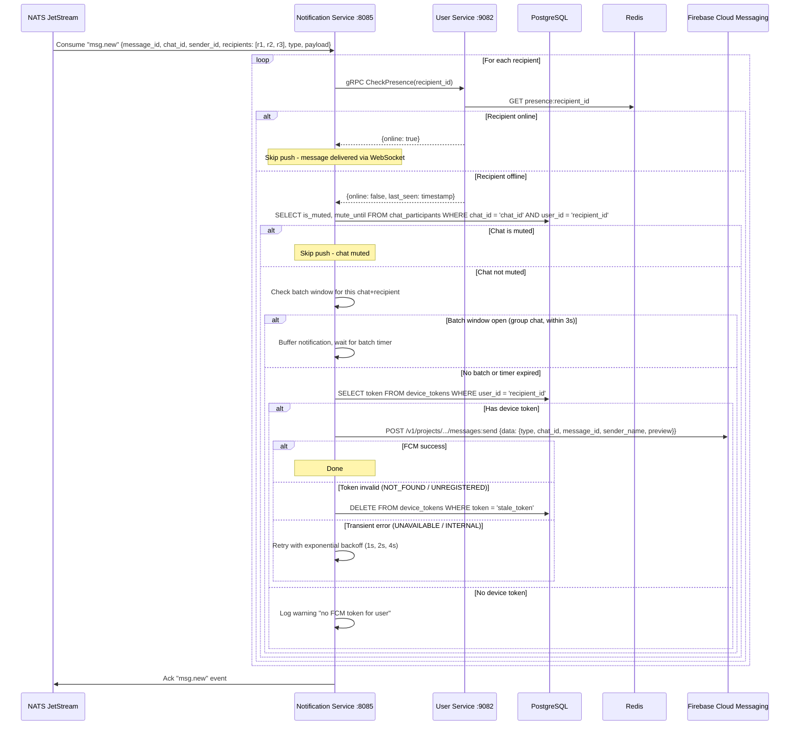

---

## 8. WebSocket Architecture

### 8.1 Connection Lifecycle

```
1. Client opens: WSS wss://<ngrok-domain>/ws?token=<jwt_access_token>
2. API Gateway proxies the upgrade request to websocket-service :8087
3. WebSocket Service validates JWT (via auth-service gRPC ValidateToken)
   - Invalid/expired token -> close with code 4001
4. Register connection in memory: connRegistry[user_id] = append(conns, conn)
5. Set presence: Redis SET presence:<user_id> "online" EX 60
6. Publish presence: Redis PUBLISH presence:updates {user_id, status: "online"}
7. Subscribe to Redis channel: user:channel:<user_id>
8. Bidirectional communication begins (JSON text frames)
9. Heartbeat loop: expect client "ping" every 25s, respond with "pong"
   - Each ping refreshes: Redis SET presence:<user_id> "online" EX 60
10. On disconnect (client close, network drop, or 60s ping timeout):
    - Unregister: delete connRegistry[user_id][conn]
    - If no remaining connections for user:
      - Redis DEL presence:<user_id>
      - Redis PUBLISH presence:updates {user_id, status: "offline"}
      - PostgreSQL UPDATE users SET last_seen = NOW() WHERE id = user_id
    - Unsubscribe from Redis channel
    - Clean up goroutines (read pump, write pump)
```

### 8.2 In-Memory Connection Registry Design

The connection registry is an in-memory data structure within each WebSocket service instance:

```
Type: sync.RWMutex-protected map[string][]*Connection

Connection struct:
  - UserID     string
  - Conn       *websocket.Conn
  - Send       chan []byte        // Buffered write channel (256 messages)
  - CreatedAt  time.Time
  - LastPing   time.Time

Operations:
  - Register(userID, conn)     -> Adds connection to user's slice
  - Unregister(userID, conn)   -> Removes specific connection
  - GetConnections(userID)     -> Returns all connections for a user
  - GetAllUserIDs()            -> Returns all connected user IDs (for stats)
  - Count()                    -> Total connection count (for metrics)
```

Each connection spawns two goroutines:
- **Read pump**: Reads frames from WebSocket, parses events, dispatches to event handlers.
- **Write pump**: Reads from the `Send` channel and writes frames to WebSocket. Handles ping/pong.

The `Send` channel is buffered (256 messages). If the channel is full (slow client), the connection is closed to prevent memory buildup.

### 8.3 Multi-Instance Fan-Out via Redis

When multiple WebSocket service instances are running, a message for User B (connected to Instance 2) may be consumed from NATS by Instance 1. Redis Pub-Sub bridges this gap:

```
Instance 1 (consumes msg.new from NATS):
  1. Determine recipients for chat
  2. For each recipient:
     a. Check local registry: connRegistry[recipient_id]
     b. If found locally -> write directly to connection's Send channel
     c. ALSO publish to Redis: PUBLISH user:channel:<recipient_id> {serialized event}

Instance 2 (subscribed to user:channel:<recipient_id>):
  1. Receive message from Redis subscription
  2. Check local registry: connRegistry[recipient_id]
  3. If found -> write to connection's Send channel
  4. If not found -> ignore (user disconnected or on another instance)
```

This "publish always, deliver locally if possible" pattern ensures that:
- Messages are never lost due to instance mismatch.
- Local connections get sub-millisecond delivery (no Redis round-trip needed for the direct path).
- The Redis overhead is minimal (small JSON payloads on targeted channels).

### 8.4 Heartbeat Mechanism

| Parameter | Value |
|-----------|-------|
| Client ping interval | 25 seconds |
| Server pong response | Immediate |
| Server read deadline | 60 seconds (from last received frame) |
| Presence TTL refresh | On every ping (Redis SET EX 60) |

The heartbeat serves three purposes:
1. **Connection health**: Detects dead connections (network drops, client crashes) within 60 seconds.
2. **Presence refresh**: Each ping extends the `presence:<user_id>` Redis key's TTL by 60 seconds, keeping the user's online status current.
3. **NAT traversal**: Regular frames prevent intermediate NAT/proxy timeouts from closing idle connections.

### 8.5 Reconnection Handling

When a client detects a disconnection:

1. **Client-side exponential backoff**: Reconnect attempts at 1s, 2s, 4s, 8s, 16s, capped at 30s.
2. **Token refresh before reconnect**: If the JWT has expired, the client calls `POST /api/v1/auth/refresh` first, then reconnects with the new token.
3. **Message catch-up**: After reconnecting, the client calls `GET /api/v1/chats/:chatId/messages?cursor=<last_known_message_id>` for each active chat to fetch missed messages.
4. **Status resync**: The client sends `message.delivered` for any messages received via REST catch-up that were not previously acknowledged.

### 8.6 Event Routing

The WebSocket service acts as a router between external events and connected clients:

| Event Source | WebSocket Action |
|-------------|-----------------|
| NATS `msg.new` | Deliver to recipient connections via Redis fan-out |
| NATS `msg.status.updated` | Deliver to sender connection |
| NATS `msg.deleted` | Deliver to all chat participant connections |
| NATS `chat.created` | Deliver to all participant connections |
| NATS `chat.updated` | Deliver to all participant connections |
| NATS `group.member.added` | Deliver to all chat participant connections |
| NATS `group.member.removed` | Deliver to removed user + remaining participants |
| Redis `typing:<chat_id>` | Deliver to all connected chat participants (excluding typer) |
| Redis `presence:updates` | Deliver to users who subscribed via `presence.subscribe` |
| Client `message.send` | gRPC to message-service, then ack back to sender |
| Client `message.delivered` | gRPC to message-service for status update |
| Client `message.read` | gRPC to message-service for status update |
| Client `ping` | Respond with `pong`, refresh Redis presence TTL |

---

## 9. Security Architecture

### 9.1 JWT Lifecycle

#### Token Issuance

```
Phone + OTP -> auth-service.VerifyOTP()
  -> Generate access token (JWT, HS256 signed)
     Claims: { sub: user_id, phone: "+1234567890", iat: unix_ts, exp: iat + 900 }
     TTL: 15 minutes
  -> Generate refresh token (opaque, crypto/rand 32 bytes, base64url encoded)
     Storage: SHA-256 hash stored in refresh_tokens table + Redis session:<user_id>
     TTL: 30 days
  -> Return both tokens to client
```

#### Token Validation (per-request)

```
Client sends: Authorization: Bearer <access_token>
API Gateway middleware:
  1. Extract token from header
  2. gRPC call: auth-service.ValidateToken(token)
  3. Auth service: jwt.Parse(token, signingKey)
     - Check exp claim (not expired)
     - Check signature (HS256)
     - Return {valid: true, user_id, phone} or {valid: false}
  4. If valid: set X-User-Id header, forward to downstream service
  5. If invalid: return 401 Unauthorized
```

#### Token Refresh

```
Client detects 401 on API call:
  1. POST /api/v1/auth/refresh {refresh_token: "opaque-token"}
  2. Auth service:
     a. Hash the incoming token: SHA-256(refresh_token)
     b. Look up in refresh_tokens table: WHERE token_hash = hash AND revoked = false AND expires_at > now()
     c. If found:
        - Revoke old refresh token: UPDATE refresh_tokens SET revoked = true
        - Issue new access token + new refresh token (token rotation)
        - Insert new refresh token record
        - Update Redis session:<user_id>
        - Return new token pair
     d. If not found or revoked: return 401 (force re-login)
```

#### Token Revocation (Logout)

```
POST /api/v1/auth/logout
  1. Revoke refresh token: UPDATE refresh_tokens SET revoked = true WHERE user_id = X AND revoked = false
  2. Delete Redis session: DEL session:<user_id>
  3. Delete FCM device token: DELETE FROM device_tokens WHERE user_id = X
  4. Access token continues to work until natural expiry (15 min max)
     - For immediate revocation: maintain a short-lived token blacklist in Redis (TTL = remaining token lifetime)
```

### 9.2 OTP Flow

```
Request OTP:
  1. Validate phone number (E.164 format)
  2. Rate limit check: GET rate:otp:<phone> (max 3 requests per 5 minutes)
  3. Generate 6-digit OTP: crypto/rand
  4. Hash OTP: bcrypt(otp, cost=10)
  5. Store in Redis: SET otp:<phone> = hashed_otp, EX 300 (5 minutes)
  6. Send via SMS provider (mock in local dev: log OTP to console)

Verify OTP:
  1. Rate limit check: GET rate:otp-verify:<phone> (max 5 attempts per 5 minutes)
  2. Retrieve: GET otp:<phone>
  3. Compare: bcrypt.Compare(stored_hash, submitted_otp)
  4. If match: DEL otp:<phone>, proceed to token issuance
  5. If no match: increment rate limit counter, return 401
  6. After 5 failed attempts: lock out for 5 minutes
```

### 9.3 Rate Limiting Strategy

The API Gateway implements token-bucket rate limiting using Redis:

| Scope | Key Pattern | Limit | Window | Action on Exceed |
|-------|-------------|-------|--------|-----------------|
| OTP send per phone | `rate:otp:<phone>` | 3 requests | 5 minutes | 429 Too Many Requests |
| OTP verify per phone | `rate:otp-verify:<phone>` | 5 attempts | 5 minutes | 429 + temporary lockout |
| API per user (general) | `rate:user:<user_id>` | 100 requests | 1 minute | 429 Too Many Requests |
| API per IP (unauthenticated) | `rate:ip:<ip>` | 30 requests | 1 minute | 429 Too Many Requests |
| WebSocket messages per user | In-memory counter | 30 messages | 10 seconds | WS close code 4029 |
| Media upload per user | `rate:upload:<user_id>` | 10 uploads | 1 minute | 429 Too Many Requests |

Implementation uses Redis `INCR` + `EXPIRE`:

```
key = "rate:user:" + user_id
count = Redis INCR key
if count == 1:
    Redis EXPIRE key 60   // Set window on first request
if count > 100:
    return 429
```

### 9.4 Input Validation Approach

- **Struct-level validation**: Gin's `binding:"required"` tags enforce presence. Custom validators for phone (E.164 regex), UUIDs (v4 format), and length constraints.
- **Phone numbers**: Validated against E.164 format (`^\+[1-9]\d{1,14}$`).
- **UUIDs**: Parsed via `uuid.Parse()` before any database query. Invalid UUIDs return 400 immediately.
- **File uploads**: Validated by reading magic bytes (file signature), not just the extension or Content-Type header. This prevents uploading malicious files disguised with a `.jpg` extension.
- **SQL injection prevention**: All PostgreSQL queries use parameterized queries via `pgx` (`$1`, `$2` placeholders). No string concatenation in SQL.
- **NoSQL injection prevention**: MongoDB Go driver uses typed BSON builders. No raw JSON-to-query conversion.
- **Message content**: Maximum body length of 4096 characters. Caption length of 1024 characters. Sanitized for any control characters.

### 9.5 Data Protection

| Data | Protection Mechanism |
|------|---------------------|
| OTP codes | bcrypt hash before Redis storage. Plain OTP never persisted. |
| Refresh tokens | SHA-256 hash stored in PostgreSQL `token_hash` column. Plain token returned to client only once. |
| JWT signing key | `JWT_SECRET` environment variable. HS256 symmetric signing. Rotated via env var update + rolling restart. |
| Media files | Presigned URLs with 1-hour expiry. No direct public access to MinIO. Bucket policy denies anonymous reads. |
| User phone numbers | Stored in PostgreSQL. Not exposed in API responses to other users (only to the user themselves and via contact sync). |
| Passwords | N/A. System uses OTP-only authentication, no passwords stored. |

### 9.6 Inter-Service Trust Model

| Communication Path | Trust Mechanism |
|-------------------|----------------|
| Client -> API Gateway | JWT access token validated on every request |
| API Gateway -> Services | Trusted internal network. Gateway sets `X-User-Id` header after validation. Services trust this header. |
| Service -> Service (gRPC) | Trusted internal network within K8s cluster. No per-request auth. |
| Service -> NATS | NATS runs on internal cluster network. No authentication for local dev. |
| Service -> PostgreSQL/MongoDB/Redis | Connection string credentials via environment variables. No TLS for local dev. |
| **Production stretch goal** | mTLS between all services via service mesh (Istio/Linkerd). NATS with TLS + token auth. Database connections with TLS. |

---

## 10. Scalability Architecture

### 10.1 Horizontal Scaling Per Service

Every service is designed to run as multiple replicas behind a Kubernetes Service (ClusterIP). Scaling decisions are based on the service's bottleneck:

| Service | Scaling Dimension | Bottleneck | Scaling Strategy |
|---------|------------------|-----------|-----------------|
| api-gateway | Request throughput | CPU (proxy + JWT validation) | HPA on CPU (target 70%) |
| auth-service | Login rate | CPU (bcrypt hashing) + Redis ops | HPA on CPU (target 60%, bcrypt is CPU-intensive) |
| user-service | Read throughput | PostgreSQL connection pool | HPA on CPU, with connection pool limits |
| chat-service | Chat operations | PostgreSQL writes | HPA on CPU |
| message-service | Write throughput | MongoDB write IOPS | HPA on custom metric (NATS consumer lag) |
| notification-service | Event processing rate | FCM API latency | HPA on NATS consumer lag |
| media-service | Upload bandwidth | Network I/O + FFmpeg CPU | HPA on CPU (FFmpeg is CPU-bound) |
| websocket-service | Connection count | Memory (per-connection goroutines) | HPA on memory + custom metric (connection count) |

### 10.2 Stateless Design

All services are stateless with one exception:

- **Stateless services** (api-gateway, auth, user, chat, message, notification, media): Any replica can handle any request. Session state lives in Redis, not in process memory. New replicas start serving immediately.
- **Stateful-compensated service** (websocket-service): The in-memory connection registry makes each instance stateful (it knows which users are connected to it). However, this is compensated by:
  - **Redis Pub-Sub fan-out**: Messages published to `user:channel:<user_id>` reach all instances. The instance holding the user's connection delivers it.
  - **Sticky sessions**: The API Gateway (or K8s ingress) uses cookie-based sticky sessions for WebSocket upgrades, so a user's connection consistently routes to the same instance.
  - **Graceful handoff**: When a WebSocket instance is terminated, clients reconnect (exponential backoff) and are routed to a different healthy instance. The brief disconnection is tolerable because clients can catch up via REST.

### 10.3 WebSocket Scaling with Redis Pub-Sub

The WebSocket service scaling model:

```
                   +-----------------------+
                   |   Load Balancer       |
                   | (Sticky Sessions)     |
                   +-----------+-----------+
                      /        |        \
               +------+   +------+   +------+
               | WS-1 |   | WS-2 |   | WS-3 |
               | 3000  |   | 3000  |   | 3000  |
               | conns |   | conns |   | conns |
               +---+---+   +---+---+   +---+---+
                   |            |            |
                   +------------+------------+
                               |
                         +-----+-----+
                         |   Redis   |
                         | Pub-Sub   |
                         +-----------+
```

- Each instance handles up to ~10,000 concurrent WebSocket connections.
- To support 30,000 users: 3 instances, each handling ~10,000 connections.
- Redis Pub-Sub overhead is minimal: ~1KB per message published, ~$O(subscribers)$ delivery.
- Scaling beyond a single Redis node: use Redis Cluster with hash-tag routing (`{user_id}` ensures per-user channels land on the same shard).

### 10.4 NATS Consumer Groups for Load Distribution

NATS JetStream consumer groups distribute event processing across service replicas:

```
                    +-------------------+
                    | NATS JetStream    |
                    | Stream: MESSAGES  |
                    +--------+----------+
                             |
              +--------------+--------------+
              |                             |
    +---------+---------+        +----------+----------+
    | Consumer Group:   |        | Consumer Group:     |
    | ws-msg-consumers  |        | notif-msg-consumers |
    +---+-------+---+---+        +---+--------+---+---+
        |       |   |                |        |   |
      WS-1   WS-2  WS-3          NOTIF-1  NOTIF-2  NOTIF-3
```

- Each message in a WorkQueue stream is delivered to exactly one consumer in each consumer group.
- Adding a new websocket-service replica automatically joins the `ws-msg-consumers` group and begins receiving a share of events.
- If a consumer fails to ack within `AckWait` (30s), the message is redelivered to another consumer in the group.

### 10.5 Database Scaling Considerations

| Database | Current (Local Dev) | Future (Production) |
|----------|-------------------|-------------------|
| **PostgreSQL** | Single instance | Read replicas for user-service queries. Connection pooling via PgBouncer. Partitioning `chat_participants` by `chat_id` range. |
| **MongoDB** | Single instance | Replica set for HA. Shard `messages` collection by `chat_id` (range sharding) for write distribution. TTL index on `created_at` for message retention policy. |
| **Redis** | Single instance | Redis Sentinel for HA. Redis Cluster for horizontal scaling of Pub-Sub channels. Separate Redis instances for cache vs. Pub-Sub to isolate workloads. |
| **MinIO** | Single instance | Distributed MinIO (4+ nodes) with erasure coding for data durability. CDN in front for download acceleration. |
| **NATS** | Single instance with JetStream | 3-node NATS cluster with JetStream replicas for stream HA. |

---

## 11. Infrastructure Architecture

### 11.1 Docker Multi-Stage Builds

Every service uses the same multi-stage Dockerfile pattern:

```
Stage 1 - Builder (golang:1.22-alpine):
  - Copy go.mod, go.sum
  - Run go mod download (cached layer)
  - Copy source code
  - Build static binary: CGO_ENABLED=0 GOOS=linux go build -o /service ./cmd/main.go

Stage 2 - Runtime (alpine:3.19):
  - Install ca-certificates, tzdata (for TLS and timezone support)
  - Copy binary from builder
  - Set EXPOSE port
  - Set ENTRYPOINT ["/service"]
```

Final image size: ~15-25MB per service (compared to ~800MB for the full Go SDK image).

The `media-service` Dockerfile has an additional step to install FFmpeg in the runtime image for thumbnail generation.

### 11.2 Docker Compose for Local Development

The `docker-compose.yml` defines 13 services (8 application services + 5 infrastructure services):

| Service | Image/Build | Ports | Depends On |
|---------|------------|-------|------------|
| postgres | postgres:16-alpine | 5432 | — |
| mongodb | mongo:7 | 27017 | — |
| redis | redis:7-alpine | 6379 | — |
| nats | nats:2-alpine (--jetstream) | 4222, 8222 | — |
| minio | minio/minio:latest | 9000, 9001 | — |
| api-gateway | ./api-gateway | 8080 | redis |
| auth-service | ./auth-service | 8081, 9081 | postgres, redis |
| user-service | ./user-service | 8082, 9082 | postgres, redis |
| chat-service | ./chat-service | 8083, 9083 | postgres, nats |
| message-service | ./message-service | 8084, 9084 | mongodb, redis, nats |
| notification-service | ./notification-service | 8085 | postgres, redis, nats |
| media-service | ./media-service | 8086, 9086 | mongodb, minio |
| websocket-service | ./websocket-service | 8087 | redis, nats |

Named volumes: `pgdata`, `mongodata`, `natsdata`, `miniodata` for data persistence across restarts.

### 11.3 Kind Cluster Topology

```
Kind Cluster: "whatsapp"

+---------------------------+
| Control Plane Node        |
| - K8s API Server          |
| - etcd                    |
| - Scheduler               |
| - Controller Manager      |
| Port Mapping: 30080->8080 |
+---------------------------+

+---------------------------+    +---------------------------+
| Worker Node 1             |    | Worker Node 2             |
| - api-gateway pod         |    | - message-service pod     |
| - auth-service pod        |    | - notification-service pod|
| - user-service pod        |    | - media-service pod       |
| - chat-service pod        |    | - websocket-service pod   |
| - postgresql pod          |    | - mongodb pod             |
| - redis pod               |    | - nats pod                |
|                           |    | - minio pod               |
+---------------------------+    +---------------------------+
```

The Kind configuration exposes port 30080 on the host, mapped to the API Gateway's NodePort service. ngrok connects to `localhost:30080` (or `localhost:8080` in Docker Compose mode).

### 11.4 Helm Umbrella Chart Structure

```
helm/
├── Chart.yaml                  # Umbrella chart metadata
├── values.yaml                 # Global defaults (image tags, resource limits)
└── charts/
    ├── api-gateway/
    │   ├── Chart.yaml
    │   ├── values.yaml
    │   └── templates/
    │       ├── deployment.yaml     # 1 replica, 128Mi memory, 100m CPU
    │       ├── service.yaml        # ClusterIP + NodePort (30080)
    │       ├── configmap.yaml      # Service URLs, Redis URL
    │       └── hpa.yaml            # Optional HPA
    ├── auth-service/
    │   └── templates/
    │       ├── deployment.yaml     # 1 replica, 128Mi memory, 100m CPU
    │       ├── service.yaml        # ClusterIP (8081, 9081)
    │       ├── configmap.yaml      # DATABASE_URL, REDIS_URL
    │       └── secret.yaml         # JWT_SECRET
    ├── user-service/              # Similar structure
    ├── chat-service/              # Similar structure
    ├── message-service/           # Similar structure
    ├── notification-service/      # Similar structure, + FCM secret
    ├── media-service/             # Similar structure
    ├── websocket-service/         # Similar structure
    ├── postgresql/                # Bitnami PostgreSQL subchart or custom
    ├── mongodb/                   # Bitnami MongoDB subchart or custom
    ├── redis/                     # Bitnami Redis subchart or custom
    ├── nats/                      # NATS official Helm chart
    └── minio/                     # MinIO official Helm chart
```

Deploy the entire stack: `helm install whatsapp ./helm -n whatsapp --create-namespace`

### 11.5 ngrok Tunnel

```
ngrok http 8080 --domain=<static-domain>.ngrok-free.app

Traffic flow:
  Android App -> HTTPS -> ngrok edge server -> ngrok tunnel -> localhost:8080 -> API Gateway
  Android App -> WSS -> ngrok edge server -> ngrok tunnel -> localhost:8080 -> API Gateway -> WS Upgrade -> WebSocket Service
```

The static ngrok domain is hardcoded in the Android client's `NetworkModule` as the base URL. This allows the backend to move between machines (e.g., home and office) without reconfiguring the client.

### 11.6 Resource Allocation Per Service (Local Dev)

| Service | CPU Request | CPU Limit | Memory Request | Memory Limit | Replicas |
|---------|------------|-----------|---------------|-------------|----------|
| api-gateway | 100m | 250m | 64Mi | 128Mi | 1 |
| auth-service | 100m | 250m | 64Mi | 128Mi | 1 |
| user-service | 100m | 250m | 64Mi | 128Mi | 1 |
| chat-service | 100m | 250m | 64Mi | 128Mi | 1 |
| message-service | 100m | 250m | 64Mi | 128Mi | 1 |
| notification-service | 50m | 150m | 64Mi | 128Mi | 1 |
| media-service | 200m | 500m | 128Mi | 256Mi | 1 |
| websocket-service | 100m | 250m | 128Mi | 256Mi | 1 |
| PostgreSQL | 200m | 500m | 256Mi | 512Mi | 1 |
| MongoDB | 200m | 500m | 256Mi | 512Mi | 1 |
| Redis | 100m | 250m | 64Mi | 128Mi | 1 |
| NATS | 100m | 250m | 64Mi | 128Mi | 1 |
| MinIO | 100m | 250m | 128Mi | 256Mi | 1 |
| **Total** | **1.55 cores** | **3.85 cores** | **1.4 GB** | **2.9 GB** | **13 pods** |

---

## 12. Observability Architecture

### 12.1 Structured Logging (zerolog)

All services use zerolog for structured JSON logging:

```json
{
  "level": "info",
  "service": "message-service",
  "request_id": "550e8400-e29b-41d4-a716-446655440000",
  "user_id": "user-uuid",
  "method": "POST",
  "path": "/api/v1/chats/chat-uuid/messages",
  "status": 201,
  "latency_ms": 12,
  "timestamp": "2024-01-15T10:30:00Z"
}
```

#### Log Levels and Usage

| Level | Usage | Example |
|-------|-------|---------|
| `DEBUG` | Detailed internal state (disabled in production) | "MongoDB query executed in 3ms" |
| `INFO` | Normal operations | "Message persisted: msg_id=X, chat_id=Y" |
| `WARN` | Recoverable issues | "FCM token invalid, removing stale token" |
| `ERROR` | Failures requiring attention | "MongoDB write failed: connection refused" |
| `FATAL` | Unrecoverable startup failures | "Cannot connect to PostgreSQL, exiting" |

#### Correlation

Every incoming HTTP request generates a `request_id` (UUID v4) in the API Gateway middleware. This ID is:
- Set as the `X-Request-Id` response header.
- Propagated to downstream services via the `X-Request-Id` request header.
- Included in every log line, gRPC metadata, and NATS message header.
- Used as the OpenTelemetry trace ID when tracing is enabled.

### 12.2 Metrics (Prometheus + Grafana)

#### RED Metrics Per Service

Every service exposes a `/metrics` endpoint (Prometheus format) with these standard metrics:

| Metric | Type | Labels | Description |
|--------|------|--------|-------------|
| `http_requests_total` | Counter | `service`, `method`, `path`, `status` | Total HTTP requests |
| `http_request_duration_seconds` | Histogram | `service`, `method`, `path` | Request latency distribution |
| `http_requests_in_flight` | Gauge | `service` | Currently processing requests |
| `grpc_server_handled_total` | Counter | `service`, `grpc_method`, `grpc_code` | Total gRPC calls handled |
| `grpc_server_handling_seconds` | Histogram | `service`, `grpc_method` | gRPC call latency |
| `grpc_client_handled_total` | Counter | `service`, `grpc_method`, `grpc_code` | Total outgoing gRPC calls |
| `nats_messages_published_total` | Counter | `service`, `subject` | NATS messages published |
| `nats_messages_consumed_total` | Counter | `service`, `subject`, `consumer_group` | NATS messages consumed |
| `nats_consumer_pending` | Gauge | `service`, `stream`, `consumer` | NATS consumer lag |

#### Service-Specific Metrics

| Service | Metric | Type | Description |
|---------|--------|------|-------------|
| websocket-service | `ws_connections_active` | Gauge | Current WebSocket connections |
| websocket-service | `ws_messages_sent_total` | Counter | WebSocket frames sent to clients |
| websocket-service | `ws_messages_received_total` | Counter | WebSocket frames received from clients |
| message-service | `messages_persisted_total` | Counter | Messages written to MongoDB |
| notification-service | `fcm_pushes_sent_total` | Counter | FCM notifications sent (with `status` label) |
| notification-service | `fcm_batch_size` | Histogram | Number of messages in each batch |
| media-service | `media_uploads_total` | Counter | Files uploaded (with `type` label) |
| media-service | `media_upload_bytes_total` | Counter | Total bytes uploaded |
| api-gateway | `rate_limit_exceeded_total` | Counter | Rate limit rejections |

#### Grafana Dashboards

- **Overview Dashboard**: Request rate, error rate, and p50/p95/p99 latency for all services.
- **WebSocket Dashboard**: Active connections, messages per second, disconnection rate.
- **Messaging Dashboard**: Messages persisted per second, NATS consumer lag, delivery latency (send to delivered).
- **Infrastructure Dashboard**: PostgreSQL connections, MongoDB ops/sec, Redis memory/commands, NATS stream sizes.

### 12.3 Distributed Tracing (OpenTelemetry + Jaeger)

#### Trace Propagation

```
Client Request -> API Gateway -> [gRPC] -> Service -> [NATS] -> Consumer Service
                  span: gateway    span: grpc-call    span: nats-publish  span: nats-consume
                  |_______________|___________________|___________________|
                                  Parent Trace
```

Traces are propagated via:
- **gRPC**: `otel-grpc` interceptor injects/extracts trace context from gRPC metadata.
- **NATS**: Trace context serialized into NATS message headers (`traceparent`, `tracestate`).
- **HTTP**: `otel-http` middleware injects/extracts from `traceparent` header.

#### Span Attributes

Each span includes:
- `service.name`: e.g., `message-service`
- `rpc.method`: e.g., `SendMessage`
- `db.system`: e.g., `mongodb`, `postgresql`, `redis`
- `db.operation`: e.g., `insert`, `find`, `set`
- `messaging.system`: `nats`
- `messaging.destination`: e.g., `msg.new`

### 12.4 Health Checks

Each service exposes two endpoints:

| Endpoint | Probe Type | Checks | Failure Action |
|----------|-----------|--------|---------------|
| `GET /health` | Liveness | Process is alive, not deadlocked | K8s restarts the pod |
| `GET /ready` | Readiness | Database connections alive, NATS connected | K8s removes pod from Service endpoints (no traffic) |

#### Readiness Checks Per Service

| Service | Readiness Checks |
|---------|-----------------|
| api-gateway | Redis ping |
| auth-service | PostgreSQL ping, Redis ping |
| user-service | PostgreSQL ping, Redis ping |
| chat-service | PostgreSQL ping, NATS connection |
| message-service | MongoDB ping, Redis ping, NATS connection |
| notification-service | PostgreSQL ping, Redis ping, NATS connection |
| media-service | MongoDB ping, MinIO bucket exists |
| websocket-service | Redis ping, NATS connection |

#### Kubernetes Probe Configuration

```yaml
livenessProbe:
  httpGet:
    path: /health
    port: http
  initialDelaySeconds: 5
  periodSeconds: 10
  failureThreshold: 3

readinessProbe:
  httpGet:
    path: /ready
    port: http
  initialDelaySeconds: 5
  periodSeconds: 5
  failureThreshold: 3
```

### 12.5 Alerting Strategy

| Alert | Condition | Severity | Action |
|-------|-----------|----------|--------|
| High Error Rate | `rate(http_requests_total{status=~"5.."}[5m]) / rate(http_requests_total[5m]) > 0.05` | Critical | Page on-call |
| High Latency | `histogram_quantile(0.95, http_request_duration_seconds) > 1.0` | Warning | Investigate |
| NATS Consumer Lag | `nats_consumer_pending > 1000` | Warning | Scale consumers |
| WebSocket Connection Drop | `delta(ws_connections_active[5m]) < -100` | Warning | Check WS service health |
| Database Connection Pool Exhausted | Pool utilization > 90% | Critical | Scale service or increase pool |
| FCM Push Failure Rate | `rate(fcm_pushes_sent_total{status="error"}[5m]) > 10` | Warning | Check FCM credentials |
| Pod Restarts | `kube_pod_container_status_restarts_total > 3` in 10m | Critical | Check logs for crash loop |

---

## 13. Failure Modes and Recovery

### 13.1 PostgreSQL Down

| Impact | Affected Services |
|--------|------------------|
| Cannot create/authenticate users | auth-service, user-service |
| Cannot manage chats/groups | chat-service |
| Cannot look up device tokens for push | notification-service |

**Degradation Strategy**:
- `auth-service`: Token validation continues to work (JWT is stateless). Token refresh and new logins fail with 503.
- `user-service`: Presence checks still work (Redis). Profile reads can be served from a Redis cache (if implemented). Writes fail with 503.
- `chat-service`: All operations fail with 503. Messages can still be sent to existing chats (message-service uses MongoDB, not PostgreSQL).
- `notification-service`: Push notifications degrade. NATS messages are buffered (AckWait + redelivery). Once PostgreSQL recovers, pending notifications are processed.

**Recovery**: PostgreSQL restarts. Services reconnect via connection pool retry. No data loss (WAL provides crash recovery). Buffered NATS events are processed.

### 13.2 MongoDB Down

| Impact | Affected Services |
|--------|------------------|
| Cannot persist or retrieve messages | message-service |
| Cannot store or retrieve media metadata | media-service |

**Degradation Strategy**:
- `message-service`: gRPC `SendMessage` returns error. WebSocket service returns WS error code 5000 to client. Client queues message locally for retry. Message history REST endpoint returns 503.
- `media-service`: Uploads fail with 503. Existing presigned URLs continue to work (direct MinIO access). Metadata lookup fails.
- Messages arriving via WebSocket are not lost: the WebSocket service receives a gRPC error from message-service and sends an error frame to the client. The client retains the message and retries.

**Recovery**: MongoDB restarts. Message service reconnects. Client retries pending messages with `client_msg_id` for idempotency.

### 13.3 Redis Down

| Impact | Affected Services |
|--------|------------------|
| Cannot validate rate limits | api-gateway |
| Cannot check presence or typing | websocket-service, user-service, notification-service |
| Cannot fan-out WebSocket messages across instances | websocket-service |
| Cannot verify OTP or check sessions | auth-service |

**Degradation Strategy**:
- `api-gateway`: Rate limiting disabled (fail-open). All requests pass through. Log warning.
- `websocket-service`: In-memory connections still work for single-instance delivery. Cross-instance fan-out fails; some recipients may not receive real-time messages until they refresh via REST. Typing indicators stop working.
- `auth-service`: OTP verification fails (503). Token validation still works (JWT is stateless). Token refresh may fail if session lookup is Redis-only.
- `user-service`: Presence returns unknown/offline for all users. Contact sync and profile operations still work (PostgreSQL).
- `notification-service`: Assumes all users are offline (fail-safe: sends push to everyone). This results in duplicate notifications for online users, but no missed notifications.

**Recovery**: Redis restarts. Services reconnect. Presence keys are repopulated as users send heartbeats. Rate limit counters reset (acceptable: brief window of unlimited requests).

### 13.4 NATS Down

| Impact | Affected Services |
|--------|------------------|
| Cannot publish message events | message-service |
| Cannot receive message events | websocket-service, notification-service |
| Cannot publish chat events | chat-service |

**Degradation Strategy**:
- `message-service`: Messages are persisted to MongoDB (synchronous write succeeds). NATS publish fails. Service buffers publish retry in-memory (bounded queue, 1000 events). If queue fills, events are written to a local disk fallback log.
- `websocket-service`: No new events from NATS. Connected clients do not receive real-time updates for messages sent by others. Clients can still send messages (via gRPC to message-service directly). Users can fetch missed messages via REST API.
- `notification-service`: Push notifications stop. NATS JetStream durability means events are not lost; they are stored on disk in the NATS data directory. Once NATS recovers, pending events are replayed and all missed notifications are sent.
- `chat-service`: Chat creation succeeds (PostgreSQL write), but events are not published. WebSocket clients are not notified. REST API still returns correct data.

**Recovery**: NATS restarts. JetStream replays unacknowledged messages from disk. Consumer groups resume processing. Notification service processes queued events. Brief delay but no data loss.

### 13.5 A Service Crashes

| Crashed Service | Impact | Recovery |
|----------------|--------|---------|
| api-gateway | All client traffic blocked | K8s restarts pod. ngrok reconnects. ~5s downtime. |
| auth-service | New logins and token refresh fail. Existing tokens continue working. | K8s restarts pod. ~3s downtime. |
| user-service | Profile and contact operations fail. Presence stale. | K8s restarts pod. Presence re-established on next heartbeat. |
| chat-service | Chat/group management fails. Messaging unaffected. | K8s restarts pod. |
| message-service | Message send and history fail. | K8s restarts pod. Client retries with `client_msg_id`. |
| notification-service | Push notifications delayed. | K8s restarts pod. NATS replays unacked events. |
| media-service | Upload/download metadata fails. Existing presigned URLs work. | K8s restarts pod. |
| websocket-service | All connected users disconnected. | K8s restarts pod. Clients reconnect with exponential backoff. |

### 13.6 Circuit Breakers

All gRPC client calls use `sony/gobreaker` circuit breakers:

```
Closed State:  Normal operation. Failures counted.
Open State:    All calls fail immediately with "service unavailable".
               No network calls made. Prevents cascading failure.
Half-Open:     After 30s timeout, allow 1 probe request.
               If it succeeds -> Closed. If it fails -> Open.
```

Circuit breaker configuration per call:

| Call | Failure Threshold | Reset Timeout | Fallback |
|------|------------------|---------------|----------|
| ValidateToken | 5 failures in 10s | 30s | Reject request (401) |
| SendMessage | 5 failures in 10s | 30s | Return error to WS client |
| UpdateMessageStatus | 5 failures in 10s | 30s | Queue retry in memory |
| GetUsers | 5 failures in 10s | 30s | Return partial response without enrichment |
| CheckPresence | 3 failures in 10s | 15s | Assume offline (fail-safe: send push) |
| GetMediaMetadata | 5 failures in 10s | 30s | Return message without media enrichment |

### 13.7 Dead Letter Queues

Events that exceed maximum delivery attempts are handled as follows:

| Stream | Max Deliveries | Dead Letter Action |
|--------|---------------|-------------------|
| MESSAGES (msg.new) | 5 | Log at ERROR level with full payload. Alert via Prometheus. Operator manually replays via NATS CLI. |
| MESSAGES (msg.status.updated) | 5 | Log at WARN level. Status will be corrected on next client sync. |
| CHATS (chat.created) | 5 | Log at ERROR. Client can still fetch chat via REST. |
| NOTIFICATIONS (msg.new) | 10 | Log at WARN. Notification is lost. Acceptable: user opens app and sees missed messages. |

---

## 14. Capacity Planning

### 14.1 Estimated Resource Requirements (Local Dev)

Target: Support 100 concurrent users, 50 active WebSocket connections, 10 messages/second.

| Component | CPU | Memory | Disk | Connections |
|-----------|-----|--------|------|-------------|
| api-gateway | 100m | 64-128Mi | — | — |
| auth-service | 100m | 64-128Mi | — | PG: 5, Redis: 5 |
| user-service | 100m | 64-128Mi | — | PG: 10, Redis: 5 |
| chat-service | 100m | 64-128Mi | — | PG: 10, NATS: 1 |
| message-service | 100m | 64-128Mi | — | Mongo: 10, Redis: 5, NATS: 1 |
| notification-service | 50m | 64-128Mi | — | PG: 5, Redis: 5, NATS: 1 |
| media-service | 200m | 128-256Mi | — | Mongo: 5, MinIO: 5 |
| websocket-service | 100m | 128-256Mi | — | Redis: 10, NATS: 1 |
| PostgreSQL | 200m | 256-512Mi | 1GB | Max: 100 |
| MongoDB | 200m | 256-512Mi | 1GB | Max: 100 |
| Redis | 100m | 64-128Mi | 100MB | Max: 1000 |
| NATS JetStream | 100m | 64-128Mi | 500MB | Max: 1000 |
| MinIO | 100m | 128-256Mi | 5GB | — |
| **Total** | **~1.55 cores** | **~1.4-2.9GB** | **~8GB** | — |

### 14.2 Connection Pool Sizes

| Service | Database | Pool Size | Max Idle | Max Lifetime |
|---------|----------|----------|----------|-------------|
| auth-service | PostgreSQL | 5 | 2 | 30 min |
| auth-service | Redis | 5 | 2 | 30 min |
| user-service | PostgreSQL | 10 | 5 | 30 min |
| user-service | Redis | 5 | 2 | 30 min |
| chat-service | PostgreSQL | 10 | 5 | 30 min |
| message-service | MongoDB | 10 | 5 | 30 min |
| message-service | Redis | 5 | 2 | 30 min |
| notification-service | PostgreSQL | 5 | 2 | 30 min |
| notification-service | Redis | 5 | 2 | 30 min |
| media-service | MongoDB | 5 | 2 | 30 min |
| websocket-service | Redis | 10 | 5 | 30 min |

### 14.3 Rate Limit Numbers

| Scope | Limit | Window | Burst |
|-------|-------|--------|-------|
| OTP send per phone | 3 | 5 min | 1 |
| OTP verify per phone | 5 | 5 min | 1 |
| General API per user | 100 | 1 min | 20 |
| General API per IP (unauthenticated) | 30 | 1 min | 10 |
| WebSocket messages per user | 30 | 10 sec | 5 |
| Media upload per user | 10 | 1 min | 2 |
| Contact sync per user | 5 | 1 min | 1 |

### 14.4 Throughput Estimates (Local Dev)

| Metric | Estimate | Derivation |
|--------|----------|-----------|
| Peak messages/second | 10 | 50 active users, 1 message every 5 seconds |
| Peak WebSocket frames/second | 50 | 10 msg/s * 2 (send + ack) + 20 status updates + typing |
| NATS events/second | 30 | 10 msg.new + 10 msg.status + 5 typing + 5 other |
| MongoDB writes/second | 15 | 10 message inserts + 5 status updates |
| PostgreSQL queries/second | 20 | Auth validation, chat lookups, user queries |
| Redis operations/second | 100 | Presence checks, rate limiting, pub-sub, typing |
| FCM pushes/second | 5 | ~50% of messages go to offline users |

### 14.5 Scaling Thresholds

| When This Happens | Scale This |
|-------------------|-----------|
| API Gateway CPU > 70% | Add api-gateway replica |
| WebSocket connections > 8,000 per instance | Add websocket-service replica |
| NATS consumer lag > 500 messages | Add consumer service replica |
| MongoDB write latency p95 > 50ms | Scale MongoDB (replica set / sharding) |
| PostgreSQL connection pool utilization > 80% | Increase pool size or add read replicas |
| Redis memory > 80% | Increase Redis memory limit or add cluster nodes |
| Message-service latency p95 > 100ms | Add message-service replica |
| Media upload queue time > 5s | Add media-service replica |
