# WhatsApp Clone Backend — Implementation Plan

> Derived from [HLD.md](./HLD.md), [LLD.md](./LLD.md), and [PRD.md](./PRD.md).
> Each task references the design section it implements.

## Table of Contents

1. [Overview](#1-overview)
2. [Phase 0 — Infrastructure Scaffold (Week 0)](#2-phase-0--infrastructure-scaffold-week-0)
3. [Phase 1 — MVP: Auth + 1-to-1 Messaging + WebSocket (Weeks 1-3)](#3-phase-1--mvp-auth--1-to-1-messaging--websocket-weeks-1-3)
4. [Phase 2 — Chat Service + Notifications + Message Status (Weeks 4-6)](#4-phase-2--chat-service--notifications--message-status-weeks-4-6)
5. [Phase 3 — Media Service (Weeks 7-8)](#5-phase-3--media-service-weeks-7-8)
6. [Phase 4 — Refinement: Typing, Contacts, Replies, Search, Privacy (Weeks 9-10)](#6-phase-4--refinement-typing-contacts-replies-search-privacy-weeks-9-10)
7. [Phase 5 — Stretch Goals (Week 11+)](#7-phase-5--stretch-goals-week-11)
8. [Dependency Graph](#8-dependency-graph)
9. [Risk Register](#9-risk-register)

---

## 1. Overview

### 1.1 Principles

- **Service-at-a-time**: Each sprint delivers a fully functional service with its own Dockerfile, tests, health checks, and docker-compose entry.
- **Shared-first**: `pkg/` libraries and `proto/` definitions are built in Phase 0 before any service code.
- **Test-as-you-go**: Every task includes unit and integration tests. No separate testing phase.
- **Infrastructure-parity**: Docker Compose runs from day 1; every service is containerized before any feature work.
- **Contract-driven**: Proto files and REST API contracts are defined before handler implementation. Services can be developed in parallel once contracts exist.

### 1.2 Effort Estimation Key

| Label | Meaning | Rough Hours |
|-------|---------|-------------|
| **XS** | Trivial config/boilerplate | 1-2h |
| **S** | Single file/function, straightforward | 2-4h |
| **M** | Multiple files, moderate complexity | 4-8h |
| **L** | Cross-cutting, significant logic | 8-16h |
| **XL** | Major feature, multi-day | 16-24h |

### 1.3 Conventions

- `[HLD §N]` = References section N in [HLD.md](./HLD.md)
- `[LLD §N.M]` = References section N.M in [LLD.md](./LLD.md)
- `[PRD §N]` = References section N in [PRD.md](./PRD.md)
- **AC** = Acceptance Criteria

---

## 2. Phase 0 — Infrastructure Scaffold (Week 0)

> **Goal**: Shared libraries compiled, proto files generated, Docker Compose boots all data stores, Makefile targets work, every service has a compilable skeleton with health endpoints. No business logic yet.

### Sprint 0A — Monorepo Bootstrap + Data Stores (Days 1-2)

| ID | Task | Size | Design Ref | Depends On | AC |
|----|------|------|-----------|------------|-----|
| **P0-01** | **Init monorepo structure** — Create `backend/` root with `Makefile`, `.gitignore`, `go.work` (Go workspace mode). Create directories: `pkg/`, `proto/`, `migrations/`, `helm/`, and all 8 service directories with identical `cmd/main.go`, `internal/`, `config/` structure. Each service gets its own `go.mod`. | M | [PRD §1.4], [LLD §3] | — | `go work sync` succeeds; all 8 service directories exist |
| **P0-02** | **Docker Compose — data stores** — `docker-compose.yml` with PostgreSQL 16, MongoDB 7, Redis 7, NATS JetStream (with `--jetstream --store_dir`), MinIO. Named volumes for persistence. Health checks on all containers. | M | [PRD §9.2], [HLD §11] | P0-01 | `docker compose up -d` boots all 5 stores; `docker compose ps` shows healthy |
| **P0-03** | **PostgreSQL migrations** — `migrations/postgres/` with golang-migrate files: `000001_create_users.up.sql`, `000002_create_contacts.up.sql`, `000003_create_chats.up.sql`, `000004_create_chat_participants.up.sql`, `000005_create_groups.up.sql`, `000006_create_device_tokens.up.sql`, `000007_create_refresh_tokens.up.sql`, `000008_create_privacy_settings.up.sql`. Matching `.down.sql` files. Makefile target `make migrate-up` / `migrate-down`. | L | [PRD §5.1], [LLD §4.3, §9.1] | P0-02 | `make migrate-up` creates all 8 tables; `make migrate-down` drops them cleanly |
| **P0-04** | **MongoDB index setup script** — `migrations/mongo/init.js` that creates indexes on `messages` collection (`chat_id+created_at`, `client_msg_id` unique, text index on `payload.body`) and `media` collection (`media_id` unique, `uploader_id`). Makefile target `make mongo-indexes`. | S | [PRD §5.2], [LLD §4.4, §9.2] | P0-02 | Indexes exist in MongoDB after running script |
| **P0-05** | **MinIO bucket init** — Script or Makefile target to create `whatsapp-media` bucket in MinIO on first boot using `mc` CLI or init container. | XS | [PRD §3.7] | P0-02 | `whatsapp-media` bucket exists; `mc ls` confirms |

### Sprint 0B — Shared Libraries (Days 2-3)

| ID | Task | Size | Design Ref | Depends On | AC |
|----|------|------|-----------|------------|-----|
| **P0-06** | **`pkg/config/`** — Base config loader: `Load[T any](prefix string) (T, error)` using struct tags for env var mapping with defaults. Used by all services. | S | [LLD §1.7, §10] | P0-01 | Unit test: env vars populate struct; defaults work; missing required fails |
| **P0-07** | **`pkg/logger/`** — zerolog wrapper: `New(serviceName) Logger`, `WithRequestID(ctx) Logger`, `WithUserID(ctx, id) Logger`. JSON output to stdout. | S | [LLD §1.2] | P0-01 | Unit test: log output contains service_name, request_id, level |
| **P0-08** | **`pkg/errors/`** — `AppError` struct (`Code string`, `Message string`, `HTTPStatus int`, `Err error`), `ErrorCode` constants (`VALIDATION_ERROR`, `UNAUTHORIZED`, `FORBIDDEN`, `NOT_FOUND`, `CONFLICT`, `RATE_LIMITED`, `INTERNAL`), `Is()`, `As()`, `Wrap()` helpers. | S | [LLD §1.3, §5] | P0-01 | Unit test: wrap + unwrap preserves original; As extracts AppError |
| **P0-09** | **`pkg/response/`** — `SuccessResponse(c *gin.Context, data any)`, `ErrorResponse(c *gin.Context, err error)`, `PaginatedResponse(c *gin.Context, data any, cursor string, hasMore bool)`. Standard envelope with `meta.request_id` and `meta.timestamp`. | S | [LLD §1.5], [PRD §6] | P0-08 | Unit test: success envelope matches PRD spec; errors map AppError to correct status |
| **P0-10** | **`pkg/middleware/`** — Gin middlewares: `RequestID()` (injects UUID into context + `X-Request-Id` header), `Logger()` (logs method, path, status, latency), `Recovery()` (panic -> 500), `CORS()` (configurable origins). | M | [LLD §1.4, §6] | P0-07 | Integration test: request gets X-Request-Id header; panic returns 500 JSON |
| **P0-11** | **`pkg/validator/`** — `ValidatePhone(phone string) error` (E.164 regex), `ValidateUUID(id string) error`, `ValidatePageSize(size int, max int) int` (clamps). | S | [LLD §1.6] | P0-08 | Unit test: valid E.164 passes; invalid fails; UUID validates |
| **P0-12** | **`pkg/jwt/`** — `Create(userID, phone, secret string, ttl time.Duration) (string, error)`, `Validate(tokenStr, secret string) (*Claims, error)`, `Claims` struct with `UserID`, `Phone`, `RegisteredClaims`. HS256 signing. | M | [LLD §1.1] | P0-01 | Unit test: create -> validate round-trip; expired token -> ErrTokenExpired |
| **P0-13** | **`pkg/health/`** — `RegisterHealthRoutes(r *gin.Engine, checks ...HealthChecker)`. `GET /health` (liveness), `GET /ready` (readiness — checks DB/Redis/NATS connectivity). `HealthChecker` interface. | S | [LLD §1.8], [HLD §12] | P0-10 | /health returns 200; /ready returns 503 if dep is down |
| **P0-14** | **`pkg/grpcclient/`** — `NewConnection(addr string, opts ...Option) (*grpc.ClientConn, error)`. Options: `WithCircuitBreaker(maxRequests, interval, timeout)` using `sony/gobreaker`, `WithRetry(maxAttempts, backoff)`, `WithTimeout(d)`. Unary interceptor chain. | M | [LLD §1.9], [HLD §5.1] | P0-01 | Unit test: circuit opens after N failures; retries succeed on transient errors |

### Sprint 0C — Proto Files + Service Skeletons (Days 3-4)

| ID | Task | Size | Design Ref | Depends On | AC |
|----|------|------|-----------|------------|-----|
| **P0-15** | **Proto definitions** — `proto/auth/v1/auth.proto` (ValidateToken), `proto/user/v1/user.proto` (GetUser, GetUsers, CheckPresence), `proto/message/v1/message.proto` (SendMessage, UpdateMessageStatus), `proto/media/v1/media.proto` (GetMediaMetadata). Buf or protoc generation config. Makefile target `make proto`. | M | [LLD §2], [PRD §4.1] | P0-01 | `make proto` generates Go code in each proto package; compiles |
| **P0-16** | **Service skeletons — all 8** — Each service: `cmd/main.go` (loads config, init logger, starts Gin + optional gRPC server, registers health routes, graceful shutdown). `config/config.go` struct with env tags. Empty `internal/handler/`, `internal/service/`, `internal/repository/`, `internal/model/`. Each gets a `Dockerfile` (multi-stage Alpine build). | L | [LLD §3.1-3.8, §7], [PRD §9.1] | P0-06, P0-07, P0-10, P0-13 | All 8 services start, `/health` returns 200, graceful shutdown on SIGTERM |
| **P0-17** | **Docker Compose — services** — Add all 8 service entries to `docker-compose.yml` with correct port mappings, `depends_on`, environment variables, build contexts. | M | [PRD §9.2] | P0-16, P0-02 | `docker compose up --build` boots entire stack; all 13 containers healthy |
| **P0-18** | **Makefile polish** — Targets: `make build`, `make test`, `make lint` (golangci-lint), `make proto`, `make migrate-up`, `make migrate-down`, `make mongo-indexes`, `make docker-up`, `make docker-down`, `make docker-build`. | S | [PRD §1.4] | P0-17 | All make targets execute successfully |
| **P0-19** | **Hot-reload with Air** — `.air.toml` config per service for live-reloading Go on file changes in dev. Docker Compose dev override (`docker-compose.override.yml`) that mounts source code and runs Air instead of the binary. | M | [PRD §12 M2] | P0-17 | Editing a .go file triggers automatic rebuild + restart in container |

**Phase 0 Deliverable**: Entire monorepo scaffolded. All shared libraries tested. Proto generation works. Docker Compose boots all 13 containers (5 data stores + 8 services). Hot-reload works. Migrations create all tables and indexes. Every service responds to `/health`.

---

## 3. Phase 1 — MVP: Auth + 1-to-1 Messaging + WebSocket (Weeks 1-3)

> **Goal**: A user can register with phone+OTP, receive JWT tokens, send and receive 1-to-1 text messages in real time via WebSocket, retrieve message history via REST, and see basic user profiles.

### Sprint 1 — Auth Service + API Gateway Auth (Week 1)

| ID | Task | Size | Design Ref | Depends On | AC |
|----|------|------|-----------|------------|-----|
| **P1-01** | **auth-service: domain models** — `model/user.go` (`User` struct), `model/otp.go` (`OTPRecord`), `model/token.go` (`RefreshToken`, `TokenPair`). | S | [LLD §3.2] | P0-16 | Structs compile with JSON and DB tags |
| **P1-02** | **auth-service: repository layer** — `UserRepository` interface: `FindByPhone(ctx, phone)`, `Create(ctx, user)`, `FindByID(ctx, id)`. `TokenRepository` interface: `StoreRefreshToken(ctx, userID, tokenHash, expiresAt)`, `GetRefreshToken(ctx, tokenHash)`, `RevokeRefreshToken(ctx, tokenHash)`, `RevokeAllForUser(ctx, userID)`. `OTPRepository` interface: `Store(ctx, phone, hashedOTP, ttl)`, `Get(ctx, phone)`, `Delete(ctx, phone)`, `IncrementAttempts(ctx, phone)`, `GetAttempts(ctx, phone)`. Implementations: pgx for User/Token, Redis for OTP. | L | [LLD §3.2] | P1-01, P0-03, P0-02 | Integration test with testcontainers: CRUD operations on all 3 repos |
| **P1-03** | **auth-service: service layer** — `AuthService` interface: `RequestOTP(ctx, phone)`, `VerifyOTP(ctx, phone, otp)`, `RefreshToken(ctx, refreshToken)`, `Logout(ctx, userID, refreshToken)`. Business logic: generate 6-digit OTP -> bcrypt hash -> store in Redis 5min TTL -> mock SMS log. Verify: check attempts (<5) -> compare bcrypt -> create user if new -> issue JWT+refresh -> store refresh hash in PG. Refresh: validate refresh -> revoke old -> issue new pair (rotation). Logout: revoke refresh. | XL | [LLD §3.2], [PRD §3.2] | P1-02, P0-12 | Unit test: full OTP flow (send -> verify -> tokens issued); refresh rotation works; rate limiting at 5 attempts |
| **P1-04** | **auth-service: HTTP handlers** — `POST /api/v1/auth/request-otp`, `POST /api/v1/auth/verify-otp`, `POST /api/v1/auth/refresh`, `POST /api/v1/auth/logout`. Wire Gin routes, request validation (`binding:"required"`), response envelope. | M | [LLD §3.2], [PRD §6.1] | P1-03, P0-09 | Integration test: full HTTP flow against real PG+Redis |
| **P1-05** | **auth-service: gRPC server** — `ValidateToken` RPC implementation: parse JWT, check expiry, return `(valid, user_id, phone)`. Register on port 9081. | M | [LLD §3.2], [PRD §4.1] | P1-03, P0-15 | Integration test: valid token -> returns user_id; expired -> valid=false |
| **P1-06** | **api-gateway: auth middleware** — `AuthMiddleware` that extracts `Authorization: Bearer <token>`, calls auth-service `ValidateToken` gRPC, injects `user_id` into Gin context. Skip for public routes (`/auth/*`, `/health`). Cache valid tokens in local LRU (1 min TTL) to reduce gRPC calls. | L | [LLD §3.1], [HLD §9] | P1-05, P0-14 | Integration test: valid token -> request passes with user_id; invalid -> 401; public routes skip |
| **P1-07** | **api-gateway: rate limiter** — Redis-backed token bucket: `RateLimiter` middleware. Per-user limits for authenticated routes, per-IP for unauthenticated. Config: 100 req/min user, 30 req/min IP, 3 req/5min OTP send, 5 req/5min OTP verify. | M | [LLD §3.1], [HLD §9.3], [PRD §11.3] | P0-02 | Integration test: exceeding limit returns 429; counter resets after window |
| **P1-08** | **api-gateway: reverse proxy** — Route matching and proxy forwarding to downstream services. Strips `/api/v1/<prefix>` and forwards. Uses `httputil.ReverseProxy` or `http.Client`. Adds `X-Request-Id` and `X-User-Id` headers. | L | [LLD §3.1], [PRD §3.1] | P1-06, P1-07 | Integration test: request to `/api/v1/auth/request-otp` proxied to auth-service; response returned to client |
| **P1-09** | **E2E: auth flow** — Test: `POST /auth/request-otp` -> `POST /auth/verify-otp` -> get tokens -> `POST /auth/refresh` -> new tokens -> `POST /auth/logout` -> refresh revoked. All through api-gateway. | M | [PRD §6.1] | P1-08 | End-to-end test passes against docker-compose stack |

### Sprint 2 — User Service + Message Service (Week 2)

| ID | Task | Size | Design Ref | Depends On | AC |
|----|------|------|-----------|------------|-----|
| **P1-10** | **user-service: domain models** — `User`, `Contact`, `PrivacySettings`, `DeviceToken` structs with DB and JSON tags. | S | [LLD §3.3] | P0-16 | Structs compile |
| **P1-11** | **user-service: repository layer** — `UserRepository`: `FindByID`, `FindByPhone`, `Upsert`, `Update`. `ContactRepository`: `FindByUserID`, `UpsertBatch`, `FindByUserAndContact`, `SetBlocked`. `PrivacyRepository`: `Get`, `Upsert`. `DeviceTokenRepository`: `Upsert`, `Delete`, `FindByUserID`. `PresenceRepository` (Redis): `SetOnline(userID, ttl)`, `SetOffline(userID)`, `IsOnline(userID)`, `GetLastSeen(userID)`. | L | [LLD §3.3] | P1-10, P0-03, P0-02 | Integration tests for all repos with testcontainers |
| **P1-12** | **user-service: service layer** — `UserService`: `GetProfile(ctx, userID)`, `UpdateProfile(ctx, userID, updates)`, `GetUserByID(ctx, requesterID, targetID)` (privacy-filtered), `SyncContacts(ctx, userID, phones[])`, `BlockUser(ctx, userID, targetID)`, `UnblockUser(ctx, userID, targetID)`, `RegisterDeviceToken(ctx, userID, token, platform)`, `UnregisterDeviceToken(ctx, userID)`, `GetPrivacy(ctx, userID)`, `UpdatePrivacy(ctx, userID, settings)`. | L | [LLD §3.3] | P1-11, P0-11 | Unit test: privacy filtering hides last_seen for "nobody"; contact sync returns matches |
| **P1-13** | **user-service: HTTP handlers** — `GET /users/me`, `PATCH /users/me`, `GET /users/:id`, `POST /users/contacts/sync`, `POST /users/:id/block`, `DELETE /users/:id/block`, `GET /users/:id/presence`, `GET /users/me/privacy`, `PUT /users/me/privacy`, `PUT /users/me/fcm-token`, `DELETE /users/me/fcm-token`. | M | [LLD §3.3], [PRD §6.2] | P1-12, P0-09 | Integration test: all endpoints return correct responses |
| **P1-14** | **user-service: gRPC server** — `GetUser`, `GetUsers`, `CheckPresence` RPCs on port 9082. | M | [LLD §3.3], [PRD §4.1] | P1-12, P0-15 | Integration test: GetUsers returns batch; CheckPresence reads Redis |
| **P1-15** | **message-service: domain models** — `Message` struct (maps to MongoDB document), `MessageStatus`, `MessagePayload`, `ForwardedFrom`. Status enum: `sent`, `delivered`, `read`. Type enum: `text`, `image`, `video`, `audio`, `document`, `system`. | S | [LLD §3.5] | P0-16 | Structs compile; JSON marshals match MongoDB schema |
| **P1-16** | **message-service: repository layer** — `MessageRepository`: `Insert(ctx, msg)` (upsert on client_msg_id for idempotency), `FindByID(ctx, msgID)`, `FindByChat(ctx, chatID, cursor, limit)` (cursor-based), `UpdateStatus(ctx, msgID, userID, status)`, `SoftDelete(ctx, msgID)`, `AddStar(ctx, msgID, userID)`, `RemoveStar(ctx, msgID, userID)`, `SearchInChat(ctx, chatID, query, limit)`. | L | [LLD §3.5], [LLD §4.4] | P1-15, P0-04, P0-02 | Integration test: insert+dedup, cursor pagination, status update, text search |
| **P1-17** | **message-service: NATS publisher** — `EventPublisher` interface: `PublishNewMessage(ctx, msg)`, `PublishStatusUpdate(ctx, msgID, userID, status)`, `PublishMessageDeleted(ctx, msgID, chatID)`. NATS JetStream setup: create MESSAGES stream if not exists. JSON marshaling. | M | [LLD §3.5], [HLD §5.2] | P1-15, P0-02 | Integration test: publish -> consume from NATS; message deserializes |
| **P1-18** | **message-service: service layer** — `MessageService`: `SendMessage(ctx, chatID, senderID, type, payload, clientMsgID, replyTo)` (validate, persist, publish NATS), `GetMessages(ctx, chatID, userID, cursor, limit)`, `UpdateStatus(ctx, msgID, userID, status)`, `DeleteMessage(ctx, msgID, userID, forEveryone)`, `ForwardMessage(ctx, msgID, userID, targetChatIDs[])`, `StarMessage(ctx, msgID, userID)`, `UnstarMessage(ctx, msgID, userID)`, `MarkRead(ctx, chatID, userID, upToMsgID)`. | XL | [LLD §3.5] | P1-16, P1-17 | Unit test: send deduplicates; status transitions are monotonic (can't go delivered->sent); delete for everyone replaces content |
| **P1-19** | **message-service: HTTP handlers** — `GET /chats/:chatId/messages`, `POST /chats/:chatId/messages`, `DELETE /messages/:messageId`, `POST /messages/:messageId/forward`, `POST /messages/:messageId/star`, `DELETE /messages/:messageId/star`, `POST /chats/:chatId/messages/read`. | M | [LLD §3.5], [PRD §6.4] | P1-18, P0-09 | Integration test: send -> retrieve -> paginate; REST fallback works |
| **P1-20** | **message-service: gRPC server** — `SendMessage`, `UpdateMessageStatus` RPCs on port 9084. Called by websocket-service. | M | [LLD §3.5], [PRD §4.1] | P1-18, P0-15 | Integration test: gRPC SendMessage persists + publishes NATS event |

### Sprint 3 — WebSocket Service + E2E Messaging (Week 3)

| ID | Task | Size | Design Ref | Depends On | AC |
|----|------|------|-----------|------------|-----|
| **P1-21** | **websocket-service: connection manager (Hub)** — `Hub` struct: `sync.RWMutex` + `map[string][]*Client`. `Client` struct: `conn *websocket.Conn`, `userID string`, `send chan []byte`. Methods: `Register(client)`, `Unregister(client)`, `GetClients(userID)`, `BroadcastToUser(userID, msg)`. | L | [LLD §3.8], [HLD §8] | P0-16 | Unit test: register/unregister/broadcast; concurrent access safe |
| **P1-22** | **websocket-service: read/write pumps** — Per-client goroutines. `readPump`: reads JSON frames, routes to event handler, detects disconnect. `writePump`: drains `send` channel, writes to conn, sends ping frames every 25s. | L | [LLD §3.8], [HLD §8] | P1-21 | Integration test with mock WebSocket: messages flow bidirectionally; ping/pong works |
| **P1-23** | **websocket-service: event router** — `handleClientEvent(client, frame)`: switch on `event` field. `message.send` -> call message-service gRPC `SendMessage`, return `message.sent` ack with server timestamp. `message.delivered` -> call `UpdateMessageStatus`. `message.read` -> call `UpdateMessageStatus`. `ping` -> respond with `pong`. | L | [LLD §3.8], [PRD §7.3] | P1-22, P1-20, P0-14 | Integration test: send event -> gRPC called -> ack returned; unknown event -> error frame |
| **P1-24** | **websocket-service: JWT auth on upgrade** — `GET /ws?token=<jwt>`: extract token from query param, call auth-service `ValidateToken` gRPC, upgrade to WebSocket if valid, reject with close code 4001 if invalid. | M | [LLD §3.8], [PRD §7.1] | P1-22, P1-05, P0-14 | Integration test: valid token -> WS connected; expired -> 4001 close |
| **P1-25** | **websocket-service: Redis pub-sub fan-out** — On client connect: subscribe to Redis channel `user:channel:<userID>`. On message from Redis: write to client's `send` channel. On disconnect: unsubscribe. Used for cross-instance delivery. | L | [LLD §3.8], [HLD §8.2] | P1-21, P0-02 | Integration test: publish to Redis channel -> message delivered to connected client |
| **P1-26** | **websocket-service: NATS consumer for msg.new** — Subscribe to `msg.new` on MESSAGES stream with durable consumer `ws-msg-consumer`. On event: look up recipient user IDs from `chat_id` (call chat-service gRPC or embed participant list in event), publish to each recipient's Redis channel. Manual ack after delivery. | L | [LLD §3.8], [HLD §5.2, §8] | P1-25, P1-17 | Integration test: message published to NATS -> delivered to recipient's WebSocket |
| **P1-27** | **websocket-service: NATS consumer for msg.status** — Subscribe to `msg.status.updated`. Route status update to sender's WebSocket via Redis pub-sub. | M | [LLD §3.8] | P1-25, P1-17 | Integration test: status update -> sender sees delivery/read receipts |
| **P1-28** | **websocket-service: presence management** — On connect: `SETEX presence:<userID> "online" 60`. Heartbeat refresh on each ping. On disconnect: `DEL presence:<userID>`, persist `last_seen` (call user-service gRPC or NATS event). | M | [LLD §3.8], [HLD §8.4] | P1-21, P0-02 | Integration test: connect -> presence set; disconnect -> presence cleared |
| **P1-29** | **api-gateway: WebSocket proxy** — Upgrade `/ws` requests and proxy to websocket-service. Pass through `token` query param. Handle connection upgrade headers correctly. | M | [LLD §3.1] | P1-24, P1-08 | Integration test: WebSocket connection through gateway works end-to-end |
| **P1-30** | **E2E: 1-to-1 messaging flow** — Test: User A logs in -> connects WS. User B logs in -> connects WS. A sends message to B via WS -> B receives `message.new` -> B sends `message.delivered` -> A receives status update. Also test REST fallback: A sends via `POST /chats/:id/messages` -> B receives via WS. | L | [PRD §2.2, §7] | P1-29, P1-09 | End-to-end test passes: real-time delivery + status updates + REST fallback |

**Phase 1 Deliverable**: Auth via OTP works. Users have profiles. 1-to-1 text messages flow in real time via WebSocket. Message history retrievable via REST. Message status tracking (sent/delivered/read). Presence tracked. Entire stack runs in Docker Compose.

---

## 4. Phase 2 — Chat Service + Notifications + Message Status (Weeks 4-6)

> **Goal**: Chat list with last message preview, group chats, FCM push notifications for offline users, complete message status flow.

### Sprint 4 — Chat Service (Week 4)

| ID | Task | Size | Design Ref | Depends On | AC |
|----|------|------|-----------|------------|-----|
| **P2-01** | **chat-service: domain models** — `Chat`, `ChatParticipant`, `Group`, `ChatType` enum (`direct`, `group`), `ParticipantRole` enum (`admin`, `member`). | S | [LLD §3.4] | P0-16 | Structs compile |
| **P2-02** | **chat-service: repository layer** — `ChatRepository`: `Create(ctx, chat)`, `FindByID(ctx, chatID)`, `FindDirectChat(ctx, userA, userB)`, `ListByUser(ctx, userID, cursor, limit)`. `ParticipantRepository`: `Add(ctx, chatID, userID, role)`, `AddBatch(ctx, chatID, userIDs[], role)`, `Remove(ctx, chatID, userID)`, `UpdateRole(ctx, chatID, userID, role)`, `ListByChat(ctx, chatID)`, `ListChatIDs(ctx, userID)`, `UpdateMute(ctx, chatID, userID, isMuted, muteUntil)`, `UpdatePin(ctx, chatID, userID, isPinned)`, `IsMember(ctx, chatID, userID)`, `IsAdmin(ctx, chatID, userID)`. `GroupRepository`: `Create(ctx, group)`, `FindByChatID(ctx, chatID)`, `Update(ctx, chatID, updates)`. All PostgreSQL with pgx. | XL | [LLD §3.4] | P2-01, P0-03, P0-02 | Integration test: all CRUD operations; direct chat idempotency |
| **P2-03** | **chat-service: NATS publisher** — `EventPublisher`: `PublishChatCreated(ctx, chat, participants)`, `PublishChatUpdated(ctx, chatID, changes)`, `PublishMemberAdded(ctx, chatID, userID, addedBy)`, `PublishMemberRemoved(ctx, chatID, userID, removedBy)`. | M | [LLD §3.4], [HLD §5.2] | P2-01, P0-02 | Events published and consumable |
| **P2-04** | **chat-service: service layer** — `ChatService`: `CreateDirectChat(ctx, userID, participantID)` (idempotent — find existing or create + NATS), `CreateGroupChat(ctx, userID, name, participantIDs[])` (transaction: insert chat + participants + group + system message via message-service gRPC + NATS), `GetChat(ctx, chatID, userID)`, `ListChats(ctx, userID, cursor, limit)` (join last message preview from message-service gRPC, unread count), `UpdateGroup(ctx, chatID, userID, updates)` (admin check), `AddMembers(ctx, chatID, adminID, userIDs[])`, `RemoveMember(ctx, chatID, adminID, targetID)`, `PromoteMember(ctx, chatID, adminID, targetID)`, `DemoteMember(ctx, chatID, adminID, targetID)`, `LeaveGroup(ctx, chatID, userID)` (transfer admin if last admin), `MuteChat(ctx, chatID, userID, muted, muteUntil)`, `PinChat(ctx, chatID, userID, pinned)`. | XL | [LLD §3.4] | P2-02, P2-03, P0-14 | Unit test: direct chat idempotency; group creation atomic; admin-only operations enforced; last admin can't leave |
| **P2-05** | **chat-service: HTTP handlers** — `POST /chats`, `GET /chats`, `GET /chats/:id`, `PATCH /chats/:id`, `POST /chats/:id/participants`, `DELETE /chats/:id/participants/:userId`, `PATCH /chats/:id/participants/:userId/role`, `PATCH /chats/:id/mute`. | M | [LLD §3.4], [PRD §6.3] | P2-04, P0-09 | Integration test: all endpoints through gateway |
| **P2-06** | **chat-service: gRPC server** — `GetChatParticipants(chatID) -> userIDs[]` (needed by websocket-service to resolve recipients), `IsMember(chatID, userID) -> bool`. Port 9083. | M | [LLD §3.4] | P2-04, P0-15 | Integration test: participant resolution works |
| **P2-07** | **websocket-service: NATS consumers for chat events** — Subscribe to `chat.created`, `chat.updated`, `group.member.added`, `group.member.removed`. Route to affected users' WebSocket connections via Redis pub-sub. | M | [LLD §3.8] | P2-03, P1-25, P1-26 | Integration test: group member added -> all group members notified via WS |
| **P2-08** | **websocket-service: resolve recipients from chat-service** — When `msg.new` NATS event arrives, call chat-service gRPC `GetChatParticipants` to get all user IDs in the chat, then fan out to each. Cache participant lists in Redis for 5 min. | M | [LLD §3.8] | P2-06, P1-26 | Group message delivered to all participants |
| **P2-09** | **E2E: group chat flow** — Test: A creates group with B and C. A sends message -> B and C receive. B leaves group -> A and C notified. A adds D -> D notified. | L | [PRD §3.4, §7] | P2-08, P1-30 | Full group lifecycle works end-to-end |

### Sprint 5 — Notification Service (Week 5)

| ID | Task | Size | Design Ref | Depends On | AC |
|----|------|------|-----------|------------|-----|
| **P2-10** | **notification-service: domain models** — `DeviceToken`, `NotificationPayload`, `BatchBuffer`. | S | [LLD §3.6] | P0-16 | Structs compile |
| **P2-11** | **notification-service: repository layer** — `DeviceTokenRepository`: `FindByUserID(ctx, userID)`. `ParticipantRepository`: `IsMuted(ctx, chatID, userID)`. Both read from PostgreSQL (shared tables owned by user-service and chat-service respectively — read-only access). `PresenceRepository` (Redis): `IsOnline(ctx, userID)`. | M | [LLD §3.6] | P2-10, P0-03, P0-02 | Integration test: reads from PG and Redis correctly |
| **P2-12** | **notification-service: FCM client** — `FCMClient`: `Send(ctx, token, payload) error`. Wraps Firebase Admin SDK or raw HTTP v1 API with OAuth2 service account auth. Handles errors: success, invalid token (delete stale), retry-able (exponential backoff, max 3 retries). | L | [LLD §3.6], [PRD §8] | P0-01 | Unit test with mock HTTP: success -> sent; invalid token -> deletes; 500 -> retries |
| **P2-13** | **notification-service: group notification batcher** — `NotificationBatcher`: per-chatID buffer with 3-second debounce timer. On first message for a chat -> start timer. On timer expiry -> collapse N messages into one notification ("N new messages from Group"). Prevents notification spam in active groups. | L | [LLD §3.6], [PRD §8] | P2-10 | Unit test: 5 messages in 2s -> 1 batched notification after 3s |
| **P2-14** | **notification-service: NATS consumers** — Durable consumer `notif-msg-consumer` on `msg.new`. Flow: check if recipient is online (Redis) -> if offline: check if chat is muted (PG) -> if not muted: build FCM payload -> batch (for groups) or send immediately (for direct). Also consume `group.member.added` -> send "You were added" push. Manual ack. | XL | [LLD §3.6], [PRD §8], [HLD §5.2] | P2-12, P2-13, P2-11 | Integration test: offline user gets FCM push; online user skipped; muted chat skipped; group messages batched |
| **P2-15** | **notification-service: stale token cleanup** — When FCM returns "registration token not registered", delete the token from `device_tokens` table. Log warning. | S | [LLD §3.6] | P2-12, P2-11 | Integration test: invalid token removed from DB |
| **P2-16** | **E2E: push notification flow** — Test: User A online, User B offline. A sends message to B -> notification-service sends FCM (mock). B comes online -> connects WS -> receives pending messages. Verify muted chat produces no push. | L | [PRD §8] | P2-14, P1-30 | FCM mock called for offline user; not called for online or muted |

### Sprint 6 — Message Status + Chat List Enrichment (Week 6)

| ID | Task | Size | Design Ref | Depends On | AC |
|----|------|------|-----------|------------|-----|
| **P2-17** | **message-service: last message + unread count gRPC** — New RPCs: `GetLastMessage(chatID)`, `GetUnreadCount(chatID, userID, sinceTimestamp)`. Used by chat-service for `GET /chats` list enrichment. | M | [LLD §3.5] | P1-20, P0-15 | Integration test: returns correct last message and count |
| **P2-18** | **chat-service: enrich chat list** — When listing chats, call message-service gRPC `GetLastMessage` and `GetUnreadCount` for each chat. Batch calls where possible. Return full chat list response with preview + unread. | L | [LLD §3.4], [PRD §6.3] | P2-17, P2-04 | Integration test: chat list returns last message preview and unread count per chat |
| **P2-19** | **message-service: NATS consumer for msg.deleted** — Websocket-service subscribes to `msg.deleted` to notify clients when a message is deleted-for-everyone. | M | [LLD §3.8] | P1-17, P1-25 | Integration test: delete-for-everyone -> all participants notified via WS |
| **P2-20** | **websocket-service: rate limiter** — Per-user WebSocket message rate limit: 30 messages per 10 seconds. Exceeding returns error frame with code 4029 and temporarily blocks sends. | M | [LLD §3.8], [PRD §11.3] | P1-23 | Integration test: rapid-fire messages past limit -> 4029 error frame |
| **P2-21** | **Helm charts — all services** — `helm/` umbrella chart with sub-charts for each of the 8 services + 5 data stores (using Bitnami charts for PG, Mongo, Redis, NATS, MinIO). Each service chart: Deployment, Service, ConfigMap, Secret, liveness/readiness probes. | XL | [PRD §9.4], [HLD §11] | P0-17 | `helm install whatsapp helm/` deploys to Kind cluster; all pods healthy |
| **P2-22** | **Kind cluster setup** — `kind-config.yaml` (1 control plane + 2 workers), port mapping for gateway. Setup script: create cluster, load Docker images, helm install, verify. Makefile target `make kind-up`, `make kind-down`. | L | [PRD §9.3], [HLD §11] | P2-21 | `make kind-up` creates cluster and deploys all services; gateway reachable on localhost:8080 |

**Phase 2 Deliverable**: Chat list with last message preview and unread counts. Group creation, admin controls, member management. Push notifications for offline users with batching. Full message status flow. Helm charts and Kind cluster deployment working.

---

## 5. Phase 3 — Media Service (Weeks 7-8)

> **Goal**: Upload and download images, videos, audio, and documents with thumbnail generation and presigned URLs.

### Sprint 7 — Media Upload + Storage (Week 7)

| ID | Task | Size | Design Ref | Depends On | AC |
|----|------|------|-----------|------------|-----|
| **P3-01** | **media-service: domain models** — `Media` struct (maps to MongoDB), `FileType` enum, `UploadResult`, `MediaMetadata`. | S | [LLD §3.7] | P0-16 | Structs compile |
| **P3-02** | **media-service: repository layer** — `MediaRepository` (MongoDB): `Insert(ctx, media)`, `FindByID(ctx, mediaID)`, `FindByUploader(ctx, uploaderID, limit)`, `Delete(ctx, mediaID)`, `FindOrphaned(ctx, olderThan)`. `StorageRepository` (MinIO): `Upload(ctx, key, reader, size, contentType)`, `Delete(ctx, key)`, `GetPresignedURL(ctx, key, expiry)`. | L | [LLD §3.7], [LLD §4.4] | P3-01, P0-04, P0-05, P0-02 | Integration test: upload to MinIO, save metadata to Mongo, generate presigned URL |
| **P3-03** | **media-service: MIME validator** — `ValidateMIME(reader io.Reader, declaredType string) (string, error)`. Reads first 512 bytes, calls `http.DetectContentType`, validates against allowed types per category. Size limit enforcement per file type (image 16MB, video 64MB, audio 16MB, doc 100MB). | M | [LLD §3.7], [PRD §3.7] | P0-01 | Unit test: JPEG passes for image type; EXE rejected; oversized rejected |
| **P3-04** | **media-service: thumbnail generator** — `GenerateThumbnail(inputPath, outputPath, maxWidth string) error`. Images: `exec.Command("ffmpeg", "-i", input, "-vf", "scale=200:-1", output)`. Video: extract first frame `ffmpeg -i input -vframes 1 -vf scale=200:-1 output.jpg`. Returns thumbnail path. | L | [LLD §3.7], [PRD §3.7] | P0-01 | Integration test: JPEG thumbnail generated for image; video first frame extracted |
| **P3-05** | **media-service: service layer** — `MediaService`: `Upload(ctx, uploaderID, file, declaredType)` (validate MIME -> save temp -> generate thumbnail -> upload original+thumbnail to MinIO -> save metadata to Mongo -> return presigned URLs), `GetMetadata(ctx, mediaID)`, `GetDownloadURL(ctx, mediaID, expiry)`, `DeleteMedia(ctx, mediaID)`. | XL | [LLD §3.7] | P3-02, P3-03, P3-04 | Integration test: upload JPEG -> thumbnail generated -> both in MinIO -> metadata in Mongo -> presigned URLs work |
| **P3-06** | **media-service: HTTP handlers** — `POST /media/upload` (multipart), `GET /media/:mediaId`, `GET /media/:mediaId/download` (302 redirect to presigned URL). | M | [LLD §3.7], [PRD §6.5] | P3-05, P0-09 | Integration test: upload via multipart -> download via presigned URL |
| **P3-07** | **media-service: gRPC server** — `GetMediaMetadata` RPC on port 9086. Returns media_id, type, mime, size, url, thumbnail_url, dimensions, duration. | M | [LLD §3.7], [PRD §4.1] | P3-05, P0-15 | Integration test: gRPC returns correct metadata with fresh presigned URLs |

### Sprint 8 — Media in Messages + Cleanup (Week 8)

| ID | Task | Size | Design Ref | Depends On | AC |
|----|------|------|-----------|------------|-----|
| **P3-08** | **message-service: media message enrichment** — When returning messages with `type` in (`image`, `video`, `audio`, `document`), call media-service gRPC `GetMediaMetadata` to include fresh presigned URLs. Batch calls for paginated results. Cache URLs in Redis (55min TTL for 1h presigned URLs). | L | [LLD §3.5] | P3-07, P1-19, P0-14 | Integration test: message response includes media URL, thumbnail URL, dimensions |
| **P3-09** | **media-service: orphan cleanup job** — Background goroutine (runs every 6 hours): find media documents not referenced by any message (older than 24h), delete from MinIO + MongoDB. Log deletions. | M | [LLD §3.7] | P3-02 | Integration test: orphaned media cleaned; referenced media untouched |
| **P3-10** | **media-service: FFmpeg Docker dependency** — Update media-service Dockerfile to include FFmpeg in the runtime image. Alpine: `apk add --no-cache ffmpeg`. | XS | [LLD §3.7] | P0-16 | Dockerfile builds; FFmpeg available in container |
| **P3-11** | **api-gateway: media upload size limit** — Configure Gin's `MaxMultipartMemory` and proxy body size limit for `/media/upload` to 100MB (max doc size). Other routes default to 1MB. | S | [LLD §3.1] | P1-08 | Upload up to 100MB succeeds; >100MB returns 413 |
| **P3-12** | **E2E: media upload flow** — Test: upload image via `POST /media/upload` -> get mediaID -> send message with `type=image` and `payload.media_id` -> recipient retrieves message with presigned URLs -> download works. | L | [PRD §6.5] | P3-08, P1-30 | Full flow: upload -> message -> retrieve -> download |

**Phase 3 Deliverable**: Full media pipeline. Upload images/videos/audio/docs with MIME validation and size limits. Automatic thumbnail generation. Presigned download URLs. Media messages enriched with URLs in message retrieval. Orphaned media cleanup.

---

## 6. Phase 4 — Refinement: Typing, Contacts, Replies, Search, Privacy (Weeks 9-10)

> **Goal**: Typing indicators, contact discovery, quoted replies, message forwarding, search, and privacy enforcement.

### Sprint 9 — Typing + Contacts + Reply/Forward (Week 9)

| ID | Task | Size | Design Ref | Depends On | AC |
|----|------|------|-----------|------------|-----|
| **P4-01** | **websocket-service: typing indicators** — Handle `typing.start` / `typing.stop` client events. On `typing.start`: `SETEX typing:<chatID>:<userID> "1" 5` in Redis + publish typing event to chat participants via Redis pub-sub. On `typing.stop`: `DEL typing:<chatID>:<userID>` + publish stop. Auto-expire via TTL handles cases where stop is never sent. | M | [LLD §3.8], [HLD §8.3] | P1-25, P2-08 | Integration test: typing event -> other participants receive via WS; auto-expires in 5s |
| **P4-02** | **websocket-service: presence.subscribe event** — Client sends `presence.subscribe` with `user_ids[]`. Server tracks subscriptions in memory per client. When any subscribed user's presence changes, push `presence` event to the subscriber. | M | [LLD §3.8], [PRD §7.3] | P1-28, P1-22 | Integration test: subscribe to user -> user goes offline -> subscriber receives presence update |
| **P4-03** | **user-service: contact sync batch optimization** — Optimize `SyncContacts`: accept up to 1000 phone numbers, query PG with `WHERE phone = ANY($1::varchar[])`, return matched registered users. Ensure E.164 normalization on input. | M | [LLD §3.3] | P1-12 | Integration test: batch of 500 numbers -> correct matches returned in <200ms |
| **P4-04** | **message-service: quoted replies support** — Ensure `reply_to_message_id` stored and returned in message responses. When returning a message with `reply_to_message_id`, include a `reply_to_preview` field (sender name + truncated content of the referenced message, fetched from MongoDB). | M | [LLD §3.5] | P1-18 | Integration test: send message with reply_to -> retrieve includes preview of original |
| **P4-05** | **message-service: forward implementation** — `ForwardMessage`: fetch original message, create N new messages (one per target chat) with `forwarded_from` populated. Publish `msg.new` for each. Return list of new message IDs. | M | [LLD §3.5], [PRD §6.4] | P1-18 | Integration test: forward to 3 chats -> 3 new messages with forwarded_from set |
| **P4-06** | **message-service: text search** — `SearchInChat(chatID, query, limit)` using MongoDB `$text` query on the text index. Return matching messages with relevance score. `SearchGlobal(userID, query, limit)` searches across all chats the user participates in (requires chat-service gRPC for chat ID list). | L | [LLD §3.5], [PRD §3.5] | P1-16, P2-06 | Integration test: search "hello" -> returns messages containing "hello" sorted by relevance |
| **P4-07** | **websocket-service: message.delete event** — Handle `message.delete` client event. Call message-service gRPC/REST to soft-delete. If `for=everyone`: publish `msg.deleted` NATS event. | M | [LLD §3.8] | P1-23, P1-18 | Integration test: delete for everyone -> all participants receive message.deleted WS event |

### Sprint 10 — Privacy + Observability + Polish (Week 10)

| ID | Task | Size | Design Ref | Depends On | AC |
|----|------|------|-----------|------------|-----|
| **P4-08** | **user-service: privacy enforcement** — When returning a user profile via `GetUserByID` or gRPC `GetUser`: check target's `privacy_settings`. If `last_seen = "nobody"`: omit `last_seen` from response. If `last_seen = "contacts"`: check if requester is in target's contacts table. Same logic for `profile_photo` and `about`. If `read_receipts = false` for target: message-service should not emit `read` status updates from this user. | L | [LLD §3.3], [PRD §11] | P1-12, P1-11 | Unit test: user with last_seen=nobody -> requester sees null; contacts -> only contacts see it |
| **P4-09** | **message-service: read receipt privacy** — Before publishing `msg.status.updated` with status=`read`, check if the reading user has `read_receipts=false` in their privacy settings (call user-service gRPC). If disabled, skip publishing the read event. | M | [LLD §3.5] | P4-08, P1-18 | Unit test: user with read_receipts=false -> no read status published |
| **P4-10** | **Observability: Prometheus metrics** — Add `prometheus/client_golang` to all services. Expose `/metrics` endpoint. Instrument: HTTP request count/duration/status (Gin middleware), gRPC request count/duration/status (interceptor), NATS consume count/lag, WebSocket connection count, active goroutines. | L | [HLD §12], [LLD §1.4] | P0-16 | `/metrics` returns Prometheus format; RED metrics visible in Grafana |
| **P4-11** | **Observability: OpenTelemetry tracing** — Add OTel SDK to all services. Instrument: Gin handler spans, gRPC client/server spans, NATS publish/consume spans. Export to Jaeger (OTLP). Propagate `trace-id` across gRPC and NATS headers. | L | [HLD §12] | P0-16 | Distributed trace in Jaeger shows request flow across gateway -> auth -> ws -> message |
| **P4-12** | **Observability: Grafana + Jaeger in Docker Compose** — Add Prometheus, Grafana, and Jaeger containers to `docker-compose.yml`. Pre-configure Prometheus to scrape all services. Grafana dashboard with request rate, error rate, latency (p50/p95/p99) per service. | L | [HLD §12], [PRD §12 M5] | P4-10, P4-11, P0-17 | `docker compose up` includes observability stack; Grafana dashboard renders metrics |
| **P4-13** | **api-gateway: request logging enrichment** — Log: method, path, status, latency, request_id, user_id, remote_ip, user_agent. Structured JSON via zerolog. Correlate with downstream spans. | S | [LLD §1.2, §3.1] | P0-07 | Logs contain all fields; grep-able by request_id |
| **P4-14** | **All services: structured error responses** — Audit all handlers to ensure consistent error envelope `{success: false, error: {code, message, details}}`. Map all `AppError` codes to HTTP statuses. Map gRPC errors to REST errors in gateway proxy. | M | [LLD §5], [PRD §6] | P0-08, P0-09 | All error responses match PRD envelope spec; no raw panic messages leak |
| **P4-15** | **ngrok setup script** — `scripts/ngrok-start.sh`: starts ngrok tunnel on port 8080, extracts public URL, prints it and generates a QR code (using `qrencode` CLI). Makefile target `make ngrok`. | S | [PRD §9.5] | P1-08 | Running `make ngrok` prints public URL and QR code |
| **P4-16** | **Load test baseline** — Use `k6` or `vegeta` to run basic load test: 50 concurrent users, 10 msg/sec sustained for 5 minutes. Measure: p50/p95/p99 latency, error rate, throughput. Save results as baseline. | M | [HLD §14] | P1-30 | Load test passes with <500ms p95; <1% error rate |

**Phase 4 Deliverable**: Typing indicators working in real time. Contact sync operational. Quoted replies and message forwarding. Text search across messages. Privacy settings enforced. Full observability stack (Prometheus + Grafana + Jaeger). Load test baseline established. ngrok tunnel scriptable.

---

## 7. Phase 5 — Stretch Goals (Week 11+)

> **Goal**: Nice-to-have features beyond core messaging scope.

| ID | Task | Size | Design Ref | Depends On | AC |
|----|------|------|-----------|------------|-----|
| **P5-01** | **Message reactions** — New message sub-document `reactions: [{emoji, user_id, timestamp}]`. WebSocket event `message.react` (client) / `message.reaction` (server). REST: `POST /messages/:id/react`, `DELETE /messages/:id/react`. | L | — | P1-18, P1-23 | React -> stored in MongoDB; all chat participants see reaction via WS |
| **P5-02** | **Read receipts detail** — New REST endpoint `GET /messages/:id/receipts` that returns per-recipient status breakdown (who delivered/read and when). Useful for group messages. | M | [PRD §3.5] | P1-18 | Returns list of {user_id, status, timestamp} for each recipient |
| **P5-03** | **User avatar upload via user-service** — `PUT /users/me/avatar` accepts multipart, delegates to media-service for storage, updates `avatar_url` in users table. | M | [PRD §6.2] | P3-05, P1-12 | Upload avatar -> stored in MinIO -> URL saved in user profile |
| **P5-04** | **Group avatar upload** — `PUT /chats/:id/avatar` (admin only). Same flow as user avatar but updates `groups.avatar_url`. | S | [PRD §6.3] | P5-03, P2-04 | Admin uploads group icon -> URL updated |
| **P5-05** | **Disappearing messages** — `chat_participants.auto_delete_timer` column (e.g., 24h, 7d). Background job deletes expired messages. | L | — | P1-18, P2-02 | Messages older than timer deleted; both users see setting |
| **P5-06** | **Admin-only messaging enforcement** — When `groups.is_admin_only = true`, message-service rejects `SendMessage` from non-admin users for that chat. Return error code `FORBIDDEN`. | S | [PRD §3.4] | P2-04, P1-18 | Non-admin send -> rejected with 403; admin send -> succeeds |
| **P5-07** | **E2E encryption (Signal Protocol)** — Key management service, pre-key bundles, double ratchet algorithm. Stretch goal requiring significant research. | XL | [PRD §11.5] | All | Messages encrypted before persistence; only recipient can decrypt |
| **P5-08** | **Voice/Video calls (WebRTC)** — Signaling service, STUN/TURN server setup, call state management, SDP/ICE exchange via WebSocket. | XL | — | P1-23 | 1-to-1 voice call connects with audio |

---

## 8. Dependency Graph

```mermaid
graph TD
    subgraph phase0 [Phase 0 - Scaffold]
        P001[P0-01 Monorepo init]
        P002[P0-02 Compose data stores]
        P003[P0-03 PG migrations]
        P004[P0-04 Mongo indexes]
        P005[P0-05 MinIO bucket]
        P006[P0-06 pkg/config]
        P007[P0-07 pkg/logger]
        P008[P0-08 pkg/errors]
        P009[P0-09 pkg/response]
        P010[P0-10 pkg/middleware]
        P011[P0-11 pkg/validator]
        P012[P0-12 pkg/jwt]
        P013[P0-13 pkg/health]
        P014[P0-14 pkg/grpcclient]
        P015[P0-15 Proto definitions]
        P016[P0-16 Service skeletons]
        P017[P0-17 Compose services]
        P018[P0-18 Makefile]
        P019[P0-19 Air hot-reload]

        P001 --> P002
        P001 --> P006
        P001 --> P007
        P001 --> P008
        P001 --> P011
        P001 --> P012
        P001 --> P014
        P001 --> P015
        P002 --> P003
        P002 --> P004
        P002 --> P005
        P008 --> P009
        P007 --> P010
        P006 --> P016
        P007 --> P016
        P010 --> P016
        P013 --> P016
        P016 --> P017
        P017 --> P018
        P017 --> P019
    end

    subgraph phase1 [Phase 1 - MVP]
        P102[P1-02 Auth repo]
        P103[P1-03 Auth service]
        P105[P1-05 Auth gRPC]
        P106[P1-06 GW auth MW]
        P107[P1-07 GW rate limit]
        P108[P1-08 GW proxy]
        P112[P1-12 User service]
        P114[P1-14 User gRPC]
        P118[P1-18 Msg service]
        P120[P1-20 Msg gRPC]
        P121[P1-21 WS Hub]
        P123[P1-23 WS event router]
        P124[P1-24 WS auth]
        P125[P1-25 WS Redis pubsub]
        P126[P1-26 WS NATS msg.new]
        P128[P1-28 WS presence]
        P129[P1-29 GW WS proxy]
        P130[P1-30 E2E messaging]

        P003 --> P102
        P012 --> P103
        P102 --> P103
        P103 --> P105
        P105 --> P106
        P014 --> P106
        P002 --> P107
        P106 --> P108
        P107 --> P108

        P003 --> P112
        P011 --> P112
        P112 --> P114

        P004 --> P118
        P118 --> P120

        P016 --> P121
        P121 --> P123
        P120 --> P123
        P121 --> P124
        P105 --> P124
        P121 --> P125
        P125 --> P126
        P121 --> P128

        P124 --> P129
        P108 --> P129
        P129 --> P130
    end

    subgraph phase2 [Phase 2 - Chats + Notifs]
        P204[P2-04 Chat service]
        P206[P2-06 Chat gRPC]
        P208[P2-08 WS recipients]
        P214[P2-14 Notif consumers]
        P218[P2-18 Chat list enrich]
        P221[P2-21 Helm charts]
        P222[P2-22 Kind cluster]

        P003 --> P204
        P204 --> P206
        P206 --> P208
        P126 --> P208
        P002 --> P214
        P120 --> P218
        P204 --> P218
        P017 --> P221
        P221 --> P222
    end

    subgraph phase3 [Phase 3 - Media]
        P305[P3-05 Media service]
        P307[P3-07 Media gRPC]
        P308[P3-08 Msg media enrich]

        P004 --> P305
        P005 --> P305
        P305 --> P307
        P307 --> P308
        P118 --> P308
    end

    subgraph phase4 [Phase 4 - Refinement]
        P401[P4-01 Typing]
        P406[P4-06 Search]
        P408[P4-08 Privacy]
        P410[P4-10 Prometheus]
        P412[P4-12 Grafana+Jaeger]

        P125 --> P401
        P208 --> P401
        P118 --> P406
        P112 --> P408
        P016 --> P410
        P410 --> P412
    end

    %% Cross-phase critical path
    P108 --> P130
    P126 --> P130
    P130 --> P204
    P208 --> P214
    P305 --> P308
```



### Critical Path

```
P0-01 -> P0-02 -> P0-03 -> P1-02 -> P1-03 -> P1-05 (Auth service)
                      |
P0-01 -> P0-12 -> P1-03 (JWT dependency)
                      |
P0-01 -> P0-14 -> P1-06 -> P1-08 -> P1-29 (API Gateway)
                      |
P0-16 -> P1-21 -> P1-23 -> P1-26 -> P1-30 (WebSocket real-time)
                      |
P0-02 -> P0-04 -> P1-16 -> P1-18 -> P1-20 (Message service)
```

The auth service, API gateway auth middleware, WebSocket hub, and message service persistence are all on the critical path. No end-to-end messaging is possible until all four are operational.

---

## 9. Risk Register

| # | Risk | Impact | Likelihood | Mitigation |
|---|------|--------|------------|------------|
| R1 | **ngrok URL changes on restart** | High -- client can't connect | Medium | Phase 0: use ngrok static domain (free tier allows 1). Phase 4: `make ngrok` script prints URL + QR. Client has runtime URL config. |
| R2 | **NATS consumer lag causes delayed delivery** | High -- messages arrive late | Low | Monitor consumer lag via NATS metrics. Add replicas if lag > 500. Dead letter queue for stuck messages. JetStream replay policy ensures no data loss. |
| R3 | **MongoDB schema drift across message types** | Medium -- runtime errors | Medium | Strict Go struct validation on insert. Schema validation rules in MongoDB (optional). Integration tests cover all message types. |
| R4 | **gRPC circuit breaker false positives** | Medium -- service calls fail | Low | Tune gobreaker: `MaxRequests=3`, `Interval=30s`, `Timeout=10s`. Monitor circuit state in metrics. Half-open probes recover quickly. |
| R5 | **Redis single point of failure** | High -- presence/typing/rate-limit broken | Low | Local dev: accept single Redis. Production: Redis Sentinel or Cluster. Graceful degradation: if Redis down, skip presence/typing (non-critical). |
| R6 | **FFmpeg not available in media-service container** | High -- thumbnails fail | Low | Mitigated in P3-10: explicitly install in Dockerfile. Integration test validates FFmpeg availability. |
| R7 | **PostgreSQL connection exhaustion** | High -- services fail to query | Medium | Sized pool limits per service (5-10). Monitor pool utilization in Prometheus. Idle connection cleanup (MaxConnLifetime=30min). |
| R8 | **WebSocket service OOM with many connections** | High -- service crash | Low | Per-client write buffer size capped (4KB). Read limit enforced (64KB per frame). Monitor goroutine count + memory in Prometheus. |
| R9 | **Docker Compose boot order race conditions** | Medium -- services start before DBs ready | Medium | `depends_on` with health checks. Services retry DB connections on startup with exponential backoff (5 attempts). |
| R10 | **FCM credentials not configured** | Medium -- no push notifications | Low | Notification-service logs clear warning if `FCM_CREDENTIALS_PATH` missing. Feature still works without push (WS delivery). |
| R11 | **NATS JetStream stream not created** | High -- event publishing fails | Medium | Services create streams on startup if not exist (idempotent). Startup health check verifies stream exists. |
| R12 | **Concurrent WebSocket reconnects overwhelm auth-service gRPC** | Medium -- auth validation slow | Low | Gateway caches valid JWT in LRU (P1-06). Auth gRPC timeout=2s. Circuit breaker prevents cascade. |
| R13 | **Client and backend API contract drift** | High -- integration breaks | Medium | Proto files are the contract source of truth. REST contracts documented in PRD §13. CI test validates contract samples. |

---

## Appendix A — Task Summary by Phase

| Phase | Tasks | Total Est. Hours | Weeks |
|-------|-------|-----------------|-------|
| **Phase 0** -- Scaffold | P0-01 through P0-19 (19 tasks) | 55-80h | 1 week |
| **Phase 1** -- MVP Auth + Messaging + WS | P1-01 through P1-30 (30 tasks) | 160-230h | 3 weeks |
| **Phase 2** -- Chat Service + Notifications | P2-01 through P2-22 (22 tasks) | 130-190h | 3 weeks |
| **Phase 3** -- Media Service | P3-01 through P3-12 (12 tasks) | 70-100h | 2 weeks |
| **Phase 4** -- Refinement + Observability | P4-01 through P4-16 (16 tasks) | 90-130h | 2 weeks |
| **Phase 5** -- Stretch | P5-01 through P5-08 (8 tasks) | 60-100h | 1+ weeks |
| **Total** | **107 tasks** | **565-830h** | **~12 weeks** |

## Appendix B — Infrastructure Milestone Alignment

| Milestone | Task IDs | Deliverable | Week |
|-----------|----------|-------------|------|
| **M1** | P0-02, P0-03, P0-04, P0-05, P0-17 | Docker Compose fully functional | 1 |
| **M2** | P0-19 | Hot-reload with Air for all services | 1 |
| **M3** | P2-21 | Helm charts for all services | 6 |
| **M4** | P2-22 | Kind cluster deployment tested | 6 |
| **M5** | P4-10, P4-11, P4-12 | Observability stack (Prometheus + Grafana + Jaeger) | 10 |
