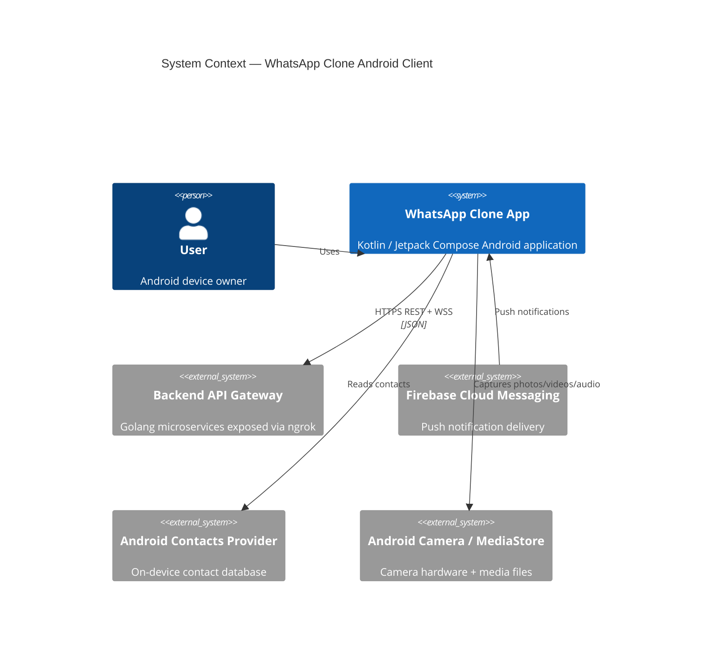
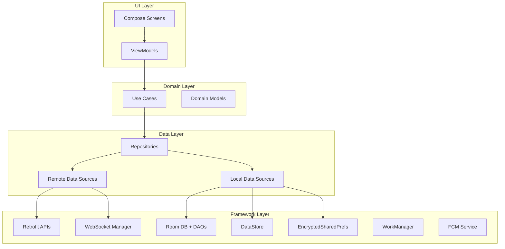
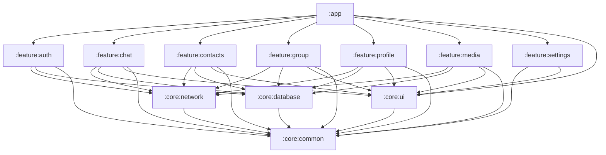
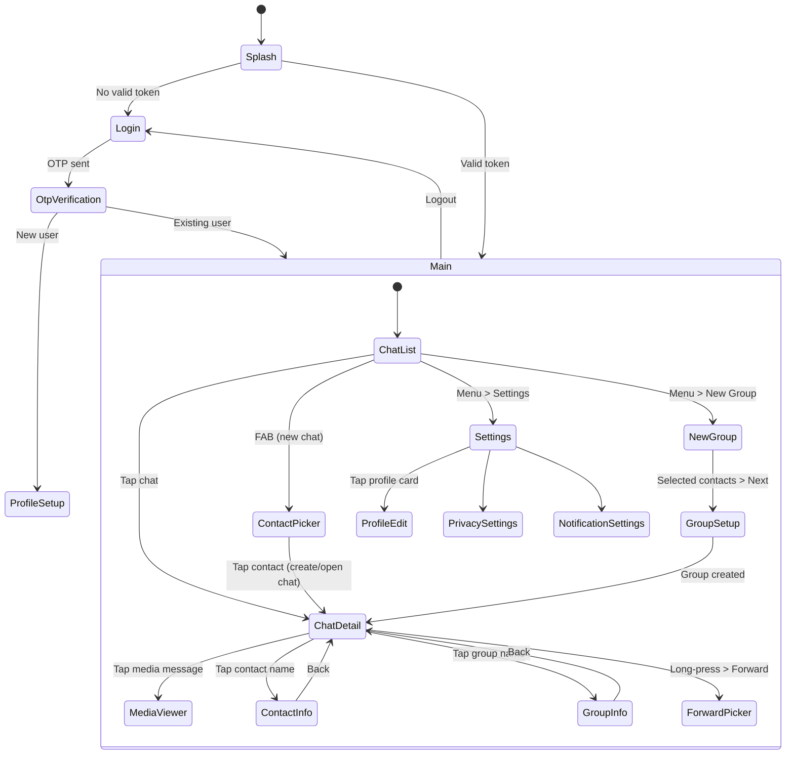
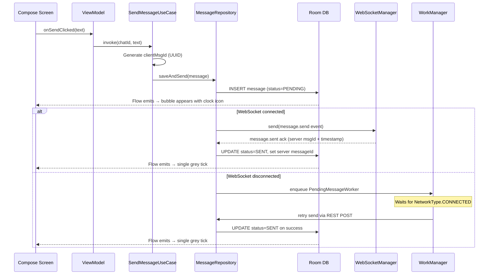
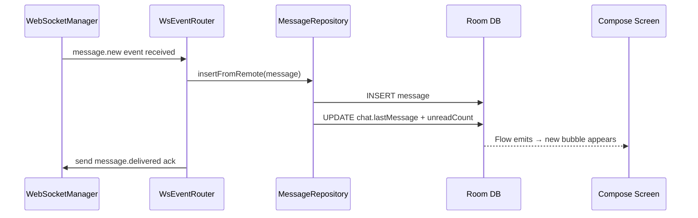
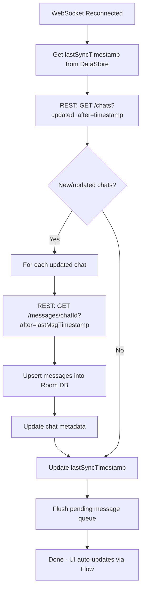
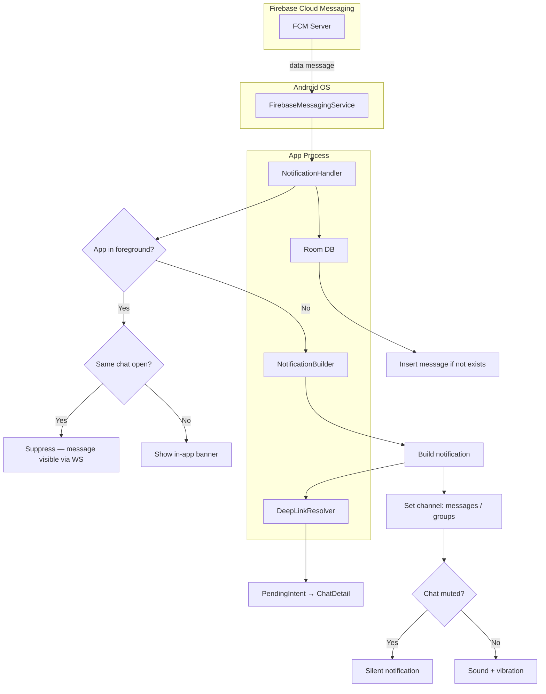
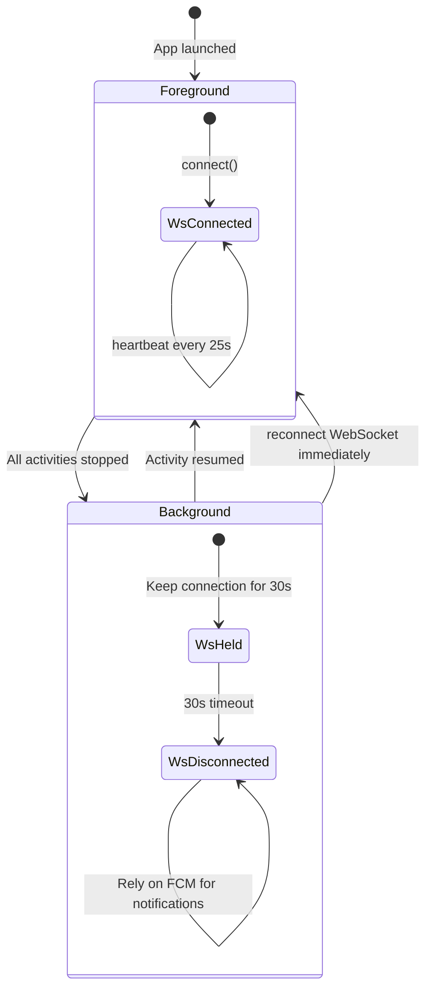

# WhatsApp Clone Android Client — High-Level Design (HLD)

> Companion documents: [LLD.md](./LLD.md) | [PRD.md](./PRD.md) | [IMPLEMENTATION_PLAN.md](./IMPLEMENTATION_PLAN.md)

## Table of Contents

1. [System Context](#1-system-context)
2. [Architecture Overview](#2-architecture-overview)
3. [Key Design Decisions](#3-key-design-decisions)
4. [Module Dependency Graph](#4-module-dependency-graph)
5. [Navigation Architecture](#5-navigation-architecture)
6. [Networking Strategy](#6-networking-strategy)
7. [State Management](#7-state-management)
8. [Offline-First Strategy](#8-offline-first-strategy)
9. [Push Notification Architecture](#9-push-notification-architecture)
10. [Security Architecture](#10-security-architecture)
11. [Concurrency Model](#11-concurrency-model)
12. [Lifecycle Management](#12-lifecycle-management)
13. [Data Ownership & Flow](#13-data-ownership--flow)

---

## 1. System Context

### 1.1 Context Diagram



### 1.2 System Boundary

```
┌──────────────────────────────────────────────────────────────────┐
│                    Android Device                                 │
│                                                                   │
│  ┌────────────────────────────────────────────────────────────┐  │
│  │                  WhatsApp Clone App                         │  │
│  │                                                             │  │
│  │  ┌─────────┐  ┌──────────┐  ┌──────────┐  ┌────────────┐ │  │
│  │  │ UI Layer│  │ Domain   │  │ Data     │  │ Platform   │ │  │
│  │  │ Compose │→ │ UseCases │→ │ Repos    │→ │ Services   │ │  │
│  │  └─────────┘  └──────────┘  └──────────┘  └────────────┘ │  │
│  │       ↑                          │  │                      │  │
│  │       │                          ↓  ↓                      │  │
│  │  ┌─────────┐              ┌──────┐ ┌──────────┐           │  │
│  │  │ NavGraph│              │ Room │ │ OkHttp + │           │  │
│  │  └─────────┘              │  DB  │ │ Retrofit │           │  │
│  │                           └──────┘ └──────────┘           │  │
│  └────────────────────────────────────────────────────────────┘  │
│                                                                   │
│  ┌─────────────┐  ┌──────────────┐  ┌─────────────────────┐     │
│  │ FCM Service │  │ WorkManager  │  │ Contacts Provider   │     │
│  └─────────────┘  └──────────────┘  └─────────────────────┘     │
└──────────────────────────────────────────────────────────────────┘
         │                │
         ↓                ↓
   ┌───────────┐   ┌────────────┐
   │  Firebase  │   │  Backend   │
   │  Servers   │   │  (ngrok)   │
   └───────────┘   └────────────┘
```

### 1.3 External Dependencies

| Dependency | Role | Protocol | Availability |
|-----------|------|----------|-------------|
| Backend API Gateway | All business logic | HTTPS REST + WSS | Required (degraded offline mode without it) |
| Firebase Cloud Messaging | Push notifications | HTTPS (Google servers) | Optional (app works without push; WS is primary) |
| Android Contacts Provider | Contact discovery | ContentResolver | Optional (app works without contacts permission) |
| Android Camera / MediaStore | Media capture | System intents / CameraX | Optional (text messaging works without camera) |

---

## 2. Architecture Overview

### 2.1 Layered Architecture



**Dependency Rule**: Dependencies point inward. UI depends on Domain, Domain depends on nothing (pure Kotlin), Data depends on Domain interfaces.

### 2.2 Layer Responsibilities

| Layer | Owns | Depends On | Key Classes |
|-------|------|-----------|-------------|
| **UI** | Screens, ViewModels, UI State, Navigation | Domain | `ChatListScreen`, `ChatListViewModel`, `ChatListUiState` |
| **Domain** | Use Cases, Domain Models, Repository Interfaces | Nothing | `SendMessageUseCase`, `Message`, `MessageRepository` (interface) |
| **Data** | Repository Implementations, Data Sources, Mappers | Domain interfaces | `MessageRepositoryImpl`, `MessageRemoteDataSource`, `MessageLocalDataSource` |
| **Framework** | API clients, DB, preferences, platform services | Android SDK | `AuthApi`, `AppDatabase`, `WebSocketManager`, `FCMService` |

### 2.3 Unidirectional Data Flow

Every feature follows this pattern:

```
User Interaction
      │
      ▼
┌──────────┐    intent     ┌──────────┐     call      ┌──────────┐
│  Screen  │ ────────────> │ ViewModel│ ────────────> │ Use Case │
│ (Compose)│               │          │               │          │
└──────────┘               └──────────┘               └──────────┘
      ▲                         │                          │
      │                    state update                    │
      │                         │                          ▼
      │                    ┌──────────┐              ┌──────────┐
      │                    │  UiState │              │Repository│
      │                    │(StateFlow│              │          │
      │                    └──────────┘              └──────────┘
      │                         ▲                     │        │
      │                         │                     ▼        ▼
      │                    Flow<T>              ┌────────┐ ┌───────┐
      └────────────────────────────────────────│ Room DB│ │ REST  │
                                                └────────┘ │  / WS │
                                                           └───────┘
```

**Reactive data flow**: Repositories expose `Flow<T>` from Room DB. ViewModels collect these flows. When new data arrives from the network/WebSocket, the repository writes to Room DB, which automatically triggers UI updates through the Flow.

---

## 3. Key Design Decisions

### 3.1 Decision Register

| # | Decision | Chosen | Alternatives Considered | Rationale |
|---|----------|--------|------------------------|-----------|
| D1 | Architecture pattern | MVVM + Clean Architecture (3 layers) | MVI, MVVM-only | Testability, separation of concerns, Android best practice. MVI adds ceremony for this scope. |
| D2 | Source of truth | Room DB (offline-first) | Network-first with caching | Enables offline mode, reactive UI via Flow, consistent state after process death |
| D3 | HTTP stack | OkHttp for REST + WebSocket | Ktor Client, Volley | Single stack, shared connection pool, mature interceptor chain, OkHttp WS is production-grade |
| D4 | Dependency Injection | Hilt | Koin, Manual DI | Official Android DI, compile-time safety, less boilerplate vs raw Dagger |
| D5 | Project structure | Multi-module Gradle | Single module, convention plugins | Faster incremental builds, enforced layer boundaries, parallel compilation |
| D6 | JSON serialization | Kotlinx Serialization | Gson, Moshi | Kotlin-native, compile-time code gen, multiplatform-ready, no reflection |
| D7 | Image loading | Coil | Glide, Picasso | Kotlin-first, Compose-native `AsyncImage`, coroutine-based, smaller binary |
| D8 | Pagination | Paging 3 with RemoteMediator | Manual cursor pagination | Memory-efficient, integrates with Room PagingSource + Compose `LazyPagingItems` |
| D9 | Offline message queue | WorkManager | AlarmManager, Foreground Service | Survives process death, respects Doze/battery, guaranteed execution with constraints |
| D10 | Preferences | DataStore | SharedPreferences | Type-safe, coroutine-based, no UI-thread I/O, migration path |
| D11 | UI toolkit | Jetpack Compose + Material 3 | XML Views, Material 2 | Declarative, less code, better state management, latest design system |
| D12 | Async | Kotlin Coroutines + Flow | RxJava | First-class Kotlin support, simpler API, structured concurrency, smaller binary |

---

## 4. Module Dependency Graph

### 4.1 Gradle Module Map



### 4.2 Module Descriptions

| Module | Type | Purpose | Key Exports |
|--------|------|---------|-------------|
| `:app` | Application | Entry point, navigation graph, Hilt setup, lifecycle | `MainActivity`, `AppNavGraph`, `WsEventRouter` |
| `:core:network` | Library | REST + WebSocket clients, interceptors, DTOs | `AuthApi`, `WebSocketManager`, `AuthInterceptor`, `TokenManager` |
| `:core:database` | Library | Room DB, entities, DAOs, type converters, migrations | `AppDatabase`, `MessageDao`, `ChatDao`, `UserDao` |
| `:core:common` | Library | Utilities, constants, extensions, Result wrapper | `AppResult<T>`, `ErrorCode`, `UuidGenerator`, `TimeUtils` |
| `:core:ui` | Library | Shared composables, theme, design tokens | `WhatsAppTheme`, `UserAvatar`, `MessageBubble`, `MessageStatusIcon` |
| `:feature:auth` | Library | Login + OTP screens, auth logic | `LoginScreen`, `LoginViewModel`, `AuthRepository` |
| `:feature:chat` | Library | Chat list + detail screens, messaging pipeline | `ChatListScreen`, `ChatDetailScreen`, `ChatRepository`, `MessageRepository` |
| `:feature:contacts` | Library | Contact picker, contact sync | `ContactPickerScreen`, `ContactRepository` |
| `:feature:group` | Library | Group creation, group info | `NewGroupScreen`, `GroupInfoScreen`, `GroupRepository` |
| `:feature:profile` | Library | Profile view/edit | `ProfileEditScreen`, `UserRepository` |
| `:feature:media` | Library | Media viewer, upload, download, compression | `MediaViewerScreen`, `MediaRepository`, `ImageCompressor` |
| `:feature:settings` | Library | Settings + privacy screens | `SettingsScreen`, `PrivacyPreferences` |

---

## 5. Navigation Architecture

### 5.1 Screen Flow



### 5.2 Deep Linking

Push notification taps deep-link directly into `ChatDetail`:

```
whatsapp-clone://chat/{chatId}
```

Handled via `<intent-filter>` on `MainActivity`, parsed by `AppNavGraph`.

### 5.3 Navigation Principles

- **Single Activity** — all screens are Compose destinations in one `NavHost`
- **Type-safe routes** — all arguments passed via route parameters (no bundles)
- **Back stack management** — login flow clears back stack on success; logout pops to root
- **Conditional start destination** — Splash checks `TokenManager.isLoggedIn()` to pick Login vs Main

---

## 6. Networking Strategy

### 6.1 Dual-Channel Architecture

```
┌───────────────────────────────────────────────────────┐
│                  Networking Layer                       │
│                                                        │
│  ┌─────────────────────┐  ┌─────────────────────────┐ │
│  │    REST Channel      │  │   WebSocket Channel     │ │
│  │                      │  │                          │ │
│  │  Retrofit + OkHttp   │  │  OkHttp WebSocket       │ │
│  │  ─────────────────   │  │  ─────────────────      │ │
│  │  • Auth (login/OTP)  │  │  • Real-time messages   │ │
│  │  • Profile CRUD      │  │  • Typing indicators    │ │
│  │  • Chat list fetch   │  │  • Presence updates     │ │
│  │  • Message history   │  │  • Message status       │ │
│  │  • Media upload      │  │  • Group events         │ │
│  │  • Contact sync      │  │  • Heartbeat            │ │
│  │  • Message send      │  │                          │ │
│  │    (REST fallback)   │  │                          │ │
│  └─────────────────────┘  └─────────────────────────┘ │
│           │                          │                  │
│           └────────┬─────────────────┘                  │
│                    ▼                                    │
│  ┌──────────────────────────────────────────────────┐  │
│  │           Shared OkHttpClient                     │  │
│  │  • AuthInterceptor (JWT injection + 401 refresh)  │  │
│  │  • HttpLoggingInterceptor (debug only)            │  │
│  │  • Connection pool (5 idle, 5 min keep-alive)     │  │
│  │  • Timeouts: connect=10s, read=30s, write=30s     │  │
│  └──────────────────────────────────────────────────┘  │
└───────────────────────────────────────────────────────┘
```

### 6.2 REST Client Strategy

- **Base URL**: Configurable at runtime via DataStore (for ngrok URL changes)
- **Serialization**: Kotlinx Serialization JSON with `ignoreUnknownKeys = true`, `isLenient = true`
- **Response handling**: All API responses wrapped in `ApiResponse<T>` envelope; mapper strips envelope and returns `AppResult<T>`
- **Token refresh**: `AuthInterceptor` catches 401, calls `auth/token/refresh`, retries original request exactly once
- **Retry policy**: No automatic retries on REST (let the caller decide)

### 6.3 WebSocket Strategy

- **Primary transport** for sending messages (low latency, already-open connection)
- **REST as fallback** if WebSocket is disconnected (queued via WorkManager)
- **Single persistent connection** per app lifecycle
- **Connection state** exposed as `StateFlow<WsConnectionState>` for UI observability
- **Heartbeat**: Client pings every 25s, expects pong within 10s
- **Reconnect**: Exponential backoff 1s → 2s → 4s → 8s → 16s → 30s (max)

---

## 7. State Management

### 7.1 ViewModel State Pattern

Every screen follows this pattern:

```
┌───────────────────────────────────────────────────┐
│                  ViewModel                         │
│                                                    │
│  ┌─────────────┐        ┌──────────────────────┐  │
│  │ UiEvent     │        │ _uiState             │  │
│  │ (sealed)    │───────>│ MutableStateFlow     │  │
│  │             │ reduce │                       │  │
│  │ • SendMsg   │        │ UiState(             │  │
│  │ • LoadMore  │        │   messages: List,    │  │
│  │ • Retry     │        │   isLoading: Bool,   │  │
│  │             │        │   error: String?,    │  │
│  └─────────────┘        │   ...)               │  │
│                         └──────────────────────┘  │
│                                │                   │
│  ┌─────────────┐              │ expose as          │
│  │ SideEffect  │              │ StateFlow          │
│  │ Channel     │              ▼                    │
│  │ • Navigate  │        ┌──────────────────────┐  │
│  │ • ShowToast │        │ uiState: StateFlow   │──┼──> Compose Screen
│  │ • Vibrate   │        └──────────────────────┘  │
│  └─────────────┘                                   │
│        │                                           │
│        └───────────────────────────────────────────┼──> LaunchedEffect
└───────────────────────────────────────────────────┘
```

### 7.2 State Principles

- **Immutable state**: `UiState` is a `data class` — all updates via `.copy()`
- **Single state stream**: One `StateFlow<UiState>` per ViewModel (no multiple LiveDatas)
- **Side effects via Channel**: One-shot events (navigation, toast) via `Channel<SideEffect>` consumed in `LaunchedEffect`
- **No business logic in Compose**: Screens only render state and emit user events
- **State survives configuration change**: `viewModelScope` outlives the Activity/Fragment

---

## 8. Offline-First Strategy

### 8.1 Write Path (Sending Messages)



### 8.2 Read Path (Receiving Messages)



### 8.3 Sync-on-Reconnect Strategy



### 8.4 Caching Strategy Summary

| Data Type | Cache Location | TTL | Sync Trigger |
|-----------|---------------|-----|-------------|
| User Profiles | Room DB | 1 hour | Profile screen open |
| Chat List | Room DB | — (live) | WebSocket events + pull-to-refresh |
| Messages | Room DB (paginated) | — (append-only) | Chat opened, WS events |
| Contacts | Room DB | 24 hours | Pull-to-refresh, periodic WorkManager |
| Media Thumbnails | Coil disk cache | 7 days | Lazy load on scroll |
| Media Files | App-private cache | 30 days (LRU) | User taps to view |
| Group Info | Room DB | 1 hour | Group screen open |
| Privacy Settings | DataStore | — (permanent) | User changes |

---

## 9. Push Notification Architecture



**FCM Token Lifecycle**:

```
App Install → onNewToken() → store locally
Login → POST /notifications/device (register)
Token Refresh → onNewToken() → POST /notifications/device (update)
Logout → DELETE /notifications/device (unregister)
```

**Notification Channels** (Android 8+):

| Channel ID | Name | Importance | Sound | Vibration |
|-----------|------|-----------|-------|-----------|
| `messages` | Messages | High | Default | Yes |
| `groups` | Group Messages | High | Default | Yes |
| `calls` | Calls (future) | Max | Ringtone | Yes |
| `general` | General | Default | None | No |

---

## 10. Security Architecture

```
┌──────────────────────────────────────────────────────────┐
│                 Security Layers                           │
│                                                           │
│  ┌─────────────────────────────────────────────────────┐ │
│  │ Transport Security                                   │ │
│  │  • All traffic over HTTPS/WSS (TLS via ngrok)       │ │
│  │  • No certificate pinning (ngrok URLs are dynamic)  │ │
│  └─────────────────────────────────────────────────────┘ │
│                                                           │
│  ┌─────────────────────────────────────────────────────┐ │
│  │ Token Security                                       │ │
│  │  • Access token: JWT, 15-min TTL, in-memory cache   │ │
│  │  • Refresh token: opaque, 30-day TTL                │ │
│  │  • Both stored in EncryptedSharedPreferences         │ │
│  │    (AES-256-SIV key + AES-256-GCM value)            │ │
│  │  • AuthInterceptor auto-refreshes on 401            │ │
│  └─────────────────────────────────────────────────────┘ │
│                                                           │
│  ┌─────────────────────────────────────────────────────┐ │
│  │ Local Data Security                                  │ │
│  │  • Room DB: unencrypted (SQLCipher as stretch goal) │ │
│  │  • DataStore: app-private directory                  │ │
│  │  • Media cache: app-private cache directory          │ │
│  │  • ProGuard/R8: strip logs + obfuscate in release   │ │
│  └─────────────────────────────────────────────────────┘ │
│                                                           │
│  ┌─────────────────────────────────────────────────────┐ │
│  │ Input Security                                       │ │
│  │  • Phone validation: E.164 regex                    │ │
│  │  • Text input: max 65,536 chars                     │ │
│  │  • File upload: MIME-type + size validation          │ │
│  │  • Deep links: validated before navigation          │ │
│  └─────────────────────────────────────────────────────┘ │
└──────────────────────────────────────────────────────────┘
```

---

## 11. Concurrency Model

### 11.1 Coroutine Dispatchers

| Dispatcher | Used For | Thread Pool |
|-----------|----------|-------------|
| `Dispatchers.Main` | UI updates, StateFlow collection | Main thread |
| `Dispatchers.IO` | Network calls, DB queries, file I/O | Shared pool (64 threads) |
| `Dispatchers.Default` | JSON parsing, image compression, crypto | CPU-core pool |

### 11.2 Coroutine Scopes

```
Application (ProcessLifecycleOwner)
 └── WebSocketScope (SupervisorJob + IO)
 │    └── Heartbeat coroutine
 │    └── Event listener coroutine
 │    └── Reconnect coroutine
 └── WsEventRouterScope (SupervisorJob + IO)
      └── Event dispatch coroutine

ViewModel (viewModelScope)
 └── UI event handlers
 └── Use case invocations
 └── Flow collection from repositories

WorkManager (CoroutineWorker)
 └── PendingMessageWorker
 └── ContactSyncWorker
 └── MediaCleanupWorker
```

### 11.3 Thread Safety Rules

- **Room DB**: Thread-safe internally; all DAO methods are `suspend` or return `Flow`
- **WebSocketManager**: State mutations guarded by `Mutex`; event emission via `MutableSharedFlow` (thread-safe)
- **TokenManager**: `EncryptedSharedPreferences` (synchronized internally) + `Mutex` for refresh-token dance
- **DataStore**: Thread-safe by design (single writer, coroutine-based)
- **TypingStateHolder**: In-memory `MutableStateFlow<Map>` — thread-safe for reads; writes in single coroutine

---

## 12. Lifecycle Management

### 12.1 App Foreground / Background



**Behavior**:

| State | WebSocket | Push Notifications | Sync |
|-------|-----------|-------------------|------|
| **Foreground** | Connected, heartbeat active | Suppressed if WS delivers | Real-time via WS |
| **Background (< 30s)** | Held open | Active (fallback) | WS still receives |
| **Background (> 30s)** | Disconnected | Primary delivery channel | Sync-on-reconnect when foregrounded |
| **Process killed** | Dead | Primary delivery channel | Full sync on next cold start |

### 12.2 Process Death Recovery

- **Room DB**: All data persisted — survives process death
- **ViewModel state**: Lost — reconstructed from Room on re-creation
- **WebSocket**: Dead — reconnects on `Application.onCreate()`
- **Pending messages**: Persisted in Room with `status=PENDING` — `PendingMessageWorker` flushes on next network availability
- **FCM token**: Persisted in `EncryptedSharedPreferences` — re-registered on next app launch if needed

---

## 13. Data Ownership & Flow

### 13.1 Data Ownership Matrix

| Data | Owner Module | Storage | Written By | Read By |
|------|-------------|---------|-----------|---------|
| Auth tokens | `:core:network` | EncryptedSharedPrefs | `AuthRepository` | `TokenManager`, `AuthInterceptor` |
| User profiles | `:feature:profile` | Room `users` table | `UserRepository`, `AuthRepository` | All features |
| Contacts | `:feature:contacts` | Room `contacts` table | `ContactSyncWorker` | `:feature:contacts`, `:feature:chat` |
| Chat list | `:feature:chat` | Room `chats` table | `ChatRepository`, `WsEventRouter` | `:feature:chat` |
| Chat participants | `:feature:chat` | Room `chat_participants` | `ChatRepository`, `WsEventRouter` | `:feature:chat`, `:feature:group` |
| Messages | `:feature:chat` | Room `messages` table | `MessageRepository`, `WsEventRouter` | `:feature:chat` |
| Groups | `:feature:group` | Room `groups` table | `ChatRepository` | `:feature:group`, `:feature:chat` |
| Media metadata | `:feature:media` | Room `media` table | `MediaRepository` | `:feature:media`, `:feature:chat` |
| Media files | `:feature:media` | App-private cache dir | `MediaDownloadManager` | `:feature:media` |
| Privacy settings | `:feature:settings` | DataStore | `PrivacyPreferences` | `:feature:chat`, `:feature:settings` |
| Server URL | `:core:network` | DataStore | `BaseUrlProvider` | All network calls |
| FCM token | `:core:network` | EncryptedSharedPrefs | `FCMTokenManager` | `AuthRepository` |
| Typing state | `:feature:chat` | In-memory only | `TypingStateHolder` | `ChatListViewModel`, `ChatDetailViewModel` |
| WS connection state | `:core:network` | In-memory only | `WebSocketManager` | All features (observational) |

### 13.2 Cross-Module Communication

Feature modules do **not** depend on each other. Cross-feature data sharing happens through:

1. **Shared Room DB** — features read/write the same tables via DAOs in `:core:database`
2. **WsEventRouter** in `:app` — dispatches WS events to the correct repository, regardless of which feature screen is active
3. **Navigation arguments** — `chatId`, `userId`, `mediaId` passed via route parameters
4. **Hilt-provided singletons** — `WebSocketManager`, `TokenManager`, `TypingStateHolder` injected wherever needed
