# WhatsApp Clone Android Client — Implementation Plan

> Derived from [HLD.md](./HLD.md), [LLD.md](./LLD.md), and [PRD.md](./PRD.md).
> Each task references the design section it implements.

## Table of Contents

1. [Overview](#1-overview)
2. [Phase 0 — Project Scaffold (Week 0)](#2-phase-0--project-scaffold-week-0)
3. [Phase 1 — MVP: Auth + 1-to-1 Text Messaging (Weeks 1-3)](#3-phase-1--mvp-auth--1-to-1-text-messaging-weeks-1-3)
4. [Phase 2 — Groups + Media + Notifications (Weeks 4-6)](#4-phase-2--groups--media--notifications-weeks-4-6)
5. [Phase 3 — Presence + Contacts + Voice Notes + Search (Weeks 7-8)](#5-phase-3--presence--contacts--voice-notes--search-weeks-7-8)
6. [Phase 4 — Polish: Replies, Deletion, Admin, Settings (Weeks 9-10)](#6-phase-4--polish-replies-deletion-admin-settings-weeks-9-10)
7. [Phase 5 — Stretch Goals (Week 11+)](#7-phase-5--stretch-goals-week-11)
8. [Dependency Graph](#8-dependency-graph)
9. [Risk Register](#9-risk-register)

---

## 1. Overview

### 1.1 Principles

- **Vertical slices**: Each task delivers a working feature end-to-end (UI → ViewModel → UseCase → Repository → DAO/API).
- **Core-first**: Shared infrastructure (network, DB, DI, theme) is built in Phase 0 before any features.
- **Test-as-you-go**: Each task includes its own unit/integration tests. No separate "testing phase".
- **Offline-first from day 1**: Every write operation goes through Room DB first, even in Phase 1.

### 1.2 Effort Estimation Key

| Label | Meaning | Rough Hours |
|-------|---------|-------------|
| **XS** | Trivial config/boilerplate | 1–2h |
| **S** | Single class/file, straightforward | 2–4h |
| **M** | Multiple files, moderate complexity | 4–8h |
| **L** | Cross-cutting, significant logic | 8–16h |
| **XL** | Major feature, multi-day | 16–24h |

### 1.3 Conventions

- `[HLD §N]` = References section N in [HLD.md](./HLD.md)
- `[LLD §N]` = References section N in [LLD.md](./LLD.md)
- `[PRD §N]` = References section N in [PRD.md](./PRD.md)
- **AC** = Acceptance Criteria

---

## 2. Phase 0 — Project Scaffold (Week 0)

> **Goal**: Empty app compiles, all modules exist, DI wired, theme renders, CI green. Server URL configurable from day 1 (mitigates Risk R1).

### Sprint 0 (3 days)

| ID | Task | Size | Design Ref | Depends On | AC |
|----|------|------|-----------|------------|-----|
| **P0-01** | **Init Gradle multi-module project** — Create root `build.gradle.kts`, `settings.gradle.kts`, `gradle.properties`. Configure Kotlin 1.9+, AGP, compose compiler, version catalog (`libs.versions.toml`). | S | [HLD §4] | — | `./gradlew build` succeeds with empty modules |
| **P0-02** | **Create `:app` module** — `MainActivity`, `WhatsAppApplication` (`@HiltAndroidApp`), `AndroidManifest.xml` with all permissions, empty `AppNavGraph`. | S | [HLD §5] | P0-01 | App launches to a blank Compose screen |
| **P0-03** | **Create `:core:common`** — `AppResult<T>` sealed class, `ErrorCode` enum, `safeApiCall()`, `map()` extension, `UuidGenerator`, `TimeUtils` (formatChatTimestamp, formatMessageTime, formatLastSeen, formatDateSeparator). | S | [LLD §1] | P0-01 | Unit tests pass for `AppResult` mapping + time formatting |
| **P0-04** | **Create `:core:network`** — `NetworkModule` (Hilt): `OkHttpClient`, `Retrofit`, `Json` instance, `HttpLoggingInterceptor`. `ApiResponse<T>` / `ApiError` / `ApiMeta` / `PaginatedData<T>` envelope DTOs. `BaseUrlProvider` backed by DataStore. | M | [LLD §2.1, 2.4, 2.5] | P0-03 | Retrofit instance resolves; `BaseUrlProvider` reads/writes URL |
| **P0-05** | **Create `TokenManager`** — `EncryptedSharedPreferences` setup, `TokenManagerImpl` with `getAccessToken()`, `saveTokens()`, `clearTokens()`, mutex-guarded `refreshToken()`. | M | [LLD §2.2] | P0-04 | Token round-trip (save/get/clear) works; refresh mutex prevents races |
| **P0-06** | **Create `AuthInterceptor`** — Inject JWT into all requests, catch 401, call `TokenManager.refreshToken()`, retry once. | S | [LLD §2.3], [PRD §6.5.2] | P0-05 | 401 triggers refresh; second 401 lets error propagate |
| **P0-07** | **Create `:core:database`** — `AppDatabase` (Room) with all 7 entities, all 7 DAO interfaces (ChatDao, MessageDao, UserDao, ContactDao, ChatParticipantDao, GroupDao, MediaDao), `DatabaseModule` (Hilt), type converters. | L | [LLD §3], [PRD §7.1] | P0-03 | Room compiles, in-memory DB creates successfully in test |
| **P0-08** | **Create `:core:ui`** — `WhatsAppTheme` (Material 3), `WhatsAppColors`, `WhatsAppTypography`, `WhatsAppShapes`. Reusable composables: `UserAvatar`, `UnreadBadge`, `MessageStatusIcon`, `DateSeparator`, `LoadingOverlay`, `ErrorBanner`, `EmptyState`. | M | [LLD §4], [PRD §5.3] | P0-01 | Preview renders for all shared components |
| **P0-09** | **Create all feature module stubs** — `:feature:auth`, `:feature:chat`, `:feature:contacts`, `:feature:group`, `:feature:profile`, `:feature:media`, `:feature:settings`. Each has empty `build.gradle.kts` with correct dependencies. | XS | [HLD §4.2] | P0-01 | All modules compile |
| **P0-10** | **Wire navigation graph** — `AppNavGraph` with `AppRoute` sealed class (all routes), placeholder screens for Splash, Login, Main (ChatList). Conditional start destination based on `TokenManager.isLoggedIn()`. | S | [HLD §5], [LLD §2.7] | P0-02, P0-05 | App navigates to Login if no token, to ChatList if token exists |
| **P0-11** | **Set up build variants** — `debug`, `staging`, `release` build types. `BuildConfig.BASE_URL` per variant. ProGuard/R8 rules for release. | XS | [PRD §13.4] | P0-01 | `./gradlew assembleDebug` and `assembleRelease` both succeed |
| **P0-12** | **Server URL configuration (debug)** — Settings stub screen with text field to enter ngrok URL. Writes to `BaseUrlProvider`. QR code scan option (stretch). Accessible from debug build only. | M | [LLD §2.4], [HLD §6.2] | P0-04 | Changing URL + restarting app uses new base URL for all requests |
| **P0-13** | **Entity-DTO mappers** — `UserDto.toEntity()`, `ChatDto.toEntity()`, `ChatParticipantDto.toEntity()`, `MessageDto.toEntity()`, `MediaUploadResponse.toEntity()`, `String.toEpochMillis()`. Unit tests for each. | S | [LLD §3.9] | P0-07 | All mappers produce correct entities; round-trip tests pass |
| **P0-14** | **GlobalErrorHandler** — Singleton that catches `UNAUTHORIZED` errors, attempts token refresh, emits `GlobalError.SessionExpired` if refresh fails. Observed by `MainActivity` to redirect to Login. | S | [LLD §14.3] | P0-05 | Session expired → global event emitted → Login screen shown |

**Phase 0 Deliverable**: Empty app shell with all modules, DI, theming, navigation skeleton, token management, server URL configuration, and shared error handling.

---

## 3. Phase 1 — MVP: Auth + 1-to-1 Text Messaging (Weeks 1-3)

> **Goal**: User can log in via OTP, see a chat list, open a chat, send/receive text messages in real time, and messages survive app restarts.

### Sprint 1 — Authentication (Week 1)

| ID | Task | Size | Design Ref | Depends On | AC |
|----|------|------|-----------|------------|-----|
| **P1-01** | **Auth API interface** — `AuthApi` Retrofit interface: `sendOtp()`, `verifyOtp()`, `refreshToken()`, `logout()`. Request/response DTOs: `SendOtpRequest`, `SendOtpResponse`, `VerifyOtpRequest`, `AuthTokenResponse`, `RefreshRequest`. | S | [LLD §2.6], [PRD §8.1] | P0-04 | Compiles, mock responses deserialize |
| **P1-02** | **AuthRepository** — `AuthRepository` interface + `AuthRepositoryImpl`. Methods: `sendOtp()`, `verifyOtp()`, `logout()`. On verify: save tokens, upsert user entity, register FCM token. | M | [LLD §5.3] | P1-01, P0-05, P0-07, P0-13 | Integration test: verify → tokens saved + user in DB |
| **P1-03** | **SendOtpUseCase + VerifyOtpUseCase** — Domain layer use cases wrapping `AuthRepository`. Validate phone format (E.164) before API call. | S | [LLD §5.1] | P1-02 | Unit test: invalid phone → validation error; valid → delegates to repo |
| **P1-04** | **Login Screen UI** — Country code picker, phone number input, "Continue" button, loading state, error display. | M | [PRD §5.2.2], [LLD §5] | P0-08 | Screen matches PRD spec; tapping Continue calls ViewModel |
| **P1-05** | **LoginViewModel** — Manages `LoginUiState`. Calls `SendOtpUseCase`. Emits navigation side-effect on success. | S | [LLD §5.2] | P1-03, P1-04 | Unit test: valid phone → loading → navigate to OTP screen |
| **P1-06** | **OTP Verification Screen UI** — 6-digit input with auto-advance, resend countdown (60s), auto-submit on 6th digit, error shake animation. | M | [PRD §5.2.3] | P0-08 | Screen matches PRD; entering 6 digits triggers verify |
| **P1-07** | **OtpViewModel** — Manages `OtpUiState`. Calls `VerifyOtpUseCase`. Resend countdown via coroutine timer. Navigate to Main on success, ProfileSetup if `is_new_user`. | M | [LLD §5.1, 5.2] | P1-03, P1-06 | Unit test: correct OTP → navigate; wrong → error state; countdown ticks |
| **P1-08** | **Splash Screen** — Check `TokenManager.isLoggedIn()`. Navigate to Login or Main. Max 2s display. | S | [PRD §5.2.1] | P0-10, P0-05 | Auto-navigates within 2s based on auth state |
| **P1-09** | **Logout flow** — Settings stub with "Logout" button. Calls `AuthRepository.logout()`, clears Room DB, navigates to Login with back-stack cleared. | S | [LLD §5.3] | P1-02 | Tokens cleared, DB wiped, lands on Login screen |

### Sprint 2 — WebSocket + Chat Infrastructure (Week 2)

| ID | Task | Size | Design Ref | Depends On | AC |
|----|------|------|-----------|------------|-----|
| **P1-10** | **WebSocketManager** — Full implementation: `connect()`, `disconnect()`, `send()`, heartbeat (25s ping, 10s pong timeout), exponential backoff reconnect (max 30s), `WsConnectionState` StateFlow, `ServerWsEvent` SharedFlow. | XL | [LLD §12] | P0-04, P0-05 | Unit test: connect → heartbeat → disconnect → reconnect with backoff |
| **P1-11** | **TypingStateHolder** — Singleton with `MutableStateFlow<Map<String, Set<String>>>`. Methods: `onTyping(chatId, userId, isTyping)`. Auto-clears after 5s timeout per user. | S | [LLD §7.5] | P0-03 | Unit test: typing event → map updated; 5s timeout → removed |
| **P1-12** | **WsEventRouter** — Singleton that subscribes to `WebSocketManager.events` and dispatches to `MessageRepository`, `ChatRepository`, `UserRepository`, `TypingStateHolder`. Handles all server events: `message.new`, `message.sent`, `message.status`, `message.deleted`, `typing`, `presence`, `chat.created`, `chat.updated`, `group.member.added`, `group.member.removed`. | L | [LLD §12.3] | P1-10, P1-11 | Integration test: emitted event → correct repository/holder method called |
| **P1-13** | **SyncOnReconnectManager** — Observes `WsConnectionState`. On `CONNECTED`: calls `chatRepository.syncChats()`, updates `lastSyncTimestamp` in DataStore, triggers `PendingMessageWorker`. | M | [LLD §12.4], [HLD §8.3] | P1-10 | Integration test: reconnect → sync triggered → pending messages flushed |
| **P1-14** | **ChatDao — full implementation** — All queries: `observeChatsWithLastMessage()`, `upsert()`, `upsertAll()`, `updateUnreadCount()`, `incrementUnreadCount()`, `updateLastMessage()`, `findDirectChatWithUser()`, `setMuted()`, `deleteAll()`. | M | [LLD §3.2] | P0-07 | All DAO queries pass against in-memory Room DB |
| **P1-15** | **MessageDao — full implementation** — All queries: `pagingSource()`, `insert()`, `insertAll()`, `updateStatus()`, `confirmSent()`, `softDelete()`, `setStarred()`, `getAllPendingMessages()`, `deleteAllForChat()`. | M | [LLD §3.3] | P0-07 | All DAO queries pass against in-memory Room DB |
| **P1-16** | **UserDao — full implementation** — Queries: `getById()`, `observeUser()`, `getByPhone()`, `upsert()`, `upsertAll()`, `updatePresence()`, `setBlocked()`. | S | [LLD §3.4] | P0-07 | All DAO queries pass |
| **P1-17** | **ChatApi + MessageApi + UserApi** — Retrofit interfaces for chats, messages, and users. All DTO classes (`ChatDto`, `MessageDto`, `UserDto`, `PresenceDto`, `SendMessageRequest`, `MarkReadRequest`, etc.). | M | [LLD §2.6], [PRD §8.2-8.4] | P0-04 | Compiles, mock responses deserialize |
| **P1-18** | **UserRepository** — `UserRepository` interface + `UserRepositoryImpl`. Methods: `getMe()`, `updateProfile()`, `getUser()`, `blockUser()`, `unblockUser()`, `updatePresence()`, `observeUser()`. | M | [LLD §11.1] | P1-16, P1-17 | Integration test: getMe → user persisted in Room; updatePresence → Room updated |
| **P1-19** | **ChatRepository** — `observeChats()` (Flow from Room), `syncChats()` (REST → Room), `createDirectChat()`, `getChatDetail()`, `updateLastMessage()`, `incrementUnreadCount()`, `muteChat()`, `insertFromRemote()`, `applyUpdate()`, `addParticipant()`, `removeParticipant()`. | L | [LLD §6.2] | P1-14, P1-17 | Integration test: sync populates Room; observe emits updates |
| **P1-20** | **MessageRepository** — `observeMessages()` (Paging 3), `saveAndSend()` (Room + WS), `insertFromRemote()`, `confirmSent()`, `updateStatus()`, `softDelete()`, `starMessage()`, `markRead()`. | L | [LLD §7.2] | P1-15, P1-10, P1-17 | Integration test: save → pending in DB; confirm → status=sent |
| **P1-21** | **Connect WebSocket on auth** — After login/splash, call `WebSocketManager.connect()`, start `WsEventRouter`, start `SyncOnReconnectManager`. On logout, `disconnect()`. Observe lifecycle via `ProcessLifecycleOwner` (foreground/background). | M | [HLD §6.3], [HLD §12] | P1-10, P1-12, P1-13, P1-08 | WS connects after login; disconnects on logout; reconnects on foreground |

### Sprint 3 — Chat UI (Week 3)

| ID | Task | Size | Design Ref | Depends On | AC |
|----|------|------|-----------|------------|-----|
| **P1-22** | **Chat List Screen** — `LazyColumn` of `ChatItemUi`, each row: avatar, title, last message preview, timestamp, unread badge, mute icon, typing indicator. Sorted by `lastMessageTimestamp DESC`. FAB for new chat. Pull-to-refresh triggers `syncChats()`. | L | [PRD §5.2.4], [LLD §6] | P1-19, P0-08 | Renders cached chats; pull-to-refresh fetches from API; tap navigates to detail |
| **P1-23** | **ChatListViewModel** — Collects `observeChats()` Flow, maps to `ChatListUiState`, handles search filtering, observes `TypingStateHolder` for live typing indicators in chat list. | M | [LLD §6.3] | P1-19, P1-11, P1-12 | Unit test: new WS message → chat moves to top + unread increments; typing shown |
| **P1-24** | **Chat Detail Screen — message list** — `LazyColumn` with Paging 3 `LazyPagingItems`. Date separator headers. Own messages right-aligned (green), received left-aligned (white). Message status icons (clock, single tick, double tick, blue tick). Scroll-to-bottom FAB. Unread divider. | XL | [PRD §5.2.5], [LLD §7] | P1-20, P0-08 | Renders cached messages; scrolling up loads more; date headers correct |
| **P1-25** | **Chat Detail Screen — compose bar** — Text input, send button (appears when text non-empty), mic button placeholder. | M | [PRD §5.2.5] | P0-08 | Text input works; send button appears/hides; tapping send calls ViewModel |
| **P1-26** | **ChatDetailViewModel** — Collects paged messages, manages `ChatDetailUiState`, `ComposerState`. `onSendMessage()` calls `SendMessageUseCase`. Observes WS events for incoming messages and status updates in this chat. Marks messages read on chat open. Typing indicator send logic (3s debounce). | L | [LLD §7.1, 7.4] | P1-20, P1-12, P1-11 | Unit test: send → pending message; WS ack → status=sent; incoming → appended; typing debounced |
| **P1-27** | **SendMessageUseCase** — Generates `clientMsgId`, builds `MessageEntity(status=PENDING)`, calls `MessageRepository.saveAndSend()`. | S | [LLD §7.2] | P1-20 | Unit test: generates UUID, saves with pending, delegates to repo |
| **P1-28** | **MarkMessagesReadUseCase** — Called when chat detail becomes visible. Sends `message.read` event via WS, calls `POST /messages/{chatId}/read`, and updates local unread count to 0. | S | [LLD §7.2] | P1-20, P1-10 | Unit test: sets unread=0 in Room; sends WS event |
| **P1-29** | **MessageRemoteMediator (Paging 3)** — Fetches pages from `GET /messages/{chatId}` when Room runs out of data. Cursor-based pagination. | M | [LLD §7.3] | P1-17, P1-15 | Integration test: appends pages from API into Room |
| **P1-30** | **PendingMessageWorker** — WorkManager worker: fetches all pending messages from Room, sends each via REST, updates status on success. Enqueued when WS is down. Exponential backoff on failure. | M | [LLD §13.1] | P1-20 | Integration test: pending messages flushed after worker runs |
| **P1-31** | **Contact Picker (basic)** — Simple screen listing registered contacts (hardcoded or pre-seeded for now). Tap to create/open direct chat. Full contact sync added in Phase 3. | M | [PRD §5.2.6] | P1-19 | Tapping a contact navigates to chat detail |
| **P1-32** | **Profile Setup Screen** — Shown after first login (new user). Name input + basic avatar placeholder. Calls `PATCH /users/me` via `UserRepository`. | M | [PRD §4.5], [LLD §11.1] | P1-02, P1-18 | New user sees profile setup; saving navigates to chat list |
| **P1-33** | **E2E smoke test** — Maestro flow: launch → login → send message → verify message appears. | M | [LLD §15] | P1-24 | Maestro flow passes on emulator |

**Phase 1 Deliverable**: User logs in, sees chat list, opens a chat, sends/receives text messages in real time with status tracking. Offline messages queued and flushed on reconnect. Typing indicators visible.

---

## 4. Phase 2 — Groups + Media + Notifications (Weeks 4-6)

> **Goal**: Group chats, image/video/document sharing, push notifications when offline.

### Sprint 4 — Group Messaging (Week 4)

| ID | Task | Size | Design Ref | Depends On | AC |
|----|------|------|-----------|------------|-----|
| **P2-01** | **GroupDao + ChatParticipantDao** — `GroupDao`: `getByChatId()`, `observeGroup()`, `upsert()`. `ChatParticipantDao`: `getParticipants()`, `observeParticipants()`, `upsert()`, `upsertAll()`, `delete()`, `deleteAllForChat()`. | M | [LLD §3.6, 3.7] | P0-07 | All queries pass |
| **P2-02** | **Group creation flow — UI** — Step 1: multi-select contact picker with chips. Step 2: group name + icon input. "Create" button. | L | [PRD §5.2.7], [LLD §9.2] | P1-31 | Selects contacts → enters name → creates group |
| **P2-03** | **NewGroupViewModel + CreateGroupUseCase** — Validates group name (max 100 chars), calls `ChatRepository.createGroupChat()`, navigates to new `ChatDetail`. | M | [LLD §9.2] | P1-19, P2-01 | Unit test: valid input → API called → navigate; empty name → error |
| **P2-04** | **Group Info Screen** — Large avatar, name, description, member count. Scrollable member list with role badges. "Leave group" action. | L | [PRD §5.2.8] | P2-01 | Renders group metadata + members from Room |
| **P2-05** | **Group message rendering** — Show sender name above bubble (color-coded per sender hash). System messages for "X added Y", "Z left". | M | [PRD §4.3.3] | P1-24 | Group messages show sender names; system messages rendered distinctly |
| **P2-06** | **Group WS events** — Handle `chat.created`, `chat.updated`, `group.member.added`, `group.member.removed` in `WsEventRouter`. Insert system messages into Room. | M | [LLD §12.3] | P1-12, P2-01 | WS group event → participant table updated + system message visible |
| **P2-07** | **Aggregated message status for groups** — Show double tick when all members received; blue when all read. Compute from per-recipient statuses. | M | [PRD §4.3.3] | P1-26 | Group message shows ✓✓ only when all members have it delivered |

### Sprint 5 — Media Sharing (Week 5)

| ID | Task | Size | Design Ref | Depends On | AC |
|----|------|------|-----------|------------|-----|
| **P2-08** | **MediaApi** — `uploadMedia()` (multipart), `getMediaMetadata()`. `MediaUploadResponse` DTO. | S | [LLD §2.6], [PRD §8.5] | P0-04 | Compiles, DTOs deserialize |
| **P2-09** | **MediaDao** — `getById()`, `insert()`, `updateLocalPath()`, `clearStaleLocalPaths()`. | S | [LLD §3.8] | P0-07 | All queries pass |
| **P2-10** | **ImageCompressor** — Scales images to max 1600px, JPEG quality 80. Returns compressed `File`. | M | [LLD §10.2] | P0-03 | Test: 4000px image → output ≤1600px wide |
| **P2-11** | **MediaRepository + UploadMediaUseCase** — Compress → upload → get `mediaId` → return. Track upload progress via OkHttp `RequestBody` wrapper. | L | [LLD §10.1, 10.4] | P2-08, P2-09, P2-10 | Integration test: file uploaded, mediaId returned, progress reported |
| **P2-12** | **Attachment bottom sheet UI** — Camera, Gallery, Document options. Gallery uses Android photo picker. Document uses `SAF` (`ACTION_OPEN_DOCUMENT`). | M | [PRD §5.2.5] | P0-08 | Bottom sheet opens; selecting image returns URI |
| **P2-13** | **Send media message flow** — User selects media → compress → upload → `SendMessageUseCase` with `type=image` and `payload.mediaId`. Show upload progress in bubble. | L | [LLD §10.4], [LLD §7.2] | P2-11, P1-27 | Image message sent; upload progress visible; thumbnail shown after |
| **P2-14** | **Media message bubble** — Render thumbnail with rounded corners. Tap opens `MediaViewerScreen`. Show caption below image if present. Download indicator for undownloaded media. | M | [PRD §4.2.3] | P2-09, P1-24 | Thumbnail renders inline; tap opens full-screen viewer |
| **P2-15** | **MediaViewerScreen** — Fullscreen image/video with pinch-to-zoom (Coil + `ZoomableImage`). Top bar with sender name + timestamp. Swipe down to dismiss. | M | [PRD §5.2.11] | P0-08 | Image displays fullscreen; pinch-to-zoom works; swipe dismisses |
| **P2-16** | **MediaDownloadManager** — Check cache → download from presigned URL → save to app-private dir → update `MediaEntity.localPath`. | M | [LLD §10.3] | P2-09 | Cached file served immediately; uncached downloads correctly |
| **P2-17** | **Video/Document message support** — Video: compress to 720p, play inline or in viewer. Document: pass-through, show filename + icon, open with system intent. | L | [PRD §4.2.3] | P2-13 | Video plays; document opens in external app |

### Sprint 6 — Push Notifications (Week 6)

| ID | Task | Size | Design Ref | Depends On | AC |
|----|------|------|-----------|------------|-----|
| **P2-18** | **Firebase setup** — Add `google-services.json`, configure FCM dependency, create notification channels (messages, groups, calls, general). | S | [HLD §9], [PRD §11.4] | P0-01 | FCM token generated on app launch |
| **P2-19** | **NotificationApi** — Retrofit interface: `POST /notifications/device`, `DELETE /notifications/device`. `DeviceTokenRequest` DTO. | XS | [LLD §2.6], [PRD §8.6] | P0-04 | Compiles |
| **P2-20** | **FCMTokenManager** — Get current FCM token, observe token refresh, register/unregister with backend. Called on login, logout, and `onNewToken()`. | M | [HLD §9] | P2-19, P1-02 | Token registered on login, unregistered on logout |
| **P2-21** | **FCM Service** — `FirebaseMessagingService` subclass. `onMessageReceived()`: parse data payload, determine foreground/background, build notification. `onNewToken()`: re-register. | L | [HLD §9], [PRD §11.3] | P2-18 | Background: system notification shows. Foreground same chat: suppressed. Foreground other chat: in-app banner |
| **P2-22** | **Notification builder** — Group notifications by chat, deep-link to `ChatDetail`, handle muted chats (silent), show avatar in notification. | M | [PRD §11.3] | P2-21 | Notifications grouped; tap opens correct chat; muted chats silent |
| **P2-23** | **Deep link handling** — `AndroidManifest` intent filter for `whatsapp-clone://chat/{chatId}`. Parse in `AppNavGraph` and navigate. | S | [HLD §5.2] | P0-10 | Notification tap opens correct chat detail screen |
| **P2-24** | **Message status → delivered via push** — When `FCMService` receives a message push, insert message into Room and send `message.delivered` ack via REST (WS might be down). | M | [LLD §12.3] | P2-21, P1-20 | Offline message delivery ack'd; status becomes "delivered" on sender side |

**Phase 2 Deliverable**: Group chats work end-to-end. Users can share images, videos, documents. Push notifications fire when offline. Deep links open the correct chat.

---

## 5. Phase 3 — Presence + Contacts + Voice Notes + Search (Weeks 7-8)

> **Goal**: Contact sync, presence/typing indicators, voice note recording, message search.

### Sprint 7 — Contacts + Presence (Week 7)

| ID | Task | Size | Design Ref | Depends On | AC |
|----|------|------|-----------|------------|-----|
| **P3-01** | **ContactDao** — `observeRegisteredContacts()`, `searchRegisteredContacts()`, `upsertAll()`, `deleteAll()`. | S | [LLD §3.5] | P0-07 | All queries pass |
| **P3-02** | **ContactRepository + ContactSyncWorker** — Read device contacts via `ContentResolver`, normalize to E.164, POST to `/users/contacts/sync`, upsert results in Room. Schedule periodic 24h sync via WorkManager. | L | [LLD §8], [LLD §13.2] | P3-01, P1-17 | Contacts synced; registered users matched; worker re-runs every 24h |
| **P3-03** | **Contact Picker (full)** — Replace Phase 1 basic picker. Alphabetically sorted with letter dividers, search bar, shows registered contacts from Room. | M | [PRD §5.2.6] | P3-01 | Renders contacts from Room; search filters; tap creates/opens chat |
| **P3-04** | **Presence handling** — `UserRepository.updatePresence()` called by `WsEventRouter` on `presence` events. UI reads `UserEntity.isOnline` / `lastSeen` from Room Flow. `presence.subscribe` sent when opening chat detail. | M | [LLD §12.3], [PRD §4.7] | P1-12, P1-16, P1-18 | Chat header shows "online" / "last seen at ..." |
| **P3-05** | **Typing indicators — send** — `ChatDetailViewModel.onTextChanged()` sends `typing.start`, debounces 3s, sends `typing.stop`. | S | [LLD §7.4] | P1-10, P1-26 | WS `typing.start` sent on first keystroke; `typing.stop` after 3s idle |
| **P3-06** | **Typing indicators — receive** — Wire `TypingStateHolder` output to `ChatDetailViewModel` (shows "Alice is typing...") and `ChatListViewModel` (shows typing indicator in row). Multiple typers support. | M | [LLD §7.5] | P1-11, P1-12 | "Alice is typing..." appears; clears after 5s; multiple typers shown |
| **P3-07** | **Contact/User Info Screen** — Large avatar, name, phone number, about/status. Shared media tabs placeholder. Block/unblock button. | M | [PRD §5.2.8] | P1-16, P1-18, P0-08 | Renders user data from Room; block toggles `isBlocked` |
| **P3-08** | **Block/unblock user** — Calls `POST/DELETE /users/{id}/block` via `UserRepository`. Updates `UserEntity.isBlocked` in Room. Hide blocked user's messages in chat (or show "blocked" placeholder). | S | [PRD §4.5], [LLD §11.1] | P3-07, P1-18 | Block → API call → Room updated; blocked user's chat hidden from list |
| **P3-09** | **Privacy preferences** — DataStore-backed `PrivacyPreferences` (last seen, profile photo, read receipts). Privacy Settings screen with radio buttons. | M | [LLD §11.3] | P0-08 | Settings persist across restart; read receipts toggle controls whether read acks are sent |

### Sprint 8 — Voice Notes + Search (Week 8)

| ID | Task | Size | Design Ref | Depends On | AC |
|----|------|------|-----------|------------|-----|
| **P3-10** | **Voice note recording** — Long-press mic button → `MediaRecorder` starts (AAC codec). Slide left to cancel. Release to stop. Waveform visualization during recording. | L | [PRD §4.2.4] | P1-25 | Recording starts/stops; cancel works; AAC file produced |
| **P3-11** | **Voice note upload + bubble** — Upload recorded audio via media service. Display voice note bubble with waveform, play/pause, duration. Use `ExoPlayer` for playback. | L | [PRD §4.2.4] | P3-10, P2-11 | Voice note sent, plays back, duration shows |
| **P3-12** | **Room FTS setup** — Create FTS4 virtual table on `messages(content)`. Add `@Fts4` entity or manual migration. | M | [PRD §4.10] | P0-07 | FTS queries return matching messages |
| **P3-13** | **Global search** — Search bar in chat list. Query contacts (by name) + messages (by content via FTS). Results: contact matches + message matches (with chat context). | L | [PRD §4.10] | P3-12, P3-01 | Typing "hello" → shows chats/contacts matching + message snippets |
| **P3-14** | **In-chat search** — Search icon in chat detail overflow menu. Highlights matched messages, up/down navigation between results. | M | [PRD §4.10] | P3-12 | Search within chat highlights matches; arrows navigate between |

**Phase 3 Deliverable**: Full contact sync, real-time presence/typing indicators, voice notes, and message search.

---

## 6. Phase 4 — Polish: Replies, Deletion, Admin, Settings (Weeks 9-10)

> **Goal**: Quoted replies, message deletion, full group admin controls, complete settings screens.

### Sprint 9 — Replies + Deletion (Week 9)

| ID | Task | Size | Design Ref | Depends On | AC |
|----|------|------|-----------|------------|-----|
| **P4-01** | **Message long-press actions** — Bottom sheet on long-press: Reply, Forward, Star, Delete, Copy (text only). | M | [PRD §4.8, 4.9] | P1-24 | Long-press shows actions; dismiss cancels |
| **P4-02** | **Quoted replies — compose** — Selecting "Reply" shows reply preview above compose bar (sender name + truncated content). `replyToMessageId` set on sent message. | M | [PRD §4.8] | P4-01, P1-25 | Reply preview shows; sent message carries `replyToMessageId` |
| **P4-03** | **Quoted replies — render** — Messages with `replyToMessageId` display a small card above the bubble with the original message. Tap card scrolls to original. | M | [PRD §4.8] | P4-02, P1-24 | Reply card renders; tapping scrolls and highlights original |
| **P4-04** | **Star messages** — Toggle star via long-press menu. Calls `POST/DELETE /messages/{id}/star`. Updates `isStarred` in Room. | S | [LLD §7.2], [PRD §8.4] | P4-01, P1-15 | Star/unstar toggles; persists in Room + API |
| **P4-05** | **Delete message — for me** — Removes message from local Room DB only. No API call. | S | [PRD §4.9] | P4-01, P1-15 | Message disappears locally |
| **P4-06** | **Delete message — for everyone** — Within 1 hour: calls `DELETE /messages/{id}`, sends WS event. Recipients see "This message was deleted". | M | [PRD §4.9] | P4-01, P1-20 | Sender: deleted. Recipient: bubble replaced with "deleted" text |
| **P4-07** | **Forward message** — Forward picker screen (reuse contact picker). Sends copy of message to selected chat. | M | [PRD §4.2] | P4-01, P1-31, P1-27 | Forward picker opens; selected chat receives forwarded message |

### Sprint 10 — Group Admin + Full Settings (Week 10)

| ID | Task | Size | Design Ref | Depends On | AC |
|----|------|------|-----------|------------|-----|
| **P4-08** | **Group admin controls** — Group Info Screen: add members, remove members, promote/demote admin. Calls `POST/DELETE /chats/{id}/participants`, `PATCH .../role`. | L | [LLD §9.1], [PRD §4.3.2] | P2-04 | Admin can add/remove/promote; non-admin cannot; system messages appear |
| **P4-09** | **Update group info** — Edit group name, description, avatar from Group Info Screen. Admin-only. | M | [PRD §4.3.2] | P2-04 | Saves to API + Room; non-admins see read-only |
| **P4-10** | **Leave group** — "Leave Group" button in Group Info. Calls `DELETE /chats/{id}/participants/{me}`. Removes chat from list or marks as "left". | S | [PRD §4.3.2] | P2-04 | After leaving: chat inactive, can't send messages |
| **P4-11** | **Profile Edit Screen (full)** — Display name, status text, avatar. Avatar: crop to square, compress, upload via media service, update `PATCH /users/me`. | M | [LLD §11.2], [PRD §5.2.9] | P2-11, P1-18 | Profile saved to API + Room; avatar uploads correctly |
| **P4-12** | **Settings Screen (full)** — Profile card, Account, Privacy, Notifications, Storage, Help, Logout. Each section navigates to its sub-screen. | M | [PRD §5.2.10] | P3-09 | All settings sections accessible; preferences persist |
| **P4-13** | **Notification settings per chat** — Mute/unmute from chat overflow menu + Chat/Group Info. `PATCH /chats/{id}/mute`. Suppress notification sound for muted. | S | [PRD §4.5] | P2-22, P1-19 | Muted chats have silent notifications; mute icon in chat list |
| **P4-14** | **MediaCleanupWorker** — Periodic worker: deletes cached media older than 30 days from disk + clears stale `localPath` in Room. | S | [LLD §13.3] | P2-09 | Old files deleted; DB paths cleared |

**Phase 4 Deliverable**: Full-featured messaging with replies, deletion, forwarding, starring. Complete group admin controls. Full settings experience.

---

## 7. Phase 5 — Stretch Goals (Week 11+)

> **Goal**: Nice-to-have features, beyond MVP scope.

| ID | Task | Size | Design Ref | Depends On | AC |
|----|------|------|-----------|------------|-----|
| **P5-01** | **Dark mode** — Material 3 dynamic color support. Dark palette for all WhatsApp colors. Toggle in Settings. | M | [PRD §5.3] | P4-12 | Dark mode renders correctly; persists preference |
| **P5-02** | **CameraX integration** — In-app camera for photos/videos from attachment sheet. | L | [PRD §6.2] | P2-12 | Camera captures photo; feeds into media upload flow |
| **P5-03** | **Admin-only messaging** — `isAdminOnly` toggle in group settings. Non-admin compose bar disabled with "Only admins can send messages" text. | S | [PRD §4.3.2] | P4-08 | Toggling restricts non-admin sending; compose bar reflects |
| **P5-04** | **Emoji picker** — Compose emoji keyboard. Integrate a library (e.g., `emoji2`) or build a grid picker. | M | [PRD §5.2.5] | P1-25 | Emoji picker opens; selecting inserts emoji into text field |
| **P5-05** | **Shared media gallery** — Contact/Group Info → Media tab. Grid of all media shared in chat, queried from Room. | M | [PRD §5.2.8] | P2-09 | Grid shows thumbnails; tap opens media viewer |
| **P5-06** | **Message reactions** — Long-press → emoji reaction row. Send reaction via WS. Show reaction chips below bubble. | L | — | P4-01 | React → chip appears; others see it via WS |
| **P5-07** | **E2E encryption (Signal Protocol)** — Key exchange, encrypt/decrypt messages locally, store keys securely. | XL | [PRD §1.2] | All | Messages encrypted before send; decrypted on receive |
| **P5-08** | **Voice/Video calls (WebRTC)** — Signaling via WS, ICE/STUN/TURN, UI for call screen. | XL | [PRD §1.2] | P1-10 | 1-to-1 voice call connects and audio works |

---

## 8. Dependency Graph

This shows the critical path through the implementation plan.

```mermaid
graph TD
    subgraph "Phase 0 — Scaffold"
        P001[P0-01 Gradle]
        P002[P0-02 :app]
        P003[P0-03 :core:common]
        P004[P0-04 :core:network]
        P005[P0-05 TokenManager]
        P006[P0-06 AuthInterceptor]
        P007[P0-07 :core:database]
        P008[P0-08 :core:ui]
        P009[P0-09 Feature stubs]
        P010[P0-10 NavGraph]
        P011[P0-11 Build variants]
        P012[P0-12 Server URL config]
        P013[P0-13 Entity-DTO mappers]
        P014[P0-14 GlobalErrorHandler]

        P001 --> P002
        P001 --> P003
        P001 --> P009
        P001 --> P011
        P003 --> P004
        P003 --> P007
        P003 --> P008
        P004 --> P005
        P004 --> P012
        P005 --> P006
        P005 --> P014
        P002 --> P010
        P005 --> P010
        P007 --> P013
    end

    subgraph "Phase 1 — MVP"
        P101[P1-01 AuthApi]
        P102[P1-02 AuthRepo]
        P103[P1-03 Auth UseCases]
        P104[P1-04 Login UI]
        P105[P1-05 LoginVM]
        P106[P1-06 OTP UI]
        P107[P1-07 OtpVM]
        P108[P1-08 Splash]
        P110[P1-10 WS Manager]
        P111[P1-11 TypingStateHolder]
        P112[P1-12 WS Router]
        P113[P1-13 SyncOnReconnect]
        P114[P1-14 ChatDao]
        P115[P1-15 MessageDao]
        P116[P1-16 UserDao]
        P117[P1-17 Chat+Msg+UserApi]
        P118[P1-18 UserRepo]
        P119[P1-19 ChatRepo]
        P120[P1-20 MessageRepo]
        P121[P1-21 WS Lifecycle]
        P122[P1-22 ChatList UI]
        P123[P1-23 ChatListVM]
        P124[P1-24 ChatDetail UI]
        P126[P1-26 ChatDetailVM]
        P130[P1-30 PendingWorker]

        P004 --> P101
        P101 --> P102
        P013 --> P102
        P102 --> P103
        P008 --> P104
        P103 --> P105
        P104 --> P105
        P008 --> P106
        P103 --> P107
        P106 --> P107
        P010 --> P108

        P004 --> P110
        P005 --> P110
        P003 --> P111
        P110 --> P112
        P111 --> P112
        P110 --> P113

        P007 --> P114
        P007 --> P115
        P007 --> P116
        P004 --> P117

        P116 --> P118
        P117 --> P118

        P114 --> P119
        P117 --> P119

        P115 --> P120
        P110 --> P120
        P117 --> P120

        P110 --> P121
        P112 --> P121
        P113 --> P121
        P108 --> P121

        P119 --> P122
        P119 --> P123
        P111 --> P123
        P112 --> P123

        P120 --> P124
        P120 --> P126
        P112 --> P126
        P111 --> P126

        P120 --> P130
    end

    subgraph "Phase 2 — Groups + Media + Notifs"
        P201[P2-01 Group DAOs]
        P206[P2-06 Group WS events]
        P211[P2-11 MediaRepo]
        P213[P2-13 Send media]
        P221[P2-21 FCM Service]
        P223[P2-23 Deep links]

        P007 --> P201
        P112 --> P206
        P004 --> P211
        P211 --> P213

        P221 --> P223
    end

    subgraph "Phase 3 — Presence + Contacts"
        P302[P3-02 ContactSync]
        P304[P3-04 Presence]
        P305[P3-05 Typing send]
        P311[P3-11 Voice notes]

        P112 --> P304
        P118 --> P304
        P110 --> P305
        P211 --> P311
    end

    subgraph "Phase 4 — Polish"
        P402[P4-02 Replies]
        P406[P4-06 Delete msg]
        P408[P4-08 Group admin]

        P124 --> P402
        P120 --> P406
        P201 --> P408
    end

    %% Cross-phase deps
    P105 --> P110
    P108 --> P110
    P119 --> P201
    P112 --> P206
    P120 --> P213
    P122 --> P302
```



### Critical Path

```
P0-01 → P0-03 → P0-04 → P0-05 → P1-01 → P1-02 → P1-03 → P1-05 (Auth)
                    ↓
               P0-04 → P1-10 → P1-12 → P1-20 → P1-26 → P1-24 (Chat Detail)
                    ↓
               P0-07 → P1-14 → P1-19 → P1-22 (Chat List)
                                  ↓
                             P0-07 → P0-13 (Entity-DTO Mappers — early dependency)
```

The auth flow, WebSocket manager, and entity mappers are on the critical path — nothing else can ship without them.

---

## 9. Risk Register

| # | Risk | Impact | Likelihood | Mitigation |
|---|------|--------|------------|------------|
| R1 | **ngrok URL changes break WS/REST** | High — app unusable | Medium | **Mitigated in P0-12**: Runtime URL config built in Phase 0, debug-only settings screen |
| R2 | **WebSocket reconnect storms** | Medium — server overload | Low | Exponential backoff (max 30s) built into WS manager from day 1 (P1-10) |
| R3 | **Room schema migrations break on update** | High — app crashes | Medium | Export schema, write migration tests, `fallbackToDestructiveMigration()` only in debug |
| R4 | **Paging 3 + Room + RemoteMediator complexity** | Medium — data duplication | Medium | Start with DAO-only paging in Sprint 3; add RemoteMediator after basic flow works (P1-29) |
| R5 | **FCM token not registered → no push** | High — silent failures | Medium | Register on every login + every `onNewToken()` (P2-20); log failed registrations prominently |
| R6 | **Image/video compression slow on low-end devices** | Medium — poor UX | Low | Compression on `Dispatchers.Default`; show progress; reasonable size limits (P2-10) |
| R7 | **Backend service not ready for a feature** | High — blocked | Medium | Stub backend with mock interceptor; feature-flag unreachable features |
| R8 | **EncryptedSharedPreferences crash on some OEMs** | Medium — auth broken | Low | Wrap in try/catch with fallback to regular SharedPreferences + log warning |
| R9 | **Message ordering issues with clock skew** | Medium — out of order | Low | Use server timestamps for ordering; client timestamps only for pending |
| R10 | **Large group chats (256 members) slow rendering** | Medium — janky | Low | Lazy-load member list; paginate if needed; use `key` in LazyColumn |
| R11 | **Global error handler not wired → silent 401 failures** | High — ghost login | Medium | **Mitigated in P0-14**: Built in Phase 0, observed by MainActivity from app start |
| R12 | **Typing indicator memory leak** | Low — OOM on long sessions | Low | `TypingStateHolder` uses auto-clearing 5s timeout jobs (P1-11) |

---

## Appendix A — Task Summary by Phase

| Phase | Tasks | Total Est. Hours | Weeks |
|-------|-------|-----------------|-------|
| **Phase 0** — Scaffold | P0-01 through P0-14 (14 tasks) | 48–64h | 1 week |
| **Phase 1** — MVP Auth + Messaging | P1-01 through P1-33 (33 tasks) | 140–200h | 3 weeks |
| **Phase 2** — Groups + Media + Notifications | P2-01 through P2-24 (24 tasks) | 100–150h | 3 weeks |
| **Phase 3** — Presence + Contacts + Search | P3-01 through P3-14 (14 tasks) | 70–100h | 2 weeks |
| **Phase 4** — Polish | P4-01 through P4-14 (14 tasks) | 60–90h | 2 weeks |
| **Phase 5** — Stretch | P5-01 through P5-08 (8 tasks) | 60–100h | 1+ weeks |
| **Total** | **107 tasks** | **478–704h** | **~12 weeks** |
