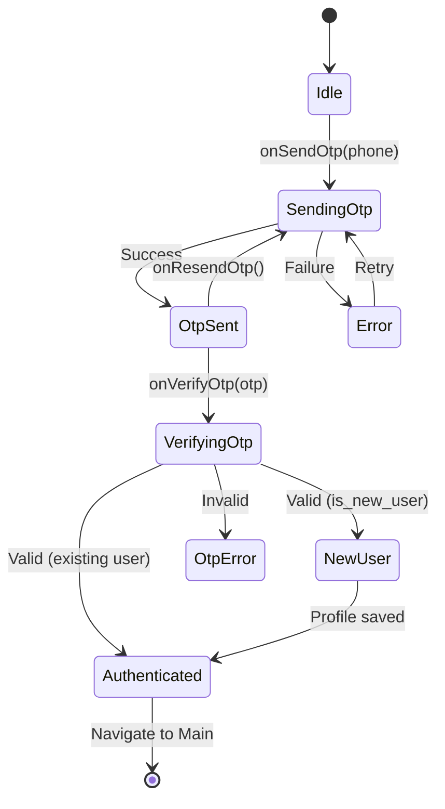
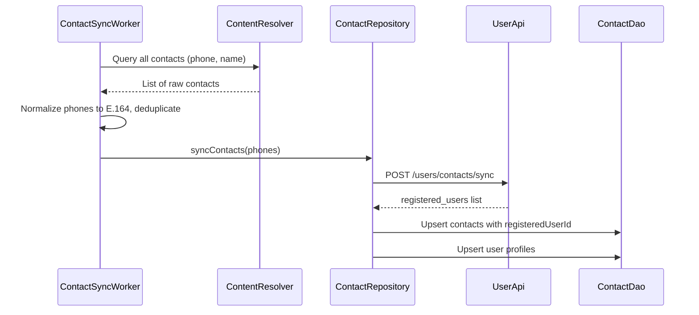
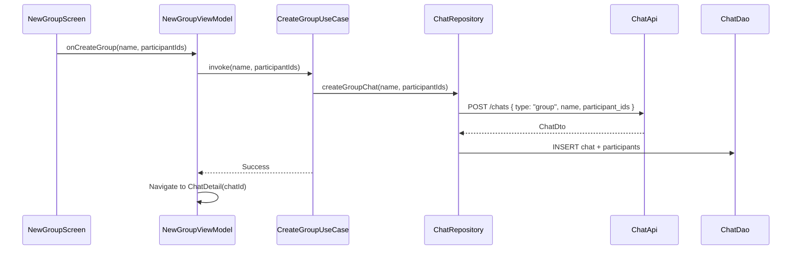
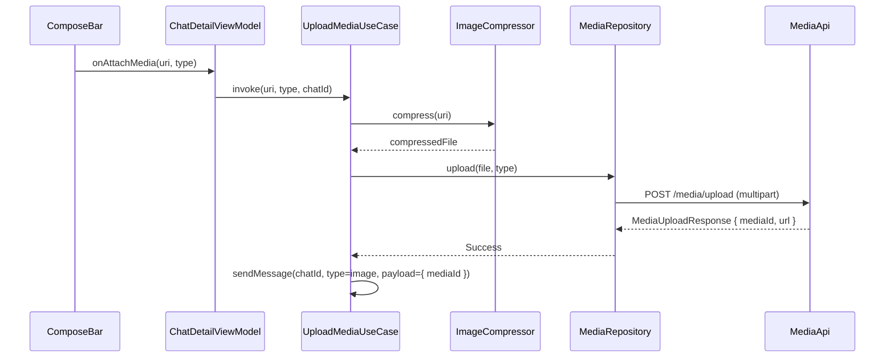
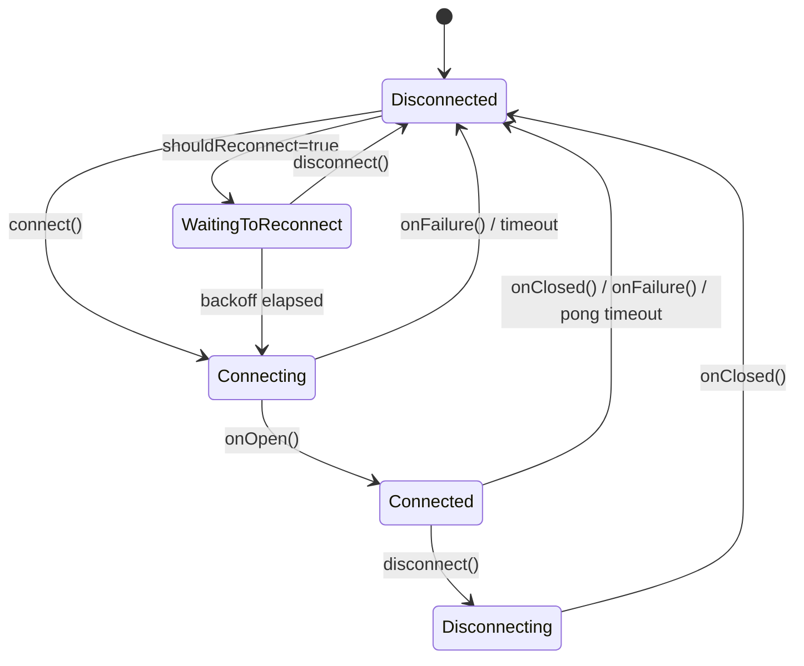

# WhatsApp Clone Android Client — Low-Level Design (LLD)

> Companion documents: [HLD.md](./HLD.md) | [PRD.md](./PRD.md) | [IMPLEMENTATION_PLAN.md](./IMPLEMENTATION_PLAN.md)

## Table of Contents

1. [Core Module: `:core:common`](#1-core-module-corecommon)
2. [Core Module: `:core:network`](#2-core-module-corenetwork)
3. [Core Module: `:core:database`](#3-core-module-coredatabase)
4. [Core Module: `:core:ui`](#4-core-module-coreui)
5. [Feature: Authentication](#5-feature-authentication)
6. [Feature: Chat List](#6-feature-chat-list)
7. [Feature: Chat Detail & Messaging](#7-feature-chat-detail--messaging)
8. [Feature: Contacts & Discovery](#8-feature-contacts--discovery)
9. [Feature: Groups](#9-feature-groups)
10. [Feature: Media](#10-feature-media)
11. [Feature: Profile & Settings](#11-feature-profile--settings)
12. [WebSocket Manager](#12-websocket-manager)
13. [Background Workers](#13-background-workers)
14. [Error Handling](#14-error-handling)
15. [Testing Architecture](#15-testing-architecture)

---

## 1. Core Module: `:core:common`

### 1.1 AppResult Wrapper

```kotlin
sealed class AppResult<out T> {
    data class Success<T>(val data: T) : AppResult<T>()
    data class Error(
        val code: ErrorCode,
        val message: String,
        val cause: Throwable? = null
    ) : AppResult<Nothing>()
    data object Loading : AppResult<Nothing>()
}

enum class ErrorCode {
    NETWORK_ERROR, TIMEOUT, UNAUTHORIZED, FORBIDDEN,
    NOT_FOUND, RATE_LIMITED, VALIDATION_ERROR, SERVER_ERROR, UNKNOWN
}

suspend fun <T> safeApiCall(
    dispatcher: CoroutineDispatcher = Dispatchers.IO,
    call: suspend () -> Response<ApiResponse<T>>
): AppResult<T> = withContext(dispatcher) {
    try {
        val response = call()
        if (response.isSuccessful) {
            val body = response.body()
            if (body?.success == true && body.data != null) {
                AppResult.Success(body.data)
            } else {
                AppResult.Error(
                    code = mapErrorCode(body?.error?.code),
                    message = body?.error?.message ?: "Unknown error"
                )
            }
        } else {
            AppResult.Error(code = mapHttpCode(response.code()), message = response.message())
        }
    } catch (e: IOException) {
        AppResult.Error(ErrorCode.NETWORK_ERROR, "Network unavailable", e)
    } catch (e: Exception) {
        AppResult.Error(ErrorCode.UNKNOWN, e.message ?: "Unknown error", e)
    }
}

fun <T, R> AppResult<T>.map(transform: (T) -> R): AppResult<R> = when (this) {
    is AppResult.Success -> AppResult.Success(transform(data))
    is AppResult.Error -> this
    is AppResult.Loading -> this
}
```

### 1.2 Utilities

```kotlin
object UuidGenerator {
    fun generate(): String = UUID.randomUUID().toString()
}

object TimeUtils {
    fun nowMillis(): Long = System.currentTimeMillis()

    fun formatChatTimestamp(epochMillis: Long): String {
        val now = Calendar.getInstance()
        val then = Calendar.getInstance().apply { timeInMillis = epochMillis }
        return when {
            isSameDay(now, then) -> SimpleDateFormat("HH:mm", Locale.getDefault()).format(Date(epochMillis))
            isYesterday(now, then) -> "Yesterday"
            isSameWeek(now, then) -> SimpleDateFormat("EEE", Locale.getDefault()).format(Date(epochMillis))
            else -> SimpleDateFormat("dd/MM/yy", Locale.getDefault()).format(Date(epochMillis))
        }
    }

    fun formatMessageTime(epochMillis: Long): String =
        SimpleDateFormat("HH:mm", Locale.getDefault()).format(Date(epochMillis))

    fun formatLastSeen(epochMillis: Long): String {
        val now = Calendar.getInstance()
        val then = Calendar.getInstance().apply { timeInMillis = epochMillis }
        return when {
            isSameDay(now, then) -> "last seen today at ${formatMessageTime(epochMillis)}"
            isYesterday(now, then) -> "last seen yesterday at ${formatMessageTime(epochMillis)}"
            else -> "last seen ${SimpleDateFormat("dd/MM/yy", Locale.getDefault()).format(Date(epochMillis))}"
        }
    }

    fun formatDateSeparator(epochMillis: Long): String {
        val now = Calendar.getInstance()
        val then = Calendar.getInstance().apply { timeInMillis = epochMillis }
        return when {
            isSameDay(now, then) -> "Today"
            isYesterday(now, then) -> "Yesterday"
            else -> SimpleDateFormat("MMMM d, yyyy", Locale.getDefault()).format(Date(epochMillis))
        }
    }
}
```

---

## 2. Core Module: `:core:network`

### 2.1 API Response Envelope

```kotlin
@Serializable
data class ApiResponse<T>(
    val success: Boolean,
    val data: T? = null,
    val error: ApiError? = null,
    val meta: ApiMeta? = null
)

@Serializable
data class ApiError(val code: String, val message: String, val details: List<String> = emptyList())

@Serializable
data class ApiMeta(val requestId: String, val timestamp: String)

@Serializable
data class PaginatedData<T>(val items: List<T>, val nextCursor: String? = null, val hasMore: Boolean = false)
```

### 2.2 TokenManager

```kotlin
interface TokenManager {
    fun getAccessToken(): String?
    fun getRefreshToken(): String?
    suspend fun saveTokens(accessToken: String, refreshToken: String)
    suspend fun refreshToken(): String?
    suspend fun clearTokens()
    fun isLoggedIn(): Boolean
}

class TokenManagerImpl @Inject constructor(
    @Named("encrypted") private val prefs: SharedPreferences,
    private val authApi: Lazy<AuthApi>,
    private val mutex: Mutex = Mutex()
) : TokenManager {

    override fun getAccessToken(): String? = prefs.getString("access_token", null)
    override fun getRefreshToken(): String? = prefs.getString("refresh_token", null)
    override fun isLoggedIn(): Boolean = getAccessToken() != null

    override suspend fun saveTokens(accessToken: String, refreshToken: String) {
        prefs.edit()
            .putString("access_token", accessToken)
            .putString("refresh_token", refreshToken)
            .apply()
    }

    override suspend fun clearTokens() {
        prefs.edit().clear().apply()
    }

    override suspend fun refreshToken(): String? = mutex.withLock {
        val refresh = getRefreshToken() ?: return null
        return try {
            val response = authApi.get().refreshToken(RefreshRequest(refresh))
            if (response.isSuccessful && response.body()?.success == true) {
                val data = response.body()!!.data!!
                saveTokens(data.accessToken, data.refreshToken)
                data.accessToken
            } else {
                clearTokens()
                null
            }
        } catch (e: Exception) { null }
    }
}
```

### 2.3 AuthInterceptor

```kotlin
class AuthInterceptor @Inject constructor(
    private val tokenManager: TokenManager
) : Interceptor {
    override fun intercept(chain: Chain): Response {
        val token = tokenManager.getAccessToken()
        val request = chain.request().newBuilder()
            .apply { if (token != null) addHeader("Authorization", "Bearer $token") }
            .build()

        val response = chain.proceed(request)

        if (response.code == 401) {
            val newToken = runBlocking { tokenManager.refreshToken() }
            if (newToken != null) {
                val retryRequest = chain.request().newBuilder()
                    .addHeader("Authorization", "Bearer $newToken")
                    .build()
                response.close()
                return chain.proceed(retryRequest)
            }
        }
        return response
    }
}
```

### 2.4 BaseUrlProvider

```kotlin
@Singleton
class BaseUrlProvider @Inject constructor(
    private val dataStore: DataStore<Preferences>
) {
    companion object {
        val BASE_URL_KEY = stringPreferencesKey("base_url")
        const val DEFAULT_URL = "http://10.0.2.2:8080/api/v1/"
    }

    val baseUrl: Flow<String> = dataStore.data.map { it[BASE_URL_KEY] ?: DEFAULT_URL }

    suspend fun setBaseUrl(url: String) {
        dataStore.edit { it[BASE_URL_KEY] = url }
    }

    fun getWsUrl(): String {
        val rest = runBlocking { baseUrl.first() }
        return rest.replace("http", "ws").replace("/api/v1/", "/ws")
    }
}
```

### 2.5 Hilt Network Module

```kotlin
@Module
@InstallIn(SingletonComponent::class)
object NetworkModule {

    @Provides @Singleton
    fun provideJson(): Json = Json {
        ignoreUnknownKeys = true
        isLenient = true
        encodeDefaults = true
    }

    @Provides @Singleton
    fun provideOkHttpClient(authInterceptor: AuthInterceptor): OkHttpClient =
        OkHttpClient.Builder()
            .addInterceptor(authInterceptor)
            .addInterceptor(HttpLoggingInterceptor().apply {
                level = if (BuildConfig.DEBUG) Level.BODY else Level.NONE
            })
            .connectTimeout(10, TimeUnit.SECONDS)
            .readTimeout(30, TimeUnit.SECONDS)
            .writeTimeout(30, TimeUnit.SECONDS)
            .build()

    @Provides @Singleton
    fun provideRetrofit(client: OkHttpClient, json: Json, baseUrlProvider: BaseUrlProvider): Retrofit {
        val baseUrl = runBlocking { baseUrlProvider.baseUrl.first() }
        return Retrofit.Builder()
            .baseUrl(baseUrl)
            .client(client)
            .addConverterFactory(json.asConverterFactory("application/json".toMediaType()))
            .build()
    }

    @Provides @Singleton fun provideAuthApi(retrofit: Retrofit): AuthApi = retrofit.create()
    @Provides @Singleton fun provideUserApi(retrofit: Retrofit): UserApi = retrofit.create()
    @Provides @Singleton fun provideChatApi(retrofit: Retrofit): ChatApi = retrofit.create()
    @Provides @Singleton fun provideMessageApi(retrofit: Retrofit): MessageApi = retrofit.create()
    @Provides @Singleton fun provideMediaApi(retrofit: Retrofit): MediaApi = retrofit.create()
    @Provides @Singleton fun provideNotificationApi(retrofit: Retrofit): NotificationApi = retrofit.create()
}
```

### 2.6 Retrofit API Interfaces

```kotlin
interface AuthApi {
    @POST("auth/otp/send")
    suspend fun sendOtp(@Body request: SendOtpRequest): Response<ApiResponse<SendOtpResponse>>
    @POST("auth/otp/verify")
    suspend fun verifyOtp(@Body request: VerifyOtpRequest): Response<ApiResponse<AuthTokenResponse>>
    @POST("auth/token/refresh")
    suspend fun refreshToken(@Body request: RefreshRequest): Response<ApiResponse<AuthTokenResponse>>
    @POST("auth/logout")
    suspend fun logout(): Response<ApiResponse<Unit>>
}

interface UserApi {
    @GET("users/me")
    suspend fun getMe(): Response<ApiResponse<UserDto>>
    @PATCH("users/me")
    suspend fun updateProfile(@Body body: UpdateProfileRequest): Response<ApiResponse<UserDto>>
    @GET("users/{userId}")
    suspend fun getUser(@Path("userId") userId: String): Response<ApiResponse<UserDto>>
    @GET("users/{userId}/presence")
    suspend fun getPresence(@Path("userId") userId: String): Response<ApiResponse<PresenceDto>>
    @POST("users/contacts/sync")
    suspend fun syncContacts(@Body body: ContactSyncRequest): Response<ApiResponse<ContactSyncResponse>>
    @POST("users/{userId}/block")
    suspend fun blockUser(@Path("userId") userId: String): Response<ApiResponse<Unit>>
    @DELETE("users/{userId}/block")
    suspend fun unblockUser(@Path("userId") userId: String): Response<ApiResponse<Unit>>
}

interface ChatApi {
    @GET("chats")
    suspend fun getChats(@Query("cursor") cursor: String? = null, @Query("limit") limit: Int = 20): Response<ApiResponse<PaginatedData<ChatDto>>>
    @POST("chats")
    suspend fun createChat(@Body body: JsonObject): Response<ApiResponse<ChatDto>>
    @GET("chats/{chatId}")
    suspend fun getChatDetail(@Path("chatId") chatId: String): Response<ApiResponse<ChatDto>>
    @PATCH("chats/{chatId}")
    suspend fun updateChat(@Path("chatId") chatId: String, @Body body: JsonObject): Response<ApiResponse<ChatDto>>
    @PATCH("chats/{chatId}/mute")
    suspend fun muteChat(@Path("chatId") chatId: String, @Body body: MuteChatRequest): Response<ApiResponse<Unit>>
    @POST("chats/{chatId}/participants")
    suspend fun addParticipants(@Path("chatId") chatId: String, @Body body: AddParticipantsRequest): Response<ApiResponse<Unit>>
    @DELETE("chats/{chatId}/participants/{userId}")
    suspend fun removeParticipant(@Path("chatId") chatId: String, @Path("userId") userId: String): Response<ApiResponse<Unit>>
    @PATCH("chats/{chatId}/participants/{userId}/role")
    suspend fun updateRole(@Path("chatId") chatId: String, @Path("userId") userId: String, @Body body: UpdateRoleRequest): Response<ApiResponse<Unit>>
}

interface MessageApi {
    @GET("messages/{chatId}")
    suspend fun getMessages(@Path("chatId") chatId: String, @Query("cursor") cursor: String? = null, @Query("limit") limit: Int = 50): Response<ApiResponse<PaginatedData<MessageDto>>>
    @POST("messages/{chatId}")
    suspend fun sendMessage(@Path("chatId") chatId: String, @Body body: SendMessageRequest): Response<ApiResponse<MessageDto>>
    @DELETE("messages/{messageId}")
    suspend fun deleteMessage(@Path("messageId") messageId: String): Response<ApiResponse<Unit>>
    @POST("messages/{messageId}/star")
    suspend fun starMessage(@Path("messageId") messageId: String): Response<ApiResponse<Unit>>
    @DELETE("messages/{messageId}/star")
    suspend fun unstarMessage(@Path("messageId") messageId: String): Response<ApiResponse<Unit>>
    @POST("messages/{chatId}/read")
    suspend fun markRead(@Path("chatId") chatId: String, @Body body: MarkReadRequest): Response<ApiResponse<Unit>>
}

interface MediaApi {
    @Multipart
    @POST("media/upload")
    suspend fun uploadMedia(@Part file: MultipartBody.Part, @Part("type") type: RequestBody): Response<ApiResponse<MediaUploadResponse>>
    @GET("media/{mediaId}")
    suspend fun getMediaMetadata(@Path("mediaId") mediaId: String): Response<ApiResponse<MediaUploadResponse>>
}

interface NotificationApi {
    @POST("notifications/device")
    suspend fun registerDevice(@Body body: DeviceTokenRequest): Response<ApiResponse<Unit>>
    @DELETE("notifications/device")
    suspend fun unregisterDevice(): Response<ApiResponse<Unit>>
}
```

### 2.7 Navigation Routes

```kotlin
sealed class AppRoute(val route: String) {
    data object Splash : AppRoute("splash")
    data object Login : AppRoute("login")
    data object OtpVerification : AppRoute("otp/{phone}") {
        fun create(phone: String) = "otp/${Uri.encode(phone)}"
    }
    data object ProfileSetup : AppRoute("profile-setup")
    data object Main : AppRoute("main")
    data object ChatDetail : AppRoute("chat/{chatId}") {
        fun create(chatId: String) = "chat/$chatId"
    }
    data object ContactPicker : AppRoute("contacts/pick")
    data object NewGroup : AppRoute("group/new")
    data object GroupSetup : AppRoute("group/setup")
    data object GroupInfo : AppRoute("group/{chatId}/info") {
        fun create(chatId: String) = "group/$chatId/info"
    }
    data object ContactInfo : AppRoute("contact/{userId}/info") {
        fun create(userId: String) = "contact/$userId/info"
    }
    data object MediaViewer : AppRoute("media/{mediaId}") {
        fun create(mediaId: String) = "media/$mediaId"
    }
    data object Settings : AppRoute("settings")
    data object ProfileEdit : AppRoute("settings/profile")
    data object PrivacySettings : AppRoute("settings/privacy")
    data object NotificationSettings : AppRoute("settings/notifications")
    data object ServerUrlSettings : AppRoute("settings/server-url")
    data object ForwardPicker : AppRoute("forward/{messageId}") {
        fun create(messageId: String) = "forward/$messageId"
    }
}
```

---

## 3. Core Module: `:core:database`

### 3.1 Database Definition

```kotlin
@Database(
    entities = [
        UserEntity::class, ContactEntity::class, ChatEntity::class,
        ChatParticipantEntity::class, MessageEntity::class,
        GroupEntity::class, MediaEntity::class
    ],
    version = 1,
    exportSchema = true
)
@TypeConverters(Converters::class)
abstract class AppDatabase : RoomDatabase() {
    abstract fun userDao(): UserDao
    abstract fun contactDao(): ContactDao
    abstract fun chatDao(): ChatDao
    abstract fun chatParticipantDao(): ChatParticipantDao
    abstract fun messageDao(): MessageDao
    abstract fun groupDao(): GroupDao
    abstract fun mediaDao(): MediaDao
}
```

### 3.2 ChatDao

```kotlin
@Dao
interface ChatDao {
    @Query("""
        SELECT c.*, m.content AS lastMessageText, m.messageType AS lastMessageType,
               m.senderId AS lastMessageSenderId, m.timestamp AS lastMessageTimestamp,
               u.displayName AS lastMessageSenderName
        FROM chats c
        LEFT JOIN messages m ON c.lastMessageId = m.messageId
        LEFT JOIN users u ON m.senderId = u.id
        ORDER BY c.lastMessageTimestamp DESC
    """)
    fun observeChatsWithLastMessage(): Flow<List<ChatWithLastMessage>>

    @Query("SELECT * FROM chats WHERE chatId = :chatId")
    suspend fun getChatById(chatId: String): ChatEntity?

    @Query("SELECT * FROM chats WHERE chatId = :chatId")
    fun observeChat(chatId: String): Flow<ChatEntity?>

    @Upsert
    suspend fun upsert(chat: ChatEntity)

    @Upsert
    suspend fun upsertAll(chats: List<ChatEntity>)

    @Query("UPDATE chats SET unreadCount = :count WHERE chatId = :chatId")
    suspend fun updateUnreadCount(chatId: String, count: Int)

    @Query("UPDATE chats SET unreadCount = unreadCount + 1 WHERE chatId = :chatId")
    suspend fun incrementUnreadCount(chatId: String)

    @Query("UPDATE chats SET isMuted = :muted WHERE chatId = :chatId")
    suspend fun setMuted(chatId: String, muted: Boolean)

    @Query("""
        UPDATE chats SET lastMessageId = :messageId, lastMessagePreview = :preview,
        lastMessageTimestamp = :timestamp, updatedAt = :timestamp WHERE chatId = :chatId
    """)
    suspend fun updateLastMessage(chatId: String, messageId: String, preview: String, timestamp: Long)

    @Query("SELECT * FROM chats WHERE chatType = 'direct' AND chatId IN (SELECT chatId FROM chat_participants WHERE userId = :userId)")
    suspend fun findDirectChatWithUser(userId: String): ChatEntity?

    @Query("DELETE FROM chats")
    suspend fun deleteAll()
}
```

### 3.3 MessageDao

```kotlin
@Dao
interface MessageDao {
    @Query("SELECT * FROM messages WHERE chatId = :chatId ORDER BY timestamp DESC")
    fun pagingSource(chatId: String): PagingSource<Int, MessageEntity>

    @Query("SELECT * FROM messages WHERE chatId = :chatId ORDER BY timestamp DESC LIMIT :limit")
    fun observeRecentMessages(chatId: String, limit: Int = 50): Flow<List<MessageEntity>>

    @Query("SELECT * FROM messages WHERE messageId = :messageId")
    suspend fun getById(messageId: String): MessageEntity?

    @Query("SELECT * FROM messages WHERE clientMsgId = :clientMsgId")
    suspend fun getByClientMsgId(clientMsgId: String): MessageEntity?

    @Insert(onConflict = OnConflictStrategy.IGNORE)
    suspend fun insert(message: MessageEntity)

    @Insert(onConflict = OnConflictStrategy.IGNORE)
    suspend fun insertAll(messages: List<MessageEntity>)

    @Query("UPDATE messages SET status = :status WHERE messageId = :messageId")
    suspend fun updateStatus(messageId: String, status: String)

    @Query("""
        UPDATE messages SET messageId = :serverMsgId, status = 'sent', timestamp = :timestamp
        WHERE clientMsgId = :clientMsgId AND status = 'pending'
    """)
    suspend fun confirmSent(clientMsgId: String, serverMsgId: String, timestamp: Long)

    @Query("UPDATE messages SET isDeleted = 1, deletedForEveryone = :forEveryone, content = NULL WHERE messageId = :messageId")
    suspend fun softDelete(messageId: String, forEveryone: Boolean)

    @Query("UPDATE messages SET isStarred = :starred WHERE messageId = :messageId")
    suspend fun setStarred(messageId: String, starred: Boolean)

    @Query("SELECT * FROM messages WHERE status = 'pending' ORDER BY createdAt ASC")
    suspend fun getAllPendingMessages(): List<MessageEntity>

    @Query("DELETE FROM messages WHERE chatId = :chatId")
    suspend fun deleteAllForChat(chatId: String)
}
```

### 3.4 UserDao

```kotlin
@Dao
interface UserDao {
    @Query("SELECT * FROM users WHERE id = :userId")
    suspend fun getById(userId: String): UserEntity?

    @Query("SELECT * FROM users WHERE id = :userId")
    fun observeUser(userId: String): Flow<UserEntity?>

    @Query("SELECT * FROM users WHERE phone = :phone")
    suspend fun getByPhone(phone: String): UserEntity?

    @Upsert
    suspend fun upsert(user: UserEntity)

    @Upsert
    suspend fun upsertAll(users: List<UserEntity>)

    @Query("UPDATE users SET isOnline = :online, lastSeen = :lastSeen WHERE id = :userId")
    suspend fun updatePresence(userId: String, online: Boolean, lastSeen: Long?)

    @Query("UPDATE users SET isBlocked = :blocked WHERE id = :userId")
    suspend fun setBlocked(userId: String, blocked: Boolean)
}
```

### 3.5 ContactDao

```kotlin
@Dao
interface ContactDao {
    @Query("""
        SELECT c.*, u.id AS userId, u.displayName, u.avatarUrl, u.statusText, u.isOnline
        FROM contacts c LEFT JOIN users u ON c.registeredUserId = u.id
        WHERE c.registeredUserId IS NOT NULL ORDER BY c.deviceName ASC
    """)
    fun observeRegisteredContacts(): Flow<List<ContactWithUser>>

    @Query("""
        SELECT c.*, u.id AS userId, u.displayName, u.avatarUrl, u.statusText, u.isOnline
        FROM contacts c LEFT JOIN users u ON c.registeredUserId = u.id
        WHERE c.registeredUserId IS NOT NULL
          AND (c.deviceName LIKE '%' || :query || '%' OR u.displayName LIKE '%' || :query || '%')
        ORDER BY c.deviceName ASC
    """)
    fun searchRegisteredContacts(query: String): Flow<List<ContactWithUser>>

    @Upsert
    suspend fun upsertAll(contacts: List<ContactEntity>)

    @Query("DELETE FROM contacts")
    suspend fun deleteAll()
}
```

### 3.6 ChatParticipantDao

```kotlin
@Dao
interface ChatParticipantDao {
    @Query("SELECT * FROM chat_participants WHERE chatId = :chatId")
    fun observeParticipants(chatId: String): Flow<List<ChatParticipantEntity>>

    @Query("SELECT * FROM chat_participants WHERE chatId = :chatId")
    suspend fun getParticipants(chatId: String): List<ChatParticipantEntity>

    @Upsert
    suspend fun upsert(participant: ChatParticipantEntity)

    @Upsert
    suspend fun upsertAll(participants: List<ChatParticipantEntity>)

    @Query("DELETE FROM chat_participants WHERE chatId = :chatId AND userId = :userId")
    suspend fun delete(chatId: String, userId: String)

    @Query("DELETE FROM chat_participants WHERE chatId = :chatId")
    suspend fun deleteAllForChat(chatId: String)
}
```

### 3.7 GroupDao

```kotlin
@Dao
interface GroupDao {
    @Query("SELECT * FROM groups WHERE chatId = :chatId")
    suspend fun getByChatId(chatId: String): GroupEntity?

    @Query("SELECT * FROM groups WHERE chatId = :chatId")
    fun observeGroup(chatId: String): Flow<GroupEntity?>

    @Upsert
    suspend fun upsert(group: GroupEntity)
}
```

### 3.8 MediaDao

```kotlin
@Dao
interface MediaDao {
    @Query("SELECT * FROM media WHERE mediaId = :mediaId")
    suspend fun getById(mediaId: String): MediaEntity?

    @Insert(onConflict = OnConflictStrategy.REPLACE)
    suspend fun insert(media: MediaEntity)

    @Query("UPDATE media SET localPath = :path WHERE mediaId = :mediaId")
    suspend fun updateLocalPath(mediaId: String, path: String)

    @Query("UPDATE media SET localPath = NULL, localThumbnailPath = NULL WHERE createdAt < :beforeTimestamp")
    suspend fun clearStaleLocalPaths(beforeTimestamp: Long)
}
```

### 3.9 Entity-DTO Mappers

```kotlin
fun UserDto.toEntity() = UserEntity(
    id = id, phone = phone, displayName = displayName,
    statusText = statusText, avatarUrl = avatarUrl,
    createdAt = TimeUtils.nowMillis(), updatedAt = TimeUtils.nowMillis()
)

fun ChatDto.toEntity() = ChatEntity(
    chatId = chatId, chatType = type,
    lastMessagePreview = lastMessage?.preview,
    lastMessageTimestamp = lastMessage?.timestamp?.toEpochMillis(),
    unreadCount = unreadCount, isMuted = isMuted,
    createdAt = TimeUtils.nowMillis(), updatedAt = updatedAt.toEpochMillis()
)

fun ChatParticipantDto.toEntity(chatId: String) = ChatParticipantEntity(
    chatId = chatId, userId = userId, role = role, joinedAt = TimeUtils.nowMillis()
)

fun MessageDto.toEntity() = MessageEntity(
    messageId = messageId, clientMsgId = clientMsgId ?: messageId,
    chatId = chatId, senderId = senderId, messageType = type,
    content = payload.body, mediaId = payload.mediaId,
    status = status, isDeleted = isDeleted, isStarred = isStarred,
    timestamp = createdAt.toEpochMillis(), createdAt = TimeUtils.nowMillis()
)

fun MediaUploadResponse.toEntity(uploaderId: String) = MediaEntity(
    mediaId = mediaId, uploaderId = uploaderId, fileType = type,
    mimeType = mimeType, originalFilename = null, sizeBytes = sizeBytes,
    width = width, height = height, storageUrl = url,
    thumbnailUrl = thumbnailUrl, createdAt = TimeUtils.nowMillis()
)

fun String.toEpochMillis(): Long = Instant.parse(this).toEpochMilli()
```

### 3.10 Hilt Database Module

```kotlin
@Module
@InstallIn(SingletonComponent::class)
object DatabaseModule {
    @Provides @Singleton
    fun provideDatabase(@ApplicationContext context: Context): AppDatabase =
        Room.databaseBuilder(context, AppDatabase::class.java, "whatsapp_clone.db")
            .fallbackToDestructiveMigration()
            .build()

    @Provides fun provideUserDao(db: AppDatabase) = db.userDao()
    @Provides fun provideChatDao(db: AppDatabase) = db.chatDao()
    @Provides fun provideMessageDao(db: AppDatabase) = db.messageDao()
    @Provides fun provideContactDao(db: AppDatabase) = db.contactDao()
    @Provides fun provideChatParticipantDao(db: AppDatabase) = db.chatParticipantDao()
    @Provides fun provideGroupDao(db: AppDatabase) = db.groupDao()
    @Provides fun provideMediaDao(db: AppDatabase) = db.mediaDao()
}
```

---

## 4. Core Module: `:core:ui`

### 4.1 Theme

```kotlin
object WhatsAppColors {
    val Primary = Color(0xFF075E54)
    val Secondary = Color(0xFF25D366)
    val Accent = Color(0xFF34B7F1)
    val ChatBackground = Color(0xFFECE5DD)
    val SentBubble = Color(0xFFDCF8C6)
    val ReceivedBubble = Color(0xFFFFFFFF)
    val OnPrimary = Color.White
    val Error = Color(0xFFB00020)
}
```

### 4.2 Shared Composables

```kotlin
@Composable fun UserAvatar(url: String?, size: Dp = 48.dp, onClick: (() -> Unit)? = null)
@Composable fun UnreadBadge(count: Int)
@Composable fun MessageStatusIcon(status: String) // pending, sent, delivered, read
@Composable fun DateSeparator(date: String)
@Composable fun TypingIndicator(names: List<String>)
@Composable fun EmptyState(icon: ImageVector, title: String, subtitle: String)
@Composable fun LoadingOverlay(isLoading: Boolean)
@Composable fun ErrorBanner(message: String, onRetry: () -> Unit)
@Composable fun MessageBubble(message: MessageUi, isMine: Boolean, onLongPress: () -> Unit, onMediaTap: () -> Unit)
```

---

## 5. Feature: Authentication

### 5.1 Auth State Machine



### 5.2 UiState Classes

```kotlin
data class LoginUiState(
    val phone: String = "", val countryCode: String = "+91",
    val isValid: Boolean = false, val isLoading: Boolean = false, val error: String? = null
)

data class OtpUiState(
    val phone: String = "", val otp: String = "", val isLoading: Boolean = false,
    val error: String? = null, val resendCountdown: Int = 0, val canResend: Boolean = false
)
```

### 5.3 AuthRepository

```kotlin
interface AuthRepository {
    suspend fun sendOtp(phone: String): AppResult<SendOtpResponse>
    suspend fun verifyOtp(phone: String, otp: String): AppResult<AuthTokenResponse>
    suspend fun logout(): AppResult<Unit>
    fun isLoggedIn(): Boolean
}

class AuthRepositoryImpl @Inject constructor(
    private val authApi: AuthApi,
    private val notificationApi: NotificationApi,
    private val tokenManager: TokenManager,
    private val fcmTokenManager: FCMTokenManager,
    private val userDao: UserDao
) : AuthRepository {

    override suspend fun verifyOtp(phone: String, otp: String): AppResult<AuthTokenResponse> {
        val result = safeApiCall { authApi.verifyOtp(VerifyOtpRequest(phone, otp)) }
        if (result is AppResult.Success) {
            tokenManager.saveTokens(result.data.accessToken, result.data.refreshToken)
            userDao.upsert(result.data.user.toEntity())
            registerFcmToken()
        }
        return result
    }

    override suspend fun logout(): AppResult<Unit> {
        try { notificationApi.unregisterDevice() } catch (_: Exception) {}
        tokenManager.clearTokens()
        return AppResult.Success(Unit)
    }

    private suspend fun registerFcmToken() {
        val token = fcmTokenManager.getToken() ?: return
        safeApiCall { notificationApi.registerDevice(DeviceTokenRequest(token)) }
    }
}
```

---

## 6. Feature: Chat List

### 6.1 UiState

```kotlin
data class ChatListUiState(
    val chats: List<ChatItemUi> = emptyList(), val searchQuery: String = "",
    val filteredChats: List<ChatItemUi> = emptyList(),
    val isLoading: Boolean = true, val isRefreshing: Boolean = false, val error: UiError? = null
)

data class ChatItemUi(
    val chatId: String, val type: ChatType, val title: String, val avatarUrl: String?,
    val lastMessage: String?, val lastMessageTime: String?, val unreadCount: Int,
    val isMuted: Boolean, val isPinned: Boolean, val isOnline: Boolean, val isTyping: Boolean
)
```

### 6.2 ChatRepository

```kotlin
interface ChatRepository {
    fun observeChats(): Flow<List<ChatWithLastMessage>>
    suspend fun syncChats(): AppResult<Unit>
    suspend fun createDirectChat(participantId: String): AppResult<ChatDto>
    suspend fun createGroupChat(name: String, participantIds: List<String>): AppResult<ChatDto>
    suspend fun getChatDetail(chatId: String): AppResult<ChatDto>
    suspend fun muteChat(chatId: String, muted: Boolean): AppResult<Unit>
    suspend fun updateUnreadCount(chatId: String, count: Int)
    suspend fun incrementUnreadCount(chatId: String)
    suspend fun updateLastMessage(chatId: String, messageId: String, preview: String, timestamp: Long)
    suspend fun insertFromRemote(event: ServerWsEvent.ChatCreated)
    suspend fun applyUpdate(chatId: String, changes: JsonObject)
    suspend fun addParticipant(chatId: String, userId: String, displayName: String)
    suspend fun removeParticipant(chatId: String, userId: String)
}
```

### 6.3 ChatListViewModel

```kotlin
@HiltViewModel
class ChatListViewModel @Inject constructor(
    private val observeChatsUseCase: ObserveChatsUseCase,
    private val syncChatsUseCase: SyncChatsUseCase,
    private val typingStateHolder: TypingStateHolder
) : ViewModel() {

    private val _uiState = MutableStateFlow(ChatListUiState())
    val uiState: StateFlow<ChatListUiState> = _uiState.asStateFlow()

    init {
        observeChats()
        observeTyping()
        syncOnLaunch()
    }

    private fun observeChats() {
        viewModelScope.launch {
            observeChatsUseCase().map { chats -> chats.map { it.toUiModel() } }
                .collect { items -> _uiState.update { it.copy(chats = items, isLoading = false) } }
        }
    }

    private fun observeTyping() {
        viewModelScope.launch {
            typingStateHolder.typingState.collect { typingMap ->
                _uiState.update { state ->
                    state.copy(chats = state.chats.map { chat ->
                        chat.copy(isTyping = typingMap.containsKey(chat.chatId))
                    })
                }
            }
        }
    }

    fun onSearch(query: String) {
        _uiState.update { it.copy(
            searchQuery = query,
            filteredChats = if (query.isBlank()) it.chats
                else it.chats.filter { c -> c.title.contains(query, ignoreCase = true) }
        )}
    }

    fun onRefresh() {
        viewModelScope.launch {
            _uiState.update { it.copy(isRefreshing = true) }
            syncChatsUseCase()
            _uiState.update { it.copy(isRefreshing = false) }
        }
    }
}
```

---

## 7. Feature: Chat Detail & Messaging

### 7.1 UiState

```kotlin
data class ChatDetailUiState(
    val chatInfo: ChatInfoUi? = null,
    val composerState: ComposerState = ComposerState(),
    val typingUsers: List<String> = emptyList(),
    val isLoading: Boolean = true,
    val error: UiError? = null
)

data class ComposerState(
    val text: String = "", val replyingTo: MessageUi? = null,
    val attachments: List<MediaAttachment> = emptyList(), val isRecordingVoice: Boolean = false
)

data class ChatInfoUi(
    val chatId: String, val type: ChatType, val title: String,
    val avatarUrl: String?, val subtitle: String, val isOnline: Boolean
)
```

### 7.2 MessageRepository

```kotlin
interface MessageRepository {
    fun observeMessages(chatId: String): Flow<PagingData<MessageEntity>>
    suspend fun saveAndSend(message: MessageEntity): AppResult<Unit>
    suspend fun insertFromRemote(message: MessageEntity)
    suspend fun confirmSent(clientMsgId: String, serverMsgId: String, timestamp: Long)
    suspend fun updateStatus(messageId: String, status: String)
    suspend fun softDelete(messageId: String, forEveryone: Boolean)
    suspend fun starMessage(messageId: String, starred: Boolean): AppResult<Unit>
    suspend fun markRead(chatId: String, upToMessageId: String): AppResult<Unit>
}
```

### 7.3 Message Pagination (Paging 3)

```kotlin
class MessageRemoteMediator(
    private val chatId: String,
    private val messageApi: MessageApi,
    private val messageDao: MessageDao
) : RemoteMediator<Int, MessageEntity>() {

    override suspend fun load(loadType: LoadType, state: PagingState<Int, MessageEntity>): MediatorResult {
        val cursor = when (loadType) {
            LoadType.REFRESH -> null
            LoadType.PREPEND -> return MediatorResult.Success(endOfPaginationReached = true)
            LoadType.APPEND -> state.lastItemOrNull()?.messageId
                ?: return MediatorResult.Success(endOfPaginationReached = true)
        }
        return try {
            val response = messageApi.getMessages(chatId, cursor, state.config.pageSize)
            val body = response.body()?.data ?: return MediatorResult.Error(Exception("Empty"))
            messageDao.insertAll(body.items.map { it.toEntity() })
            MediatorResult.Success(endOfPaginationReached = !body.hasMore)
        } catch (e: Exception) { MediatorResult.Error(e) }
    }
}
```

### 7.4 Typing Indicator Logic

```kotlin
// Sending typing events (in ChatDetailViewModel)
private var typingJob: Job? = null
private var isCurrentlyTyping = false

fun onTextChanged(text: String) {
    _uiState.update { it.copy(composerState = it.composerState.copy(text = text)) }
    if (text.isNotEmpty() && !isCurrentlyTyping) {
        isCurrentlyTyping = true
        webSocketManager.send(ClientWsEvent.TypingStart(chatId))
    }
    typingJob?.cancel()
    typingJob = viewModelScope.launch {
        delay(3000)
        if (isCurrentlyTyping) {
            isCurrentlyTyping = false
            webSocketManager.send(ClientWsEvent.TypingStop(chatId))
        }
    }
}
```

### 7.5 TypingStateHolder

```kotlin
@Singleton
class TypingStateHolder @Inject constructor() {
    private val _typingState = MutableStateFlow<Map<String, Set<String>>>(emptyMap())
    val typingState: StateFlow<Map<String, Set<String>>> = _typingState.asStateFlow()

    private val timeoutJobs = mutableMapOf<Pair<String, String>, Job>()
    private val scope = CoroutineScope(SupervisorJob() + Dispatchers.Default)

    fun onTyping(chatId: String, userId: String, isTyping: Boolean) {
        val key = chatId to userId
        timeoutJobs[key]?.cancel()

        if (isTyping) {
            _typingState.update { current ->
                val users = current.getOrDefault(chatId, emptySet()) + userId
                current + (chatId to users)
            }
            timeoutJobs[key] = scope.launch {
                delay(5000)
                removeTyper(chatId, userId)
            }
        } else {
            removeTyper(chatId, userId)
        }
    }

    private fun removeTyper(chatId: String, userId: String) {
        _typingState.update { current ->
            val users = current.getOrDefault(chatId, emptySet()) - userId
            if (users.isEmpty()) current - chatId else current + (chatId to users)
        }
    }

    fun getTypingNames(chatId: String): List<String> =
        _typingState.value[chatId]?.toList() ?: emptyList()
}
```

---

## 8. Feature: Contacts & Discovery

### 8.1 ContactRepository

```kotlin
interface ContactRepository {
    fun observeRegisteredContacts(): Flow<List<ContactWithUser>>
    suspend fun syncContacts(): AppResult<Unit>
    fun searchContacts(query: String): Flow<List<ContactWithUser>>
}

data class ContactWithUser(
    val contactId: String, val phone: String, val deviceName: String, val user: UserEntity?
)
```

### 8.2 Contact Sync Flow



---

## 9. Feature: Groups

### 9.1 GroupRepository

```kotlin
interface GroupRepository {
    suspend fun addMembers(chatId: String, userIds: List<String>): AppResult<Unit>
    suspend fun removeMember(chatId: String, userId: String): AppResult<Unit>
    suspend fun updateRole(chatId: String, userId: String, role: String): AppResult<Unit>
    suspend fun updateGroupInfo(chatId: String, name: String?, description: String?, avatarUrl: String?): AppResult<Unit>
    suspend fun leaveGroup(chatId: String): AppResult<Unit>
    fun observeGroupMembers(chatId: String): Flow<List<ChatParticipantWithUser>>
}

data class ChatParticipantWithUser(
    val chatId: String, val userId: String, val role: String,
    val joinedAt: Long, val user: UserEntity
)
```

### 9.2 Group Creation Sequence



---

## 10. Feature: Media

### 10.1 MediaRepository

```kotlin
interface MediaRepository {
    suspend fun upload(file: File, type: String): AppResult<MediaUploadResponse>
    suspend fun getMetadata(mediaId: String): AppResult<MediaUploadResponse>
    suspend fun download(mediaId: String, url: String): File
}
```

### 10.2 ImageCompressor

```kotlin
class ImageCompressor @Inject constructor(@ApplicationContext private val context: Context) {
    suspend fun compress(uri: Uri, maxWidth: Int = 1600, quality: Int = 80): File =
        withContext(Dispatchers.Default) {
            val bitmap = context.contentResolver.openInputStream(uri)!!.use { BitmapFactory.decodeStream(it) }
            val scaled = if (bitmap.width > maxWidth) {
                val ratio = maxWidth.toFloat() / bitmap.width
                Bitmap.createScaledBitmap(bitmap, maxWidth, (bitmap.height * ratio).toInt(), true)
            } else bitmap

            val out = File.createTempFile("compressed_", ".jpg", context.cacheDir)
            FileOutputStream(out).use { scaled.compress(Bitmap.CompressFormat.JPEG, quality, it) }
            if (scaled !== bitmap) scaled.recycle()
            bitmap.recycle()
            out
        }
}
```

### 10.3 MediaDownloadManager

```kotlin
class MediaDownloadManager @Inject constructor(
    private val okHttpClient: OkHttpClient, private val mediaDao: MediaDao, private val cacheDir: File
) {
    suspend fun download(mediaId: String, url: String): File {
        val cached = mediaDao.getById(mediaId)
        if (cached?.localPath != null && File(cached.localPath).exists()) return File(cached.localPath)

        val request = Request.Builder().url(url).build()
        val response = okHttpClient.newCall(request).await()
        val file = File(cacheDir, "media/$mediaId")
        file.parentFile?.mkdirs()
        file.outputStream().use { out -> response.body?.byteStream()?.copyTo(out) }
        mediaDao.updateLocalPath(mediaId, file.absolutePath)
        return file
    }
}
```

### 10.4 Upload Sequence



---

## 11. Feature: Profile & Settings

### 11.1 UserRepository

```kotlin
interface UserRepository {
    suspend fun getMe(): AppResult<UserDto>
    suspend fun updateProfile(displayName: String, statusText: String, avatarUrl: String?): AppResult<UserDto>
    suspend fun getUser(userId: String): AppResult<UserDto>
    suspend fun blockUser(userId: String): AppResult<Unit>
    suspend fun unblockUser(userId: String): AppResult<Unit>
    suspend fun updatePresence(userId: String, online: Boolean, lastSeen: Long?)
    fun observeUser(userId: String): Flow<UserEntity?>
}
```

### 11.2 ProfileEditViewModel

```kotlin
@HiltViewModel
class ProfileEditViewModel @Inject constructor(
    private val userRepository: UserRepository,
    private val mediaRepository: MediaRepository,
    private val imageCompressor: ImageCompressor
) : ViewModel() {

    data class ProfileUiState(
        val displayName: String = "", val statusText: String = "",
        val avatarUrl: String? = null, val phone: String = "",
        val isLoading: Boolean = true, val isSaving: Boolean = false,
        val error: String? = null, val saved: Boolean = false
    )

    private val _uiState = MutableStateFlow(ProfileUiState())
    val uiState: StateFlow<ProfileUiState> = _uiState.asStateFlow()
    private var pendingAvatarUri: Uri? = null

    fun onSave() { viewModelScope.launch {
        _uiState.update { it.copy(isSaving = true) }
        val avatarUrl = pendingAvatarUri?.let { uri ->
            val file = imageCompressor.compress(uri, maxWidth = 512)
            when (val r = mediaRepository.upload(file, "image")) {
                is AppResult.Success -> r.data.url
                is AppResult.Error -> { _uiState.update { it.copy(error = r.message, isSaving = false) }; return@launch }
                else -> null
            }
        }
        when (val r = userRepository.updateProfile(_uiState.value.displayName, _uiState.value.statusText, avatarUrl)) {
            is AppResult.Success -> _uiState.update { it.copy(isSaving = false, saved = true) }
            is AppResult.Error -> _uiState.update { it.copy(error = r.message, isSaving = false) }
            else -> {}
        }
    }}
}
```

### 11.3 PrivacyPreferences

```kotlin
class PrivacyPreferences @Inject constructor(private val dataStore: DataStore<Preferences>) {
    companion object {
        val LAST_SEEN = stringPreferencesKey("privacy_last_seen")
        val PROFILE_PHOTO = stringPreferencesKey("privacy_photo")
        val READ_RECEIPTS = booleanPreferencesKey("privacy_read_receipts")
    }
    val lastSeenVisibility: Flow<String> = dataStore.data.map { it[LAST_SEEN] ?: "everyone" }
    val readReceiptsEnabled: Flow<Boolean> = dataStore.data.map { it[READ_RECEIPTS] ?: true }
    suspend fun setLastSeenVisibility(value: String) { dataStore.edit { it[LAST_SEEN] = value } }
    suspend fun setReadReceiptsEnabled(value: Boolean) { dataStore.edit { it[READ_RECEIPTS] = value } }
}
```

---

## 12. WebSocket Manager

### 12.1 Connection State Machine



### 12.2 WebSocketManager

```kotlin
enum class WsConnectionState { DISCONNECTED, CONNECTING, CONNECTED, WAITING_TO_RECONNECT }

@Singleton
class WebSocketManager @Inject constructor(
    private val okHttpClient: OkHttpClient, private val tokenManager: TokenManager,
    private val json: Json, private val baseUrlProvider: BaseUrlProvider
) {
    private var webSocket: WebSocket? = null
    private val mutex = Mutex()
    private val _connectionState = MutableStateFlow(WsConnectionState.DISCONNECTED)
    val connectionState: StateFlow<WsConnectionState> = _connectionState.asStateFlow()
    private val _events = MutableSharedFlow<ServerWsEvent>(extraBufferCapacity = 128, onBufferOverflow = BufferOverflow.DROP_OLDEST)
    val events: SharedFlow<ServerWsEvent> = _events.asSharedFlow()
    private var reconnectAttempt = 0
    private var reconnectJob: Job? = null
    private var shouldReconnect = true
    private val scope = CoroutineScope(SupervisorJob() + Dispatchers.IO)
    private var heartbeatJob: Job? = null
    private var pongReceived = true

    fun connect() { scope.launch { mutex.withLock {
        if (_connectionState.value == WsConnectionState.CONNECTED || _connectionState.value == WsConnectionState.CONNECTING) return@launch
        shouldReconnect = true; reconnectAttempt = 0; doConnect()
    }}}

    private fun doConnect() {
        val token = tokenManager.getAccessToken() ?: return
        _connectionState.value = WsConnectionState.CONNECTING
        val request = Request.Builder().url(baseUrlProvider.getWsUrl() + "?token=$token").build()
        webSocket = okHttpClient.newWebSocket(request, object : WebSocketListener() {
            override fun onOpen(ws: WebSocket, response: okhttp3.Response) {
                _connectionState.value = WsConnectionState.CONNECTED; reconnectAttempt = 0; startHeartbeat()
            }
            override fun onMessage(ws: WebSocket, text: String) { scope.launch { handleMessage(text) } }
            override fun onClosing(ws: WebSocket, code: Int, reason: String) { ws.close(1000, null) }
            override fun onClosed(ws: WebSocket, code: Int, reason: String) { handleDisconnect() }
            override fun onFailure(ws: WebSocket, t: Throwable, response: okhttp3.Response?) { handleDisconnect() }
        })
    }

    fun send(event: ClientWsEvent) {
        val frame = WsFrame(event = event.eventName(), data = json.encodeToJsonElement(event).jsonObject, reqId = UuidGenerator.generate())
        webSocket?.send(json.encodeToString(frame))
    }

    fun disconnect() { shouldReconnect = false; reconnectJob?.cancel(); heartbeatJob?.cancel(); webSocket?.close(1000, "Client disconnect"); _connectionState.value = WsConnectionState.DISCONNECTED }

    private suspend fun handleMessage(text: String) {
        val frame = json.decodeFromString<WsFrame>(text)
        val event = frame.toServerEvent(json) ?: return
        if (event is ServerWsEvent.Pong) { pongReceived = true; return }
        _events.emit(event)
    }

    private fun handleDisconnect() { heartbeatJob?.cancel(); _connectionState.value = WsConnectionState.DISCONNECTED; if (shouldReconnect) scheduleReconnect() }

    private fun startHeartbeat() { heartbeatJob?.cancel(); heartbeatJob = scope.launch {
        while (isActive) { delay(25_000); pongReceived = false; send(ClientWsEvent.Ping); delay(10_000); if (!pongReceived) { webSocket?.cancel(); handleDisconnect(); return@launch } }
    }}

    private fun scheduleReconnect() {
        _connectionState.value = WsConnectionState.WAITING_TO_RECONNECT
        val delay = minOf(1000L * (1 shl reconnectAttempt), 30_000L); reconnectAttempt++
        reconnectJob?.cancel(); reconnectJob = scope.launch { delay(delay); doConnect() }
    }
}
```

### 12.3 WsEventRouter

```kotlin
@Singleton
class WsEventRouter @Inject constructor(
    private val webSocketManager: WebSocketManager,
    private val messageRepository: MessageRepository,
    private val chatRepository: ChatRepository,
    private val userRepository: UserRepository,
    private val typingStateHolder: TypingStateHolder,
    @Named("appScope") private val scope: CoroutineScope
) {
    fun start() { scope.launch {
        webSocketManager.events.collect { event -> when (event) {
            is ServerWsEvent.MessageNew -> {
                messageRepository.insertFromRemote(event.toEntity())
                chatRepository.updateLastMessage(event.chatId, event.messageId, event.payload.body ?: "[Media]", event.timestamp.toEpochMillis())
                chatRepository.incrementUnreadCount(event.chatId)
                webSocketManager.send(ClientWsEvent.MessageDelivered(listOf(event.messageId)))
            }
            is ServerWsEvent.MessageSent -> messageRepository.confirmSent(event.clientMsgId, event.messageId, event.timestamp.toEpochMillis())
            is ServerWsEvent.MessageStatus -> messageRepository.updateStatus(event.messageId, event.status)
            is ServerWsEvent.MessageDeleted -> messageRepository.softDelete(event.messageId, forEveryone = true)
            is ServerWsEvent.Typing -> typingStateHolder.onTyping(event.chatId, event.userId, event.isTyping)
            is ServerWsEvent.Presence -> userRepository.updatePresence(event.userId, event.online, event.lastSeen?.toEpochMillis())
            is ServerWsEvent.ChatCreated -> chatRepository.insertFromRemote(event)
            is ServerWsEvent.ChatUpdated -> chatRepository.applyUpdate(event.chatId, event.changes)
            is ServerWsEvent.GroupMemberAdded -> chatRepository.addParticipant(event.chatId, event.userId, event.displayName)
            is ServerWsEvent.GroupMemberRemoved -> chatRepository.removeParticipant(event.chatId, event.userId)
            is ServerWsEvent.Error -> { /* log */ }
            is ServerWsEvent.Pong -> { /* handled in WS manager */ }
        }}
    }}
}
```

### 12.4 SyncOnReconnectManager

```kotlin
@Singleton
class SyncOnReconnectManager @Inject constructor(
    private val webSocketManager: WebSocketManager,
    private val chatRepository: ChatRepository,
    private val dataStore: DataStore<Preferences>,
    @Named("appScope") private val scope: CoroutineScope
) {
    companion object { val LAST_SYNC = longPreferencesKey("last_sync_timestamp") }

    fun start() { scope.launch {
        webSocketManager.connectionState.collect { state ->
            if (state == WsConnectionState.CONNECTED) syncMissedData()
        }
    }}

    private suspend fun syncMissedData() {
        chatRepository.syncChats()
        dataStore.edit { it[LAST_SYNC] = TimeUtils.nowMillis() }
        PendingMessageWorker.enqueue(scope.coroutineContext[Job]!!.let { /* get context */ })
    }
}
```

---

## 13. Background Workers

### 13.1 PendingMessageWorker

```kotlin
@HiltWorker
class PendingMessageWorker @AssistedInject constructor(
    @Assisted context: Context, @Assisted params: WorkerParameters,
    private val messageDao: MessageDao, private val messageApi: MessageApi, private val chatDao: ChatDao
) : CoroutineWorker(context, params) {

    override suspend fun doWork(): Result {
        val pending = messageDao.getAllPendingMessages()
        for (msg in pending) {
            try {
                val resp = messageApi.sendMessage(msg.chatId, SendMessageRequest(msg.clientMsgId, msg.messageType, msg.toPayloadDto()))
                if (resp.isSuccessful) {
                    val data = resp.body()?.data!!
                    messageDao.confirmSent(msg.clientMsgId, data.messageId, data.createdAt.toEpochMillis())
                    chatDao.updateLastMessage(msg.chatId, data.messageId, msg.content ?: "[Media]", data.createdAt.toEpochMillis())
                }
            } catch (e: Exception) { return Result.retry() }
        }
        return Result.success()
    }

    companion object {
        fun enqueue(context: Context) {
            WorkManager.getInstance(context).enqueueUniqueWork("pending_messages", ExistingWorkPolicy.REPLACE,
                OneTimeWorkRequestBuilder<PendingMessageWorker>()
                    .setConstraints(Constraints.Builder().setRequiredNetworkType(NetworkType.CONNECTED).build())
                    .setBackoffCriteria(BackoffPolicy.EXPONENTIAL, 10, TimeUnit.SECONDS).build())
        }
    }
}
```

### 13.2 ContactSyncWorker

```kotlin
@HiltWorker
class ContactSyncWorker @AssistedInject constructor(
    @Assisted context: Context, @Assisted params: WorkerParameters,
    private val contactRepository: ContactRepository
) : CoroutineWorker(context, params) {
    override suspend fun doWork(): Result = when (contactRepository.syncContacts()) {
        is AppResult.Success -> Result.success()
        is AppResult.Error -> Result.retry()
        else -> Result.failure()
    }
    companion object {
        fun schedulePeriodicSync(context: Context) {
            WorkManager.getInstance(context).enqueueUniquePeriodicWork("contact_sync", ExistingPeriodicWorkPolicy.KEEP,
                PeriodicWorkRequestBuilder<ContactSyncWorker>(24, TimeUnit.HOURS)
                    .setConstraints(Constraints.Builder().setRequiredNetworkType(NetworkType.CONNECTED).setRequiresBatteryNotLow(true).build()).build())
        }
    }
}
```

### 13.3 MediaCleanupWorker

```kotlin
@HiltWorker
class MediaCleanupWorker @AssistedInject constructor(
    @Assisted context: Context, @Assisted params: WorkerParameters,
    private val mediaDao: MediaDao, @Named("mediaCacheDir") private val cacheDir: File
) : CoroutineWorker(context, params) {
    override suspend fun doWork(): Result {
        val cutoff = System.currentTimeMillis() - (30L * 24 * 60 * 60 * 1000)
        cacheDir.listFiles()?.filter { it.lastModified() < cutoff }?.forEach { it.delete() }
        mediaDao.clearStaleLocalPaths(cutoff)
        return Result.success()
    }
}
```

---

## 14. Error Handling

### 14.1 Error Propagation

```
Framework (IOException, HttpException, SQLiteException)
     │ caught in safeApiCall()
     ▼
Data Layer → AppResult.Error(code, message, cause)
     │
     ▼
Domain Layer → AppResult.Error (passes through)
     │
     ▼
ViewModel → UiState.error = UiError(...)
     │
     ▼
Compose → ErrorBanner / Snackbar / Dialog
```

### 14.2 Error → UI Mapping

| Error | Code | UI Treatment |
|-------|------|-------------|
| No internet | `NETWORK_ERROR` | Banner + retry |
| Timeout | `TIMEOUT` | Snackbar + retry |
| 401 | `UNAUTHORIZED` | Silent refresh → if fails, redirect Login |
| 403 | `FORBIDDEN` | Toast: "No permission" |
| 404 | `NOT_FOUND` | Toast: "Not found" |
| 429 | `RATE_LIMITED` | Snackbar: "Too many requests" |
| 500 | `SERVER_ERROR` | Banner + retry |
| WS 4001 | Auth expired | Reconnect with fresh token |
| WS 4029 | Rate limited | Exponential backoff on sends |

### 14.3 GlobalErrorHandler

```kotlin
@Singleton
class GlobalErrorHandler @Inject constructor(private val tokenManager: TokenManager) {
    private val _errors = MutableSharedFlow<GlobalError>(extraBufferCapacity = 16)
    val errors: SharedFlow<GlobalError> = _errors.asSharedFlow()

    suspend fun handle(error: AppResult.Error) {
        if (error.code == ErrorCode.UNAUTHORIZED) {
            if (tokenManager.refreshToken() == null) _errors.emit(GlobalError.SessionExpired)
        }
    }
}

sealed class GlobalError {
    data object SessionExpired : GlobalError()
}
```

---

## 15. Testing Architecture

### 15.1 Test Pyramid

```
         ┌───────────┐
         │  E2E (5%) │   Maestro: Login → Send → Receive
         ├───────────┤
         │ UI (15%)  │   Compose Test Rule: screen rendering
         ├───────────┤
         │Integ (20%)│   Hilt Test + in-memory Room
         ├───────────┤
         │ Unit (60%)│   JUnit 5 + MockK + Turbine
         └───────────┘
```

### 15.2 Test Doubles

| Dependency | Double | Approach |
|-----------|--------|---------|
| Retrofit APIs | MockK | Stub responses |
| Room DAOs | In-memory Room | `Room.inMemoryDatabaseBuilder()` |
| WebSocketManager | `FakeWebSocketManager` | Emit controlled events |
| TokenManager | `FakeTokenManager` | In-memory store |
| DataStore | Test DataStore | `PreferenceDataStoreFactory.create(TestScope)` |
| Dispatchers | `StandardTestDispatcher` | Controlled advancement |
| WorkManager | `TestWorkerBuilder` | Synchronous execution |

### 15.3 ViewModel Test Example

```kotlin
@OptIn(ExperimentalCoroutinesApi::class)
class ChatDetailViewModelTest {
    @get:Rule val mainDispatcherRule = MainDispatcherRule()
    private val messageRepository = mockk<MessageRepository>()

    @Test
    fun `send message creates pending entry`() = runTest {
        coEvery { messageRepository.saveAndSend(any()) } returns AppResult.Success(Unit)
        val vm = createViewModel(chatId = "chat-1")
        vm.onSendMessage("Hello!")
        coVerify { messageRepository.saveAndSend(match { it.content == "Hello!" && it.status == "pending" }) }
    }
}
```

### 15.4 DAO Integration Test Example

```kotlin
class MessageDaoTest {
    private lateinit var db: AppDatabase
    private lateinit var dao: MessageDao

    @Before fun setup() {
        db = Room.inMemoryDatabaseBuilder(ApplicationProvider.getApplicationContext(), AppDatabase::class.java)
            .allowMainThreadQueries().build()
        dao = db.messageDao()
    }

    @Test
    fun `confirmSent updates pending to sent`() = runTest {
        dao.insert(testMessage(clientMsgId = "c1", status = "pending"))
        dao.confirmSent("c1", "s1", System.currentTimeMillis())
        val msg = dao.getByClientMsgId("c1")
        assertEquals("sent", msg?.status)
        assertEquals("s1", msg?.messageId)
    }

    @After fun tearDown() { db.close() }
}
```
